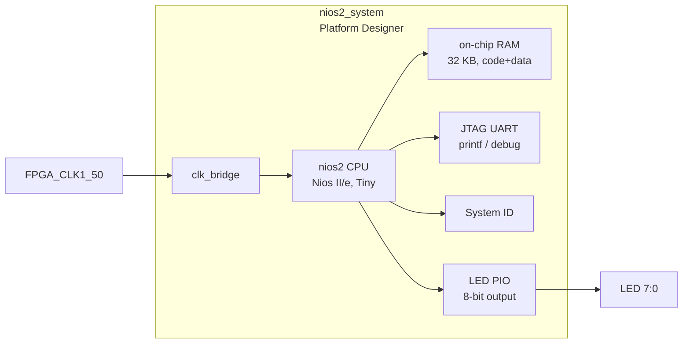

# 04 — Nios II LED Demo

This project demonstrates a **soft-core embedded processor** on the DE10-Nano board.
A Nios II/e CPU running C firmware cycles LED patterns via a memory-mapped PIO peripheral.

## Architecture



### Memory map

| Peripheral              | Base address | Size  |
|-------------------------|-------------|-------|
| On-chip RAM (code+data) | `0x00000000` | 32 KB |
| LED PIO                 | `0x00010010` | 16 B  |
| JTAG UART               | `0x00010100` | 8 B   |
| System ID               | `0x00010108` | 8 B   |
| Nios II debug slave     | `0x00010800` | 2 KB  |

## Directory structure

```
04_nios2_led/
├── doc/
│   └── README.md          ← this file
├── hdl/
│   └── de10_nano_top.vhd  ← VHDL top-level wrapper
├── qsys/
│   └── nios2_system.tcl   ← Platform Designer system script (qsys-script input)
├── quartus/
│   ├── Makefile           ← full build orchestrator
│   ├── de10_nano_project.tcl
│   ├── de10_nano_pin_assignments.tcl
│   └── de10_nano.sdc
└── software/
    ├── bsp/               ← generated by nios2-bsp (not committed)
    └── app/
        ├── Makefile
        └── main.c
```

## Building (fully scripted)

All steps are driven from the project's `quartus/` directory. The Makefile includes the
shared `common/make/quartus-version.mk` fragment, which auto-detects Docker 23.1 for this
Nios II project. No GUI tool is required.

```bash
cd 04_nios2_led/quartus

# Auto-detects Docker 23.1
make all

# Or be explicit
make QUARTUS_VERSION=23.1 all
```

The `make all` target runs in order:

| Step | Make target | Tool              | Output                           |
|------|-------------|-------------------|----------------------------------|
| 1    | `qsys`      | `qsys-script`     | `qsys/nios2_system.qsys`         |
| 1b   |             | `qsys-generate`   | `qsys/nios2_system_gen/` (VHDL)  |
| 2    | `project`   | `quartus_sh -t`   | `.qpf`, `.qsf`                   |
| 3    | `compile`   | `quartus_sh --flow compile` | `.sof` bitstream         |
| 4    | `bsp`       | `nios2-bsp`       | `software/bsp/` HAL BSP          |
| 5    | `app`       | `nios2-elf-gcc`   | `software/app/nios2_led.elf`     |

### Running individual steps

```bash
# Regenerate Platform Designer system only
make qsys

# FPGA compile only (assumes qsys already generated)
make project compile

# Regenerate BSP after hardware changes
make bsp

# Rebuild application only
make app
```

## Firmware

`software/app/main.c` cycles through LED patterns using the HAL macro:

```c
IOWR_ALTERA_AVALON_PIO_DATA(LED_PIO_BASE, pattern);
```

`LED_PIO_BASE` is defined in `system.h` (generated by `nios2-bsp`).

## Programming the board

After a successful build, attach the USB-Blaster to WSL2 once, then program from the
project's `quartus/` directory:

```bash
cd 04_nios2_led/quartus

# Attach USB-Blaster (replace 2-4 with your bus ID)
make usb-wsl USBIPD_BUSID=2-4

# Program SRAM configuration (not persistent)
make program-sof USBIPD_BUSID=2-4

# Download software
make download-elf USBIPD_BUSID=2-4

# Open JTAG terminal (printf output)
make terminal USBIPD_BUSID=2-4
```

## Concepts covered

- Platform Designer (Qsys) system integration
- Avalon-MM bus and memory mapping
- Nios II/e soft-core CPU
- HAL (Hardware Abstraction Layer) BSP generation
- Memory-mapped I/O from C
- Fully script-driven FPGA + embedded software build flow
