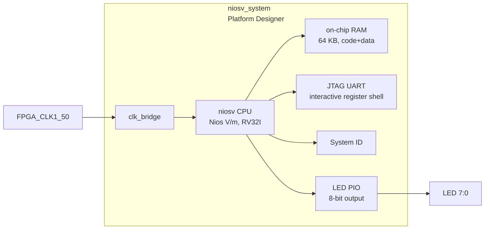

# 04b — Nios V/m LED Demo

Sibling project to `04_nios2_led`, demonstrating the **Nios V/m** (RISC-V RV32I) soft-core
processor. Same LED-cycling firmware, but targeting **Quartus 25.1 only** — `intel_niosv_m`
does not exist in 23.1.

## Architecture



### Memory map

| Peripheral                    | Base address | Size  |
|-------------------------------|-------------|-------|
| On-chip RAM (code+data)       | `0x00000000` | 64 KB |
| LED PIO                       | `0x00010010` | 16 B  |
| JTAG UART                     | `0x00010100` | 8 B   |
| System ID                     | `0x00010108` | 8 B   |
| Timer / SW interrupt (mtime)  | `0x00010140` | 64 B  |
| Debug module (dm_agent)       | `0x00100000` | 64 KB |

The Nios V/m masters are Avalon-MM `data_manager` / `instruction_manager`; the
interrupt receiver is `platform_irq_rx`. `enableAvalonInterface` is set so the
CPU drives the Avalon peripherals directly.

## Directory structure

```
04b_niosv_led/
├── doc/
│   └── README.md          ← this file
├── hdl/
│   └── de10_nano_top.vhd  ← VHDL top-level wrapper
├── qsys/
│   └── niosv_system.tcl   ← Platform Designer system script (qsys-script input)
├── quartus/
│   ├── Makefile           ← full build orchestrator
│   ├── de10_nano_project.tcl
│   ├── de10_nano_pin_assignments.tcl
│   └── de10_nano.sdc
└── software/
    ├── bsp/               ← generated by niosv-bsp (not committed)
    └── app/
        ├── Makefile
        ├── led.hpp             ← typed LED register interface
        └── main.cpp            ← LED demo and interactive command handlers
```

## Building (hardware)

```bash
cd 04b_niosv_led/quartus
make qsys project compile QUARTUS_VERSION=25.1
```

| Step | Make target | Tool              | Output                          |
|------|-------------|-------------------|---------------------------------|
| 1    | `qsys`      | `qsys-script`     | `qsys/niosv_system.qsys`        |
| 1b   |             | `qsys-generate`   | `qsys/niosv_system_gen/` (VHDL) |
| 2    | `project`   | `quartus_sh -t`   | `.qpf`, `.qsf`                  |
| 3    | `compile`   | `quartus_sh --flow compile` | `.sof` bitstream      |

## Building (software)

Software builds need the **RiscFree RISC-V toolchain** (not bundled with Quartus
25.1 — only the `niosv-bsp` / `niosv-app` / `niosv-download` shells ship). Until
the toolchain is installed the `bsp` / `app` targets fail with a toolchain
error; the FPGA bitstream builds regardless.

```bash
make bsp app QUARTUS_VERSION=25.1
```

`niosv-bsp` generates the HAL BSP into `software/bsp/`; `niosv-app` generates a
CMake build (`software/app/build/niosv_led.elf`), because Nios V uses a
CMake-based build flow rather than the Nios II make flow.

## Interactive register shell

For a beginner-oriented explanation of the complete design, including
memory-mapped I/O, C++ templates, command registration, parsing, and UART
transport, see [Building an Interactive Register Shell with Embedded
C++](REGISTER_SHELL_TUTORIAL.md).

After programming the FPGA and downloading the application, connect to the
JTAG UART:

```bash
make program-sof
make download-elf
make terminal
```

The shell resolves peripherals symbolically. The generated `system.h` supplies
`LED_PIO_BASE`, so commands never require a numeric base address:

```text
CVSoC register shell
Type 'help' for commands.
niosv> led.status
led.status = 0x1f
niosv> led.control = 0xaa
OK
niosv> led.on 0
OK
niosv> led.toggle 7
OK
niosv> led.cycle on
OK
```

`led.control`, `led.on`, `led.off`, and `led.toggle` pause the automatic LED
pattern so the requested value remains visible. `led.cycle on` resumes the
demo, while `led.cycle` reports whether cycling is enabled. `help led` lists
all LED commands.

The reusable fixed-buffer terminal and parser are in
`common/software/niosv_shell/`. They use polled MMIO and do not require dynamic
allocation, C++ streams, `printf`, or hard-coded addresses in the shell. The
transport disables the generated HAL JTAG UART interrupts before polling so the
HAL driver and shell cannot race each other for received characters.

## Concepts covered

- Platform Designer (Qsys) system integration with the Nios V/m soft-core CPU
- Avalon-MM bus and memory mapping (`data_manager` / `instruction_manager`)
- HAL (Hardware Abstraction Layer) BSP generation for RISC-V
- Typed memory-mapped I/O from C++ using BSP-generated base addresses
- Interactive, symbolic register control over JTAG UART
- Fully script-driven FPGA + embedded software build flow
