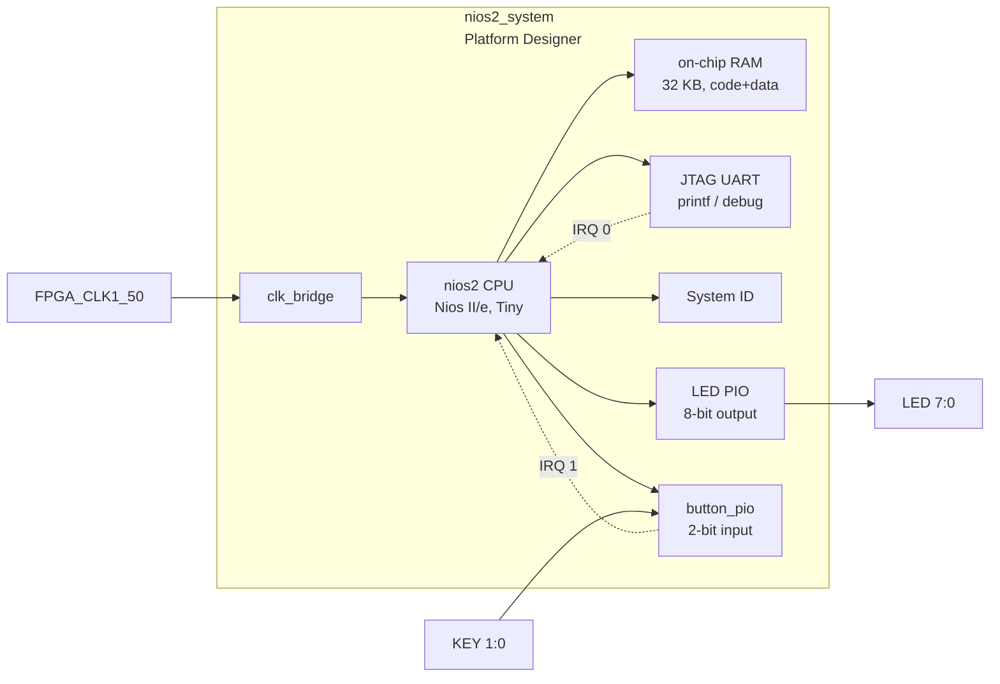

# 06 — Nios II Hardware Interrupt Demo

Extends project 04 with **hardware interrupt handling**.  When KEY[0] or KEY[1]
is pressed, the button PIO captures a falling edge and asserts an IRQ to the
Nios II CPU.  An interrupt service routine (ISR) updates the LED pattern
without polling, leaving the main loop free for other work.

## Architecture



The button PIO is configured in **edge-capture** mode: the falling edge of a
button press is latched in the edge-capture register and the IRQ line is held
HIGH until the ISR clears the register.  This means the CPU does not need to
debounce: one edge → one interrupt.

### Memory map

| Peripheral              | Base address  | Size  | IRQ |
|-------------------------|--------------|-------|-----|
| On-chip RAM (code+data) | `0x00000000`  | 32 KB | —   |
| LED PIO                 | `0x00010010`  | 16 B  | —   |
| button_pio              | `0x00010020`  | 16 B  | 1   |
| JTAG UART               | `0x00010100`  | 8 B   | 0   |
| System ID               | `0x00010108`  | 8 B   | —   |
| Nios II debug slave     | `0x00010800`  | 2 KB  | —   |

### button_pio register map (altera_avalon_pio)

| Offset | Name         | Access | Description                                        |
|--------|--------------|--------|----------------------------------------------------|
| +0x00  | DATA         | R      | Current pin state (1 = button not pressed)         |
| +0x08  | IRQ_MASK     | R/W    | 1 = enable interrupt for that bit                  |
| +0x0C  | EDGE_CAPTURE | R/W    | Set on falling edge; cleared by writing 1 to bits  |

## Directory structure

```
06_nios2_interrupts/
├── doc/
│   └── README.md          ← this file
├── hdl/
│   └── de10_nano_top.vhd  ← VHDL top-level; adds key(1:0) port
├── qsys/
│   └── nios2_system.tcl   ← Platform Designer script; adds button_pio
├── quartus/
│   ├── Makefile           ← full build orchestrator
│   ├── de10_nano_project.tcl
│   ├── de10_nano_pin_assignments.tcl
│   └── de10_nano.sdc
└── software/
    ├── bsp/               ← generated by nios2-bsp (not committed)
    └── app/
        ├── Makefile
        └── main.c
```

## Building

```bash
docker run --rm \
  -v /path/to/cvsoc:/work \
  cvsoc/quartus:23.1 \
  bash -c "cd /work/06_nios2_interrupts/quartus && make all"
```

| Step | Make target | Tool                        | Output                              |
|------|-------------|-----------------------------|-------------------------------------|
| 1    | `qsys`      | `qsys-script` + `qsys-generate` | `qsys/nios2_system_gen/` (VHDL) |
| 2    | `project`   | `quartus_sh -t`             | `.qpf`, `.qsf`                      |
| 3    | `compile`   | `quartus_sh --flow compile` | `.sof` bitstream                    |
| 4    | `bsp`       | `nios2-bsp-create-settings` | `software/bsp/`                     |
| 5    | `app`       | `nios2-elf-gcc`             | `software/app/nios2_interrupts.elf` |

## Firmware design

### ISR registration

The HAL function `alt_ic_isr_register()` connects `button_isr` to IRQ 1 of
interrupt controller 0:

```c
alt_ic_isr_register(BUTTON_PIO_IRQ_INTERRUPT_CONTROLLER_ID,
                    BUTTON_PIO_IRQ,
                    button_isr, NULL, NULL);
```

All constants come from the BSP-generated `system.h`.

### ISR logic

```c
static void button_isr(void *context)
{
    uint32_t edges = IORD_ALTERA_AVALON_PIO_EDGE_CAP(BUTTON_PIO_BASE);
    IOWR_ALTERA_AVALON_PIO_EDGE_CAP(BUTTON_PIO_BASE, edges); /* clear BEFORE acting */

    if (edges & 0x1) {
        g_led_pattern = (g_led_pattern << 1) | (g_led_pattern >> 7); /* barrel-rotate left */
    }
    if (edges & 0x2) {
        g_press_count++;
        g_led_pattern = (uint8_t)g_press_count;  /* show count on LEDs */
    }
}
```

**Why clear before acting?**  The edge-capture register is sticky: an edge that
arrives during the ISR is captured immediately.  By clearing the register at the
start of the ISR, the new edge is preserved and will trigger another interrupt
after this one completes.  Clearing at the end would lose that edge.

### Shared state and `volatile`

`g_led_pattern` and `g_press_count` are declared `volatile` because they are
written in interrupt context and read in the main loop.  Without `volatile`, the
compiler may cache the value in a register and the main loop would never see
updates.

### Interrupt context rules

- Do not call HAL functions that may block (e.g. `printf`) from the ISR.
- Keep the ISR short: update state, clear hardware flags, return.
- The main loop polls `g_led_pattern` and writes to the LED PIO.

## Programming the board

```bash
# Program FPGA
quartus_pgm -m jtag -o "p;output_files/06_nios2_interrupts.sof"

# Download ELF (and run)
nios2-download -g software/app/nios2_interrupts.elf

# Watch JTAG UART output
nios2-terminal
```

## Concepts covered

- Nios II interrupt mechanism (HAL `alt_ic_isr_register`)
- `altera_avalon_pio` edge-capture and IRQ mask registers
- Volatile shared state between ISR and main context
- Falling-edge detection with active-low push buttons
- Clear-before-act pattern for edge-capture registers
