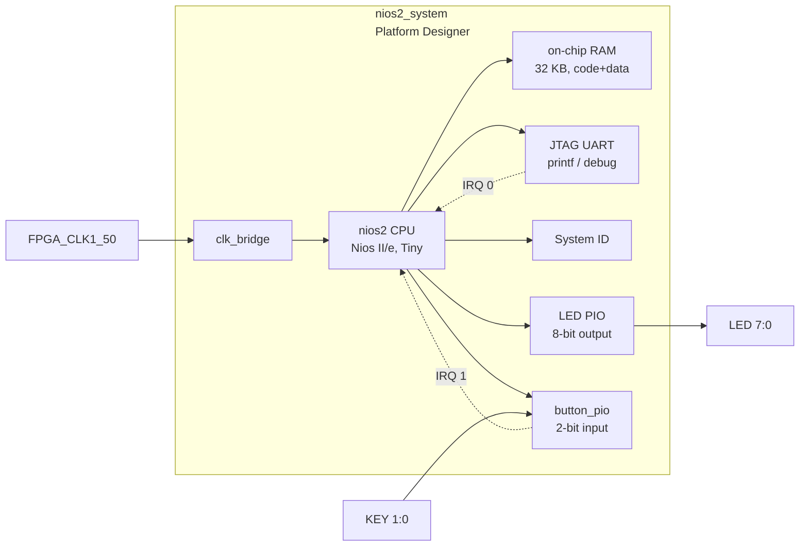

# 06 — Nios II Hardware Interrupt Demo

Extends project 04 with **hardware interrupt handling**.  When KEY[0] or KEY[1]
is pressed, the button PIO captures a falling edge and asserts an IRQ to the
Nios II CPU.  An interrupt service routine (ISR) updates the LED pattern
without polling, leaving the main loop free for other work.

## Architecture


```mermaid
flowchart LR
    CLK[FPGA_CLK1_50] --> CLK_BRIDGE[clk_bridge]
    
    subgraph nios2_system [nios2_system <br/> Platform Designer]
        direction LR
        CLK_BRIDGE --> CPU[nios2 CPU <br/> Nios II/e, Tiny]
        CPU --> RAM[on-chip RAM <br/> 32 KB, code+data]
        CPU --> UART[JTAG UART <br/> printf / debug]
        CPU --> SYSID[System ID]
        CPU --> LED[LED PIO <br/> 8-bit output]
        CPU --> BTN[button_pio <br/> 2-bit input]
        
        UART -.->|IRQ 0| CPU
        BTN -.->|IRQ 1| CPU
    end
    
    LED --> LED_OUT[LED 7:0]
    KEY[KEY 1:0] --> BTN
```

The button PIO is configured in **edge-capture** mode: the falling edge of a
button press is latched in the edge-capture register and the IRQ line is held
HIGH until the ISR clears the register.  This means the CPU does not need to
debounce: one edge → one interrupt.

### Memory map

| Peripheral              | Base address  | Size  | IRQ |
|-------------------------|--------------|-------|-----|
| On-chip RAM (code+data) | `0x00000000`  | 32 KB | —   |
| LED PIO                 | `0x00010010`  | 16 B  | —   |
| button_pio              | `0x00010020`  | 16 B  | 1   |
| JTAG UART               | `0x00010100`  | 8 B   | 0   |
| System ID               | `0x00010108`  | 8 B   | —   |
| Nios II debug slave     | `0x00010800`  | 2 KB  | —   |

### button_pio register map (altera_avalon_pio)

| Offset | Name         | Access | Description                                        |
|--------|--------------|--------|----------------------------------------------------|
| +0x00  | DATA         | R      | Current pin state (1 = button not pressed)         |
| +0x08  | IRQ_MASK     | R/W    | 1 = enable interrupt for that bit                  |
| +0x0C  | EDGE_CAPTURE | R/W    | Set on falling edge; cleared by writing 1 to bits  |

## Directory structure

```
06_nios2_interrupts/
├── doc/
│   └── README.md          ← this file
├── hdl/
│   └── de10_nano_top.vhd  ← VHDL top-level; adds key(1:0) port
├── qsys/
│   └── nios2_system.tcl   ← Platform Designer script; adds button_pio
├── quartus/
│   ├── Makefile           ← full build orchestrator
│   ├── de10_nano_project.tcl
│   ├── de10_nano_pin_assignments.tcl
│   └── de10_nano.sdc
└── software/
    ├── bsp/               ← generated by nios2-bsp (not committed)
    └── app/
        ├── Makefile
        └── main.c
```

## Building

```bash
docker run --rm \
  -v $(pwd):/work \
  cvsoc/quartus:23.1 \
  bash -c 'cd /work/06_nios2_interrupts/qsys && qsys-script --script=nios2_system.tcl && \
    cd /work/06_nios2_interrupts/quartus && \
    qsys-generate ../qsys/nios2_system.qsys --synthesis=VHDL --output-directory=../qsys/nios2_system_gen && \
    quartus_sh -t de10_nano_project.tcl && \
    quartus_sh --flow compile 06_nios2_interrupts -c de10_nano && \
    mkdir -p ../software/bsp && \
    nios2-bsp-create-settings --sopc ../qsys/nios2_system.sopcinfo --type hal \
      --settings ../software/bsp/settings.bsp --bsp-dir ../software/bsp \
      --script /opt/intelFPGA/nios2eds/sdk2/bin/bsp-set-defaults.tcl --cpu-name nios2 && \
    make -C ../software/bsp WINDOWS_EXE= && \
    make -C ../software/app'
```

| Step | Make target | Tool                        | Output                              |
|------|-------------|-----------------------------|-------------------------------------|
| 1    | `qsys`      | `qsys-script` + `qsys-generate` | `qsys/nios2_system_gen/` (VHDL) |
| 2    | `project`   | `quartus_sh -t`             | `.qpf`, `.qsf`                      |
| 3    | `compile`   | `quartus_sh --flow compile` | `.sof` bitstream                    |
| 4    | `bsp`       | `nios2-bsp-create-settings` | `software/bsp/`                     |
| 5    | `app`       | `nios2-elf-gcc`             | `software/app/nios2_interrupts.elf` |

## Firmware design

### ISR registration

The HAL function `alt_ic_isr_register()` connects `button_isr` to IRQ 1 of
interrupt controller 0:

```c
alt_ic_isr_register(BUTTON_PIO_IRQ_INTERRUPT_CONTROLLER_ID,
                    BUTTON_PIO_IRQ,
                    button_isr, NULL, NULL);
```

All constants come from the BSP-generated `system.h`.

### ISR logic

```c
static void button_isr(void *context)
{
    uint32_t edges = IORD_ALTERA_AVALON_PIO_EDGE_CAP(BUTTON_PIO_BASE);
    IOWR_ALTERA_AVALON_PIO_EDGE_CAP(BUTTON_PIO_BASE, edges); /* clear BEFORE acting */

    if (edges & 0x1) {
        g_led_pattern = (g_led_pattern << 1) | (g_led_pattern >> 7); /* barrel-rotate left */
    }
    if (edges & 0x2) {
        g_press_count++;
        g_led_pattern = (uint8_t)g_press_count;  /* show count on LEDs */
    }
}
```

**Why clear before acting?**  The edge-capture register is sticky: an edge that
arrives during the ISR is captured immediately.  By clearing the register at the
start of the ISR, the new edge is preserved and will trigger another interrupt
after this one completes.  Clearing at the end would lose that edge.

### Shared state and `volatile`

`g_led_pattern` and `g_press_count` are declared `volatile` because they are
written in interrupt context and read in the main loop.  Without `volatile`, the
compiler may cache the value in a register and the main loop would never see
updates.

### Interrupt context rules

- Do not call HAL functions that may block (e.g. `printf`) from the ISR.
- Keep the ISR short: update state, clear hardware flags, return.
- The main loop polls `g_led_pattern` and writes to the LED PIO.

## Programming the board

```bash
# Program FPGA bitstream
docker run --rm --privileged \
  -v /dev/bus/usb:/dev/bus/usb \
  -v $(pwd):/work \
  cvsoc/quartus:23.1 \
  bash -c 'jtagd && sleep 2 && \
    quartus_pgm -m jtag -o "p;/work/06_nios2_interrupts/quartus/de10_nano.sof@2"; \
    kill $(pgrep jtagd) 2>/dev/null || true'

# Download ELF and run
docker run --rm --privileged \
  -v $(pwd):/work \
  -v $(pwd)/common/docker/uname_shim.sh:/usr/local/bin/uname:ro \
  cvsoc/quartus:23.1 \
  nios2-download -g /work/06_nios2_interrupts/software/app/nios2_interrupts.elf

# Open JTAG UART terminal
docker run --rm -it --privileged \
  -v $(pwd)/common/docker/uname_shim.sh:/usr/local/bin/uname:ro \
  cvsoc/quartus:23.1 \
  nios2-terminal
```

## Debugging

All three workflows share the same first step: start the GDB server in a
dedicated terminal and leave it running.

```bash
cd ~/workspace/bleviet/cvsoc/06_nios2_interrupts/quartus
make gdb-server          # starts nios2-gdb-server on localhost:2345
```

The server resets the Nios II CPU and prints:
```
Listening on port 2345 for connection from GDB:
```
Leave this terminal open.  Connect a GDB client in any of the three ways below.

### Option A — GDB TUI (terminal, split source + assembly view)

```bash
# In a second terminal
cd ~/workspace/bleviet/cvsoc/06_nios2_interrupts/quartus
make gdb-tui
```

GDB opens in TUI mode.  The init script (`scripts/nios2_interrupts.gdb`)
connects to port 2345, loads the ELF, and sets a breakpoint at `button_isr`.
Press **KEY[0]** or **KEY[1]** on the board to trigger the ISR.

Useful TUI keys:

| Key        | Action                            |
|------------|-----------------------------------|
| `Ctrl-X a` | Toggle TUI on / off               |
| `Ctrl-X 2` | Source + assembly split           |
| `Ctrl-L`   | Refresh screen after noisy output |
| `↑ ↓`      | Scroll the active window          |

Useful GDB commands once halted inside `button_isr`:

```
inspect-led        — read LED PIO DATA register (0x00010010)
inspect-buttons    — read button PIO DATA + EDGE_CAPTURE
print/x edges      — print the captured edge bits
bt                 — show the call stack
continue           — resume until next button press
```

### Option B — VS Code

1. Open the workspace in VS Code.
2. Set the USB bus ID once in `.vscode/settings.json`:
   ```json
   "cvsoc.usbBusId": "<your-busid>"   // find with: usbipd.exe list
   ```
3. Press **F5**, select **"Toolchain: Debug Nios II (Project 06 — Interrupts)"**.

VS Code automatically starts the GDB server, waits for it to print
`Listening on port`, then connects GDB, loads the ELF, and breaks at
`button_isr`.  The Variables / Call Stack / Breakpoints panels appear in the
sidebar.

### Option C — Neovim (LazyVim + nvim-dap)

**Prerequisites (already satisfied on this machine):**

| Requirement | Status |
|-------------|--------|
| `lazyvim.plugins.extras.dap.core` enabled | ✓ in `~/.config/nvim/lazyvim.json` |
| mason package `cpptools` installed | ✓ provides `OpenDebugAD7` |
| `~/.config/nvim/lua/plugins/nvim-dap.lua` installed | ✓ |

The plugin file is kept in sync at `doc/nvim-dap.lua`.  If you need to
reinstall it on a new machine:

```bash
cp ~/workspace/bleviet/cvsoc/06_nios2_interrupts/doc/nvim-dap.lua \
   ~/.config/nvim/lua/plugins/nvim-dap.lua
```

Then open Neovim and run `:Lazy sync` to apply the change.

**What the plugin does:**

- Registers the `cppdbg` DAP adapter pointing to
  `~/.local/share/nvim/mason/packages/cpptools/extension/debugAdapters/bin/OpenDebugAD7`
- Adds a `"Nios II: 06 — Interrupts"` configuration for filetype `c`
- Uses `~/workspace/bleviet/cvsoc/common/docker/nios2-elf-gdb-wrapper.sh`
  as the GDB executable (runs `nios2-elf-gdb` inside the Docker image)

**Debugging workflow:**

```bash
# Terminal — start the GDB server
cd ~/workspace/bleviet/cvsoc/06_nios2_interrupts/quartus
make gdb-server
```

```
# Neovim
nvim ~/workspace/bleviet/cvsoc/06_nios2_interrupts/software/app/main.c
```

Press **`<leader>dc`** → pick **"Nios II: 06 — Interrupts"** → `Enter`.

nvim-dap-ui opens automatically (panels: Variables, Call Stack, Watches,
Breakpoints, REPL).  Press **KEY[0]** or **KEY[1]** on the board to hit the
`button_isr` breakpoint.

Key bindings (LazyVim defaults):

| Key            | Action                     |
|----------------|----------------------------|
| `<leader>dc`   | Start / continue           |
| `<leader>db`   | Toggle breakpoint          |
| `<leader>dB`   | Conditional breakpoint     |
| `<leader>do`   | Step over                  |
| `<leader>di`   | Step into                  |
| `<leader>dO`   | Step out                   |
| `<leader>dr`   | Open REPL                  |
| `<leader>du`   | Toggle nvim-dap-ui         |

**Troubleshooting:**

| Symptom | Likely cause | Fix |
|---------|--------------|-----|
| `adapter not found: cppdbg` | Mason package not installed | `:MasonInstall cpptools` |
| `DAP Error on launch` (instant exit) | Missing `miDebuggerServerAddress` — cppdbg validates the ELF as a native binary and rejects the Nios II cross-compiled ELF | Ensure `nvim-dap.lua` has `miDebuggerServerAddress = "localhost:2345"` |
| `Connection refused` on port 2345 | GDB server not running | Run `make gdb-server` first |
| `No such file or directory` for ELF | App not built | Run `make app` |
| GDB wrapper fails | Docker not running | Start Docker Desktop |

## Concepts covered

- Nios II interrupt mechanism (HAL `alt_ic_isr_register`)
- `altera_avalon_pio` edge-capture and IRQ mask registers
- Volatile shared state between ISR and main context
- Falling-edge detection with active-low push buttons
- Clear-before-act pattern for edge-capture registers
