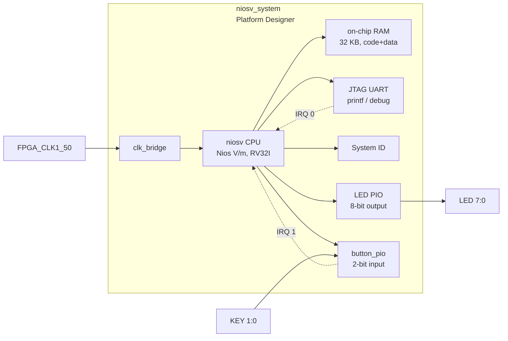

# 06b — Nios V/m Interrupt Demo

Sibling project to `06_nios2_interrupts`, demonstrating **hardware interrupt
handling** on the **Nios V/m** (RISC-V RV32I) soft-core processor. Same
button-driven ISR firmware, but targeting **Quartus 25.1 only** —
`intel_niosv_m` does not exist in 23.1.

When KEY[0] or KEY[1] is pressed, the button PIO captures a falling edge and
asserts an IRQ to the Nios V/m CPU. An interrupt service routine (ISR) updates
the LED pattern without polling, leaving the main loop free for other work.

## Architecture



The button PIO is configured in **edge-capture** mode: the falling edge of a
button press is latched in the edge-capture register and the IRQ line is held
HIGH until the ISR clears the register. This means the CPU does not need to
debounce: one edge → one interrupt.

The Nios V/m masters are Avalon-MM `data_manager` / `instruction_manager`; the
interrupt receiver is `platform_irq_rx` (a 16-bit vector, `individualRequests`
scheme). Each peripheral is assigned a bit via the `irqNumber` connection
parameter. `enableAvalonInterface` is set so the CPU drives the Avalon
peripherals directly.

### Memory map

| Peripheral                       | Base address  | Size  | IRQ |
|----------------------------------|--------------|-------|-----|
| On-chip RAM (code+data)          | `0x00000000`  | 32 KB | —   |
| LED PIO                          | `0x00010010`  | 16 B  | —   |
| button_pio                       | `0x00010020`  | 16 B  | 1   |
| JTAG UART                        | `0x00010100`  | 8 B   | 0   |
| System ID                        | `0x00010108`  | 8 B   | —   |
| Timer / SW interrupt (mtime)     | `0x00010140`  | 64 B  | —   |
| Debug module (dm_agent)          | `0x00100000`  | 64 KB | —   |

### button_pio register map (altera_avalon_pio)

| Offset | Name         | Access | Description                                        |
|--------|--------------|--------|----------------------------------------------------|
| +0x00  | DATA         | R      | Current pin state (1 = button not pressed)         |
| +0x08  | IRQ_MASK     | R/W    | 1 = enable interrupt for that bit                  |
| +0x0C  | EDGE_CAPTURE | R/W    | Set on falling edge; cleared by writing 1 to bits  |

## Directory structure

```
06b_niosv_interrupts/
├── doc/
│   └── README.md          ← this file
├── hdl/
│   └── de10_nano_top.vhd  ← VHDL top-level; adds key(1:0) port
├── qsys/
│   └── niosv_system.tcl   ← Platform Designer script; adds button_pio
├── quartus/
│   ├── Makefile           ← full build orchestrator + gdb-server/gdb-tui
│   ├── de10_nano_project.tcl
│   ├── de10_nano_pin_assignments.tcl
│   └── de10_nano.sdc
├── scripts/
│   └── niosv_interrupts.gdb ← RISC-V GDB init script (breakpoint + helpers)
└── software/
    ├── bsp/               ← generated by niosv-bsp (not committed)
    └── app/
        ├── Makefile
        └── main.c
```

## Building (hardware)

```bash
cd 06b_niosv_interrupts/quartus
make qsys project compile QUARTUS_VERSION=25.1
```

| Step | Make target | Tool              | Output                          |
|------|-------------|-------------------|---------------------------------|
| 1    | `qsys`      | `qsys-script`     | `qsys/niosv_system.qsys`        |
| 1b   |             | `qsys-generate`   | `qsys/niosv_system_gen/` (VHDL) |
| 2    | `project`   | `quartus_sh -t`   | `.qpf`, `.qsf`                  |
| 3    | `compile`   | `quartus_sh --flow compile` | `.sof` bitstream      |

## Building (software)

Software builds need the **RiscFree RISC-V toolchain** (not bundled with Quartus
25.1 — only the `niosv-bsp` / `niosv-app` / `niosv-download` shells ship). Until
the toolchain is installed the `bsp` / `app` targets fail with a toolchain
error; the FPGA bitstream builds regardless.

```bash
make bsp app QUARTUS_VERSION=25.1
```

`niosv-bsp` generates the HAL BSP into `software/bsp/`; `niosv-app` generates a
CMake build (`software/app/build/niosv_interrupts.elf`), because Nios V uses a
CMake-based build flow rather than the Nios II make flow.

## Debugging (RISC-V GDB)

Nios V is debugged with the **Ashling RiscFree GDB server**
(`ash-riscv-gdb-server`) plus a RISC-V GDB client (`riscv32-unknown-elf-gdb`),
both shipped with the RiscFree toolchain. Until RiscFree is installed these
targets fail with `command not found`; they are written for the Nios V flow and
verified syntactically with `make -n`.

```bash
# Terminal 1 — start the GDB server (needs RiscFree on PATH, e.g. niosv-shell)
cd 06b_niosv_interrupts/quartus
make gdb-server QUARTUS_VERSION=25.1

# Terminal 2 — RISC-V GDB TUI session
make gdb-tui QUARTUS_VERSION=25.1
```

The init script (`scripts/niosv_interrupts.gdb`) connects to port 2345, loads
the ELF, and sets a breakpoint at `button_isr`. Press **KEY[0]** or **KEY[1]**
on the board to trigger the ISR.

## Firmware design

The ISR registration and edge-capture clearing follow the exact pattern of
`06_nios2_interrupts` (see that project's README for the detailed rationale):

```c
IOWR_ALTERA_AVALON_PIO_EDGE_CAP(BUTTON_PIO_BASE, 0x3u);   /* clear stale edges */
IOWR_ALTERA_AVALON_PIO_IRQ_MASK(BUTTON_PIO_BASE, 0x3u);   /* arm both buttons */
alt_ic_isr_register(BUTTON_PIO_IRQ_INTERRUPT_CONTROLLER_ID,
                    BUTTON_PIO_IRQ, button_isr, NULL, NULL);
```

All constants come from the BSP-generated `system.h`.

## Concepts covered

- Platform Designer (Qsys) system integration with the Nios V/m soft-core CPU
- Nios V interrupt mechanism (HAL `alt_ic_isr_register` +
  `platform_irq_rx` receiver)
- `altera_avalon_pio` edge-capture and IRQ mask registers
- Volatile shared state between ISR and main context
- Falling-edge detection with active-low push buttons
- Clear-before-act pattern for edge-capture registers
