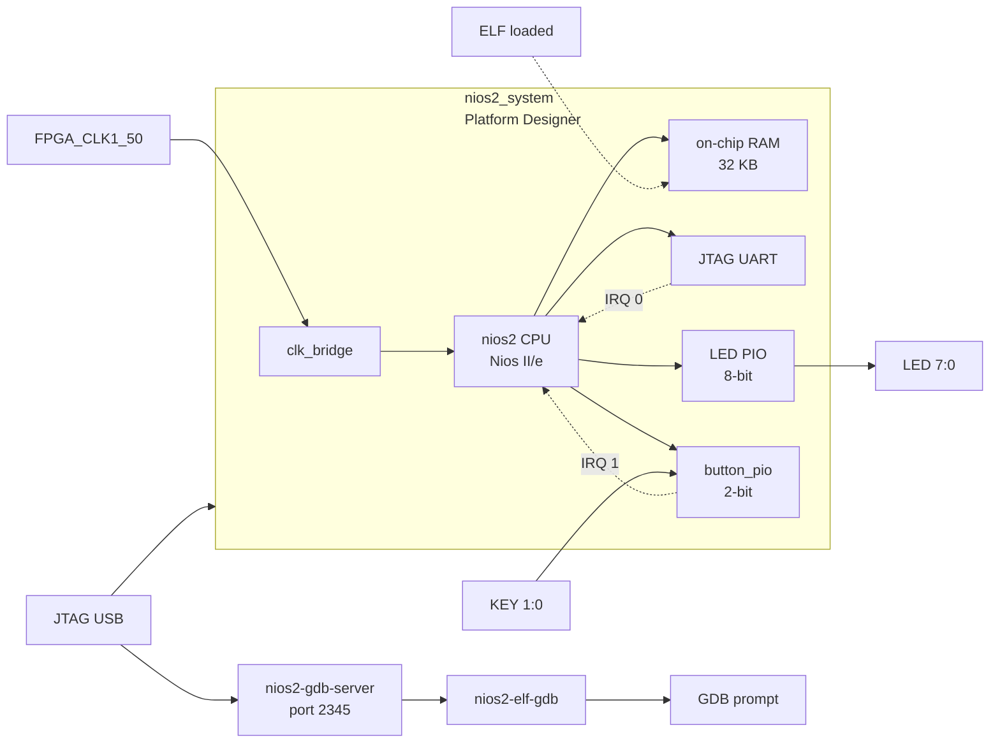

# 08 — Nios II Software Debugging with GDB

Extends project 06 with **interactive GDB debugging** of the Nios II soft-core.
The same hardware design is reused; the firmware is recompiled with `-O0 -g3`
so that all variables, structs, and call frames are visible to GDB.

## Architecture



### Memory map

| Peripheral              | Base address  | Size  | IRQ |
|-------------------------|--------------|-------|-----|
| On-chip RAM (code+data) | `0x00000000`  | 32 KB | —   |
| LED PIO                 | `0x00010010`  | 16 B  | —   |
| button_pio              | `0x00010020`  | 16 B  | 1   |
| JTAG UART               | `0x00010100`  | 8 B   | 0   |
| System ID               | `0x00010108`  | 8 B   | —   |
| Nios II debug slave     | `0x00010800`  | 2 KB  | —   |

## Directory structure

```
08_nios2_debug/
├── doc/
│   └── README.md              ← this file
├── hdl/
│   └── de10_nano_top.vhd      ← identical to 06_nios2_interrupts
├── qsys/
│   └── nios2_system.tcl       ← identical to 06_nios2_interrupts
├── quartus/
│   ├── Makefile               ← adds gdb-server and gdb targets
│   ├── de10_nano_project.tcl
│   ├── de10_nano_pin_assignments.tcl
│   └── de10_nano.sdc
├── scripts/
│   └── nios2_debug.gdb        ← GDB init script (breakpoints + helpers)
└── software/
    ├── bsp/                   ← generated; not committed
    └── app/
        ├── Makefile           ← -O0 -g3; ELF = nios2_debug.elf
        └── main.c             ← debug_state_t struct, __attribute__((noinline))
```

## Building

```bash
docker run --rm \
  -v /path/to/cvsoc:/work \
  cvsoc/quartus:23.1 \
  bash -c "cd /work/08_nios2_debug/quartus && make all"
```

| Step | Target      | Tool                            | Output                         |
|------|-------------|---------------------------------|--------------------------------|
| 1    | `qsys`      | `qsys-script` + `qsys-generate` | `qsys/nios2_system_gen/`       |
| 2    | `project`   | `quartus_sh -t`                 | `.qpf`, `.qsf`                 |
| 3    | `compile`   | `quartus_sh --flow compile`     | `.sof` bitstream               |
| 4    | `bsp`       | `nios2-bsp-create-settings`     | `software/bsp/`                |
| 5    | `app`       | `nios2-elf-gcc -O0 -g3`         | `software/app/nios2_debug.elf` |

## GDB debugging workflow

### Start GDB server (Terminal 1)

```bash
docker run --rm \
  -v /path/to/cvsoc:/work \
  --device /dev/bus/usb \
  cvsoc/quartus:23.1 \
  bash -c "cd /work/08_nios2_debug/quartus && make gdb-server"
```

This programs the FPGA, loads the ELF into Nios II OCRAM, and starts
`nios2-gdb-server` listening on TCP port 2345.

### Launch GDB client (Terminal 2)

```bash
docker run --rm -it \
  -v /path/to/cvsoc:/work \
  --network host \
  cvsoc/quartus:23.1 \
  bash -c "cd /work/08_nios2_debug/quartus && make gdb"
```

GDB connects to localhost:2345, loads symbols, sets a hardware breakpoint
at `set_led()` and a watchpoint on `debug_state.step_count`, then runs.

### Example GDB session

```
(gdb) continue                         # run until breakpoint
Breakpoint 1, set_led (pattern=0x55) at main.c:34

(gdb) print debug_state                # inspect struct
$1 = {step_count = 1, irq_count = 0, last_edges = 0, led_pattern = 85}

(gdb) inspect-led-pio                  # read LED PIO register
=== LED PIO DATA register (0x00010010) ===
0x00010010:  0x00000055

(gdb) hbreak button_isr                # break in ISR on next keypress
(gdb) continue

# Press KEY[0] on the board — GDB halts in ISR
Breakpoint 2, button_isr (context=0x0) at main.c:55

(gdb) inspect-button-pio               # read PIO edge-capture
=== Button PIO registers (0x00010020) ===
EDGE_CAP  (0x0001002C):  0x00000001   ← bit 0 set (KEY[0] pressed)

(gdb) finish                           # run to end of ISR
(gdb) print debug_state.irq_count      # verify ISR incremented counter
$2 = 1
```

## Firmware design

### `debug_state_t` struct

All debug-relevant state is grouped in a single struct so it can be
inspected with one `print debug_state` command:

```c
typedef struct {
    volatile uint32_t step_count;    /* incremented each main-loop iteration */
    volatile uint32_t irq_count;     /* incremented by button_isr            */
    volatile uint32_t last_edges;    /* edge-capture value from last ISR      */
    volatile uint8_t  led_pattern;   /* current LED output value              */
} debug_state_t;

debug_state_t debug_state;          /* non-static: visible to GDB by name    */
```

### `__attribute__((noinline))`

Key functions are decorated with `__attribute__((noinline))` to ensure they
appear as separate frames in the GDB backtrace even at `-O0`:

- `set_led(uint8_t pattern)` — hardware breakpoint target
- `delay_ms(uint32_t ms)` — step through timing loops
- `process_button(void)` — inspect button debounce state

### Watchpoint demo

Press KEY[1] to trigger a watchpoint fire:

```c
/* KEY[1] resets step_count — watchpoint fires here */
if (edges & 0x2)
    debug_state.step_count = 0;
```

## Concepts covered

- `nios2-gdb-server` TCP bridge between JTAG and GDB
- Hardware breakpoints on soft-core CPUs (Nios II debug unit)
- Struct inspection with a single `print` command
- Watchpoints on volatile shared variables
- Inspecting Avalon peripheral registers via `x/1xw <addr>`
- ISR debugging with `hbreak` inside an interrupt service routine
