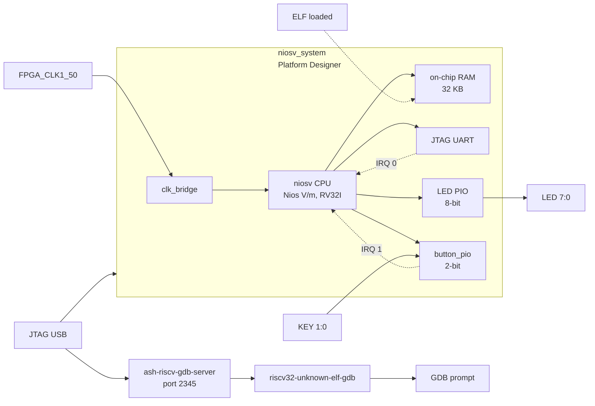

# 08b — Nios V/m Software Debugging with RISC-V GDB

Sibling project to `08_nios2_debug`, demonstrating **interactive GDB debugging**
of the **Nios V/m** (RISC-V RV32I) soft-core processor. The same hardware design
as `06b_niosv_interrupts` is reused; the firmware is recompiled with debug
symbols so all variables, structs, and call frames are visible to GDB.

Targets **Quartus 25.1 only** — `intel_niosv_m` does not exist in 23.1, and Nios V
debugging uses the Ashling RiscFree GDB server plus a RISC-V GDB client (both
part of the RiscFree toolchain).

## Architecture



### Memory map

| Peripheral                       | Base address  | Size  | IRQ |
|----------------------------------|--------------|-------|-----|
| On-chip RAM (code+data)          | `0x00000000`  | 32 KB | —   |
| LED PIO                          | `0x00010010`  | 16 B  | —   |
| button_pio                       | `0x00010020`  | 16 B  | 1   |
| JTAG UART                        | `0x00010100`  | 8 B   | 0   |
| System ID                        | `0x00010108`  | 8 B   | —   |
| Timer / SW interrupt (mtime)     | `0x00010140`  | 64 B  | —   |
| Debug module (dm_agent)          | `0x00100000`  | 64 KB | —   |

## Directory structure

```
08b_niosv_debug/
├── doc/
│   └── README.md              ← this file
├── hdl/
│   └── de10_nano_top.vhd      ← identical to 06b_niosv_interrupts
├── qsys/
│   └── niosv_system.tcl       ← identical to 06b_niosv_interrupts
├── quartus/
│   ├── Makefile               ← all reuses 06b; adds gdb-server / gdb / download-elf
│   ├── de10_nano_project.tcl
│   ├── de10_nano_pin_assignments.tcl
│   └── de10_nano.sdc
├── scripts/
│   └── niosv_debug.gdb        ← RISC-V GDB init script (breakpoints + helpers)
└── software/
    ├── bsp/                   ← copied from 06b by make all; not committed
    └── app/
        ├── Makefile           ← CMake forwarding; ELF = niosv_debug.elf
        └── main.c             ← debug_state_t struct, __attribute__((noinline))
```

## Building

```bash
cd 08b_niosv_debug/quartus
make all QUARTUS_VERSION=25.1
```

`make all` first builds `06b_niosv_interrupts` (qsys + compile + BSP), then
copies the bitstream and BSP into this project and builds the debug app.

| Step | Target      | Tool                            | Output                                |
|------|-------------|---------------------------------|---------------------------------------|
| 1    | (06b `all`) | `qsys-script` + `qsys-generate` | `qsys/niosv_system_gen/`              |
| 2    | (06b `all`) | `quartus_sh --flow compile`     | 06b `.sof` bitstream                  |
| 3    | (06b `all`) | `niosv-bsp`                     | 06b `software/bsp/`                   |
| 4    | `all`       | `cp`                            | this project's `de10_nano.sof` + BSP  |
| 5    | `all`       | `niosv-app` + `cmake`           | `software/app/build/niosv_debug.elf`  |

Steps 1–3 always succeed. Step 5 needs the **RiscFree RISC-V toolchain**; without
it `make all` prints a warning and continues (the bitstream and BSP copies are
still produced). `make app` alone hard-fails so the toolchain gap is visible.

## GDB debugging workflow

### Start GDB server (Terminal 1)

```bash
cd 08b_niosv_debug/quartus
make gdb-server QUARTUS_VERSION=25.1
```

This starts `ash-riscv-gdb-server` listening on TCP port 2345. It requires the
RiscFree toolchain on PATH (e.g. inside a `niosv-shell`).

### Launch GDB client (Terminal 2)

```bash
make gdb QUARTUS_VERSION=25.1
```

GDB connects to localhost:2345, loads symbols, sets a breakpoint at `set_led()`,
then runs.

### Example GDB session

```
(gdb) continue                         # run until breakpoint
Breakpoint 1, set_led (pattern=0x55) at main.c:34

(gdb) print debug_state                # inspect struct
$1 = {led_pattern = 85, step_count = 1, irq_count = 0, last_edges = 0}

(gdb) inspect-led-pio                  # read LED PIO register
=== LED PIO DATA register (0x00010010) ===
0x00010010:  0x00000055

(gdb) break button_isr                 # break in ISR on next keypress
(gdb) continue

# Press KEY[0] on the board — GDB halts in ISR
Breakpoint 2, button_isr (context=0x0) at main.c:55

(gdb) inspect-button-pio               # read PIO edge-capture
=== Button PIO registers (0x00010020) ===
EDGE_CAP  (0x0001002C):  0x00000001   ← bit 0 set (KEY[0] pressed)

(gdb) finish                           # run to end of ISR
(gdb) print debug_state.irq_count      # verify ISR incremented counter
$2 = 1
```

## Firmware design

The firmware is the Nios V port of `08_nios2_debug`'s `main.c`:

- `debug_state_t` groups all debug-relevant state in one struct so it can be
  inspected with a single `print debug_state`.
- `set_led()`, `delay_ms()` and `process_button()` are marked
  `__attribute__((noinline))` so they appear as separate frames in the
  backtrace.
- Pressing KEY[1] resets `debug_state.step_count` — a watchpoint demo target.

## Concepts covered

- `ash-riscv-gdb-server` TCP bridge between JTAG and RISC-V GDB
- Breakpoints on the Nios V debug module
- Struct inspection with a single `print` command
- Watchpoints on volatile shared variables
- Inspecting Avalon peripheral registers via `x/1xw <addr>`
- ISR debugging inside an interrupt service routine
