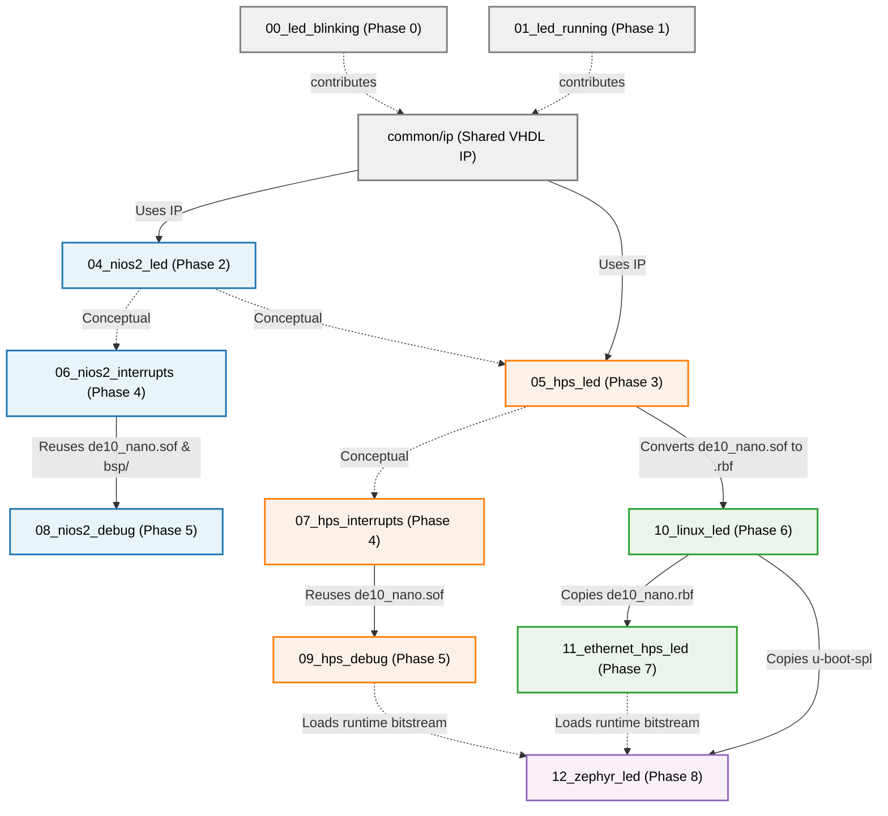

# Project Dependencies

This document maps out the dependencies between different project phases (folders) in the `cvsoc` tutorial series. While each phase builds *conceptually* on the previous ones, some phases also strictly require **binary files or generated source files** from an earlier phase to compile or run successfully.

## Explicit Binary and Source Dependencies

The table below outlines the exact files that must be generated in a previous project directory before you can build or use a subsequent project directory.

| Dependent Project (Phase) | Required Files | Source Project (Phase) | Notes |
| :--- | :--- | :--- | :--- |
| `04_nios2_led` (Phase 2) `05_hps_led` (Phase 3) | `power_on_reset_generator.vhd` | `common/ip/` | Both Phase 2 and Phase 3 use the shared reset IP component derived from the foundational logic of Phases 0 and 1. |
| `08_nios2_debug` (Phase 5) | `de10_nano.sof` `software/bsp/` (directory) | `06_nios2_interrupts` (Phase 4) | The Nios II debugging tutorial reuses the bitstream and the Board Support Package (BSP) from the Phase 4 Nios II interrupt project. |
| `09_hps_debug` (Phase 5) | `de10_nano.sof` | `07_hps_interrupts` (Phase 4) | The HPS debugging tutorial natively reuses the exact bitstream from the Phase 4 bare-metal HPS project. |
| `10_linux_led` (Phase 6) | `de10_nano.sof` | `05_hps_led` (Phase 3) | The Embedded Linux phase converts the bitstream from Phase 3 (`.sof`) into a Raw Binary File (`.rbf`) that gets automatically copied onto the generated SD Card image. |
| `11_ethernet_hps_led` (Phase 7) | `de10_nano.rbf` | `10_linux_led` (Phase 6) | The Ethernet phase's `make rbf` directly copies the `.rbf` bitstream that was converted during Phase 6. |
| `12_zephyr_led` (Phase 8) | `u-boot-spl` | `10_linux_led` (Phase 6) | Zephyr relies on the Secondary Program Loader (U-Boot SPL) built by Buildroot in Phase 6 to initialize the DDR memory controller over JTAG before flashing Zephyr. |
| `12_zephyr_led` (Phase 8) | `de10_nano.sof`/`.rbf` | *Phase 5 or Phase 7* | A runtime dependency: Zephyr expects an FPGA bitstream to be loaded on the board prior to executing its ELF binary. You can use the bitstream from Phase 5 or Phase 7. |

## Dependency Graph

Below is a Mermaid diagram visually representing the project folders and their dependencies. Solid arrows represent strict binary/file copying dependencies, while dashed lines represent conceptual continuity or runtime dependency.

## Summary
- Before building **Phase 5 (`08`, `09`)**, you must build **Phase 4 (`06`, `07`)** to generate the initial bitstreams and (for Nios II) the BSP headers.
- Before building **Phase 6 (`10`)**, you must build **Phase 3 (`05`)** to generate the FPGA bitstream used by the embedded Linux environment.
- Before building **Phase 7 (`11`)**, you must have run `make rbf` via **Phase 6 (`10`)** to produce the compressed `.rbf` bitstream.
- Before running **Phase 8 (`12`)**, you must complete **Phase 6 (`10`)**'s Buildroot process to obtain the U-Boot SPL preloader and rely on earlier bitstreams for the hardware LEDs implementation.
