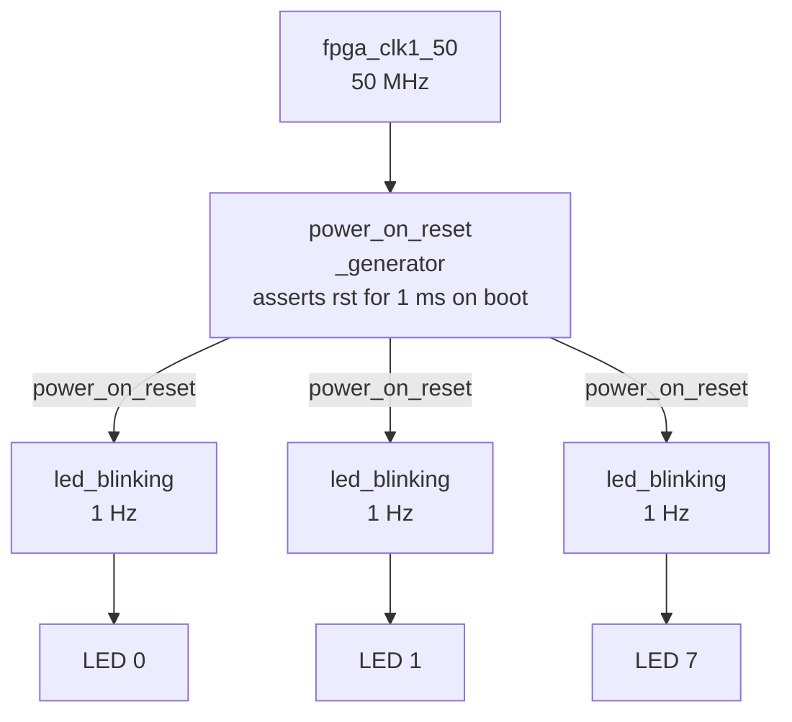

# Tutorial — Your First FPGA Design: LED Blinking on the DE10-Nano

> **Series:** cvsoc — Stepping into advanced FPGA development on the DE10-Nano  
> **Phase:** 0 — `00_led_blinking`  
> **Difficulty:** Beginner — no prior FPGA experience required  
> **Time:** ~30 minutes to first blinking LEDs

---

## What you will learn

By the end of this tutorial you will have:

- Written and understood a VHDL clock divider and LED toggle module
- Created a Quartus Prime project from a TCL script
- Compiled the design to a bitstream (`.sof`) using Docker — no native Quartus install needed
- Programmed the DE10-Nano FPGA over JTAG from WSL2
- Observed all eight LEDs blinking at 1 Hz on the board

This is the simplest possible complete FPGA project for the DE10-Nano: no processors, no IP cores, no software — just pure HDL describing what the FPGA should do.

---

## Prerequisites

| Requirement | Details |
|---|---|
| **Hardware** | Terasic DE10-Nano board + USB cable |
| **Docker** | Docker Desktop installed, `cvsoc/quartus:23.1` image available |
| **WSL2** | Ubuntu on WSL2 with Docker Desktop integration enabled |
| **usbipd-win** | Installed on Windows (see [tutorial_debug_setup.md](tutorial_debug_setup.md)) |
| **Repository** | `git clone` of `bleviet/cvsoc` |

Build the Docker image if you have not yet:

```bash
docker build -t cvsoc/quartus:23.1 common/docker/
```

---

## The design at a glance



Each `led_blinking` instance divides the 50 MHz clock by 25,000,000 to produce a 1 Hz toggle.

---

## Step 1 — Understand the VHDL

### The LED blinking module (`hdl/led_blinking.vhd`)

```vhdl
entity led_blinking is
  generic (
    G_CLK_FREQ_HZ  : integer := 50000000;
    G_BLINK_FREQ_HZ : integer := 1
  );
  port (
    clk_i : in  std_logic;
    rst_i : in  std_logic;
    led_o : out std_logic
  );
end entity led_blinking;
```

The entity has two **generics**: the clock frequency and the desired blink frequency. These are parameters set at compile time, not signals. The default values produce a 1 Hz blink on a 50 MHz clock.

Inside the architecture, a constant divides the frequencies to determine how many clock cycles form a half-period:

```vhdl
constant C_COUNTER_MAX : integer := G_CLK_FREQ_HZ / (2 * G_BLINK_FREQ_HZ);
-- With defaults: 50_000_000 / (2 × 1) = 25_000_000 cycles
```

A counter increments each clock cycle. When it reaches `C_COUNTER_MAX - 1`, it resets to zero and toggles the LED output:

```vhdl
if counter = C_COUNTER_MAX - 1 then
  counter    <= 0;
  led_toggle <= not led_toggle;   -- flip: HIGH → LOW or LOW → HIGH
else
  counter <= counter + 1;
end if;
```

This is called a **clock divider** or **frequency divider**. It is one of the most fundamental patterns in digital design.

> **Why `2 *`?** A full blink cycle (on + off) consists of two half-periods. The counter covers one half-period, so the blink frequency is `clk_freq / (2 × counter_max)`.

### The reset (`hdl/led_blinking.vhd` reset clause)

```vhdl
if rst_i then
  counter <= 0;
```

When reset is active (high), the counter is held at zero. This is a **synchronous active-high reset**: it only takes effect on the rising edge of the clock. All eight LED instances start from a known state when power is applied.

### The top-level module (`hdl/de10_nano_top.vhd`)

```vhdl
entity de10_nano_top is
  port (
    fpga_clk1_50 : in  std_logic;
    led          : out std_logic_vector(7 downto 0)
  );
end entity de10_nano_top;
```

The top-level only exposes the 50 MHz clock input and the 8-bit LED output. There are no buttons or switches — the design is entirely self-contained.

Inside, a `generate` statement instantiates one `led_blinking` for each LED:

```vhdl
led_blinking_gen : for i in 0 to led'length-1 generate
  led_blinking_inst : entity work.led_blinking
    port map (
      clk_i => fpga_clk1_50,
      rst_i => power_on_reset,
      led_o => led(i)
    );
end generate led_blinking_gen;
```

> **Why a generate loop instead of one 8-bit instance?** Each LED could theoretically blink at a different frequency by passing different generics. The loop makes this trivial to extend — just change the generic in the loop condition.

---

## Step 2 — Understand the project files

### `quartus/de10_nano_project.tcl`

This TCL script creates the Quartus project. You never open the Quartus GUI; `quartus_sh -t` runs it headlessly:

```tcl
project_new 00_led_blinking -revision de10_nano -overwrite

set_global_assignment -name FAMILY "Cyclone V"
set_global_assignment -name DEVICE 5CSEBA6U23I7        # DE10-Nano Cyclone V
set_global_assignment -name VHDL_INPUT_VERSION VHDL_2008

set_global_assignment -name VHDL_FILE ../../common/ip/power_on_reset/power_on_reset_generator.vhd
set_global_assignment -name VHDL_FILE ../hdl/led_blinking.vhd
set_global_assignment -name VHDL_FILE ../hdl/de10_nano_top.vhd

source de10_nano_pin_assignments.tcl
```

The `pin_assignments.tcl` file maps VHDL port names to physical FPGA pins, matching the DE10-Nano schematic.

### `quartus/de10_nano.sdc`

The SDC (Synopsys Design Constraints) file declares the clock:

```tcl
create_clock -period "50.0 MHz" [get_ports fpga_clk1_50]
```

This tells the Quartus timing analyser what frequency to target. Without it, the tool cannot check whether your design meets timing.

### `quartus/Makefile`

The Makefile has two layers:

1. **Build targets** (`project`, `compile`, `check_timing`) — run inside the Docker container where Quartus tools are in `PATH`.
2. **Programming targets** (`program-sof`, `usb-wsl`, `usb-windows`) — run on the WSL2 host and invoke Docker or `usbipd.exe` as appropriate.

---

## Step 3 — Build the bitstream

Navigate to the repository root in your WSL2 terminal.

### 3.1 Create the project and compile

```bash
docker run --rm -v $(pwd):/work cvsoc/quartus:23.1 \
  bash -c "cd /work/00_led_blinking/quartus && make all"
```

`make all` runs three targets in order:

1. `project` — creates `.qpf` and `.qsf` project files via `quartus_sh -t`
2. `compile` — runs the full Quartus compilation flow (analysis → synthesis → fit → assemble → STA)
3. `check_timing` — reads the STA report and fails if any critical paths have negative slack

The compile step will take **3–8 minutes** depending on your machine.

Expected output at the end:

```
Info (332119): Timing requirements met.
Info (144001): Generated bitstream file "de10_nano.sof"
Info: Quartus Prime Shell was successful. 0 errors, N warnings
```

### 3.2 Verify the bitstream exists

```bash
ls -lh 00_led_blinking/quartus/de10_nano.sof
# Expected: de10_nano.sof  (~2.5 MB)
```

---

## Step 4 — Attach the USB-Blaster to WSL2

Connect the DE10-Nano to your PC via USB. Then from your WSL2 terminal:

```bash
# Find the USB-Blaster bus ID (first time only)
usbipd.exe list
# Look for "USB-Blaster II" — note the BUSID, e.g. "2-4"

# Bind it (run once in Windows Administrator PowerShell):
#   usbipd bind --busid 2-4

# Attach to WSL2
cd 00_led_blinking/quartus
make usb-wsl USBIPD_BUSID=2-4
```

Verify Docker can see the USB-Blaster:

```bash
docker run --rm --privileged -v /dev/bus/usb:/dev/bus/usb cvsoc/quartus:23.1 \
  bash -c 'jtagd && sleep 2 && jtagconfig'
```

Expected:

```
1) DE-SoC [1-1]
  4BA00477   SOCVHPS
  02D020DD   5CSEBA6(.|ES)/5CSEMA6/..
```

If you see "No JTAG hardware available", check that the board is powered on and the USB cable is connected.

---

## Step 5 — Program the FPGA

```bash
make program-sof -C 00_led_blinking/quartus USBIPD_BUSID=2-4
```

Expected output:

```
Info (213045): Use File /work/00_led_blinking/quartus/de10_nano.sof for device 2
Info (209060): Started Programmer operation at ...
Info (209016): Configuring device index 2
Info (209011): Successfully performed operation(s)
```

**Observe the board:** All eight LEDs (`LED[7:0]`) should be blinking simultaneously at 1 Hz.

> **FPGA configuration is volatile.** The `.sof` programs the FPGA's SRAM-based configuration cells, which are lost when power is removed. The LEDs will stop blinking after a power cycle. To persist across power cycles, you would need to write to the board's flash in Active Serial (AS) mode — that is outside the scope of this tutorial.

---

## Step 6 — Experiment

Now that the design works, try these modifications to deepen your understanding.

### Change the blink frequency

Open `hdl/led_blinking.vhd` and change `G_BLINK_FREQ_HZ`:

```vhdl
entity led_blinking is
  generic (
    G_CLK_FREQ_HZ   : integer := 50000000;
    G_BLINK_FREQ_HZ : integer := 4   -- was 1 → now blinks at 4 Hz
  );
```

Then rebuild and reprogram:

```bash
docker run --rm -v $(pwd):/work cvsoc/quartus:23.1 \
  bash -c "cd /work/00_led_blinking/quartus && make compile"

make program-sof -C 00_led_blinking/quartus USBIPD_BUSID=2-4
```

### Make each LED blink at a different rate

Replace the generate loop in `de10_nano_top.vhd` with individual instances using different generics:

```vhdl
led_inst_0 : entity work.led_blinking
  generic map (G_CLK_FREQ_HZ => 50000000, G_BLINK_FREQ_HZ => 1)
  port map (clk_i => fpga_clk1_50, rst_i => power_on_reset, led_o => led(0));

led_inst_1 : entity work.led_blinking
  generic map (G_CLK_FREQ_HZ => 50000000, G_BLINK_FREQ_HZ => 2)
  port map (clk_i => fpga_clk1_50, rst_i => power_on_reset, led_o => led(1));
-- ...
```

---

## Summary

| Concept | Where it appears |
|---|---|
| Clock divider (frequency divider) | `led_blinking.vhd` — counter + toggle |
| Synchronous active-high reset | `led_blinking.vhd` — `if rst_i then` |
| Generic parameters | `G_CLK_FREQ_HZ`, `G_BLINK_FREQ_HZ` |
| Generate statement (structural instantiation) | `de10_nano_top.vhd` |
| TCL-based scriptable project | `de10_nano_project.tcl` |
| SDC timing constraints | `de10_nano.sdc` |
| Docker-based build | `Makefile` — `make project compile` inside container |
| JTAG programming from WSL2 | `Makefile` — `make program-sof` with `jtagd` + `quartus_pgm` |

---

## What's next

Phase 01 (`01_led_running`) builds directly on this project. Instead of all LEDs blinking in unison, a single lit LED shifts across the row — a "knight rider" effect — implemented with a shift register in VHDL. See [tutorial_phase1_led_running.md](tutorial_phase1_led_running.md).
