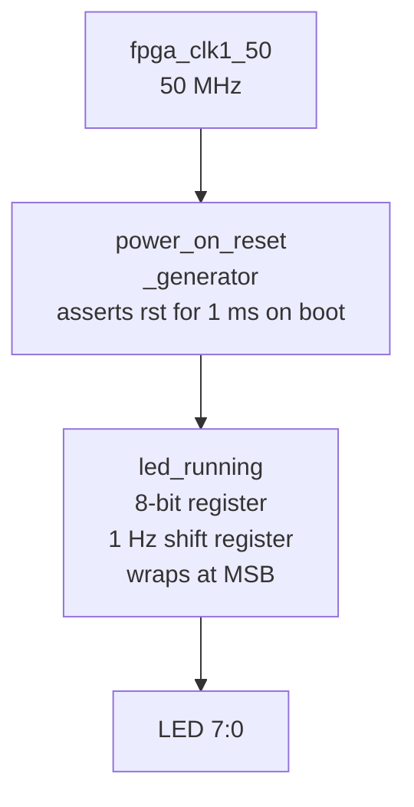

# Tutorial — Shifting Light: LED Running on the DE10-Nano

> **Series:** cvsoc — Stepping into advanced FPGA development on the DE10-Nano  
> **Phase:** 1 — `01_led_running`  
> **Difficulty:** Beginner — requires completion of Phase 0 (`00_led_blinking`)  
> **Time:** ~20 minutes (the design is already built on Phase 0 knowledge)

---

## What you will learn

By the end of this tutorial you will have:

- Implemented a **shift register** in VHDL to create a running-light ("knight rider") LED pattern
- Understood how `unsigned` arithmetic from `ieee.numeric_std` enables shift operations on `std_logic_vector`
- Reused the Phase 0 build and program workflow without change
- Observed a single lit LED travelling across all eight LEDs at 1 Hz

---

## Prerequisites

| Requirement | Details |
|---|---|
| **Phase 0 complete** | You have worked through [tutorial_phase0_led_blinking.md](tutorial_phase0_led_blinking.md) |
| **Docker image** | `cvsoc/quartus:23.1` available locally |
| **USB-Blaster bound** | `usbipd bind` run once in Windows (see Phase 0) |

---

## The design at a glance



Where Phase 0 used eight independent identical instances (one per LED), Phase 1 uses a **single module** that holds all eight LED states in one register and shifts the lit bit one position per clock period.

---

## Step 1 — Understand the VHDL

### The running light module (`hdl/led_running.vhd`)

```vhdl
entity led_running is
  generic (
    G_CLK_FREQ_HZ    : integer := 50000000;
    G_RUNNING_FREQ_HZ : integer := 1
  );
  port (
    clk_i : in  std_logic;
    rst_i : in  std_logic;
    led_o : out std_logic_vector(7 downto 0)
  );
end entity led_running;
```

The interface is almost identical to `led_blinking`, except `led_o` is now an 8-bit vector rather than a single bit.

Inside the architecture, the state register holds the current LED pattern:

```vhdl
signal led_running : std_logic_vector(7 downto 0) := x"01";
```

The initial value `x"01"` means `0000_0001` — only `LED[0]` is lit at power-on.

### The shift operation

```vhdl
if counter = C_COUNTER_MAX - 1 then
  counter <= 0;

  led_running <= std_logic_vector(unsigned(led_running) sll 1);
  if led_running = x"00" then
    led_running <= x"01";
  end if;
```

Breaking this down:

| Expression | What it does |
|---|---|
| `unsigned(led_running)` | Reinterprets the `std_logic_vector` as an unsigned integer |
| `sll 1` | **Shift Left Logical** by 1 bit — moves the lit bit one position toward MSB |
| `std_logic_vector(...)` | Converts back to `std_logic_vector` for assignment |
| `if led_running = x"00"` | Detects when the lit bit has shifted out of the top position |
| `<= x"01"` | Wraps around: restart from `LED[0]` |

> **Why does `= x"00"` catch the wrap-around?** After `LED[7]` is lit (`1000_0000`), one more `sll 1` produces `0000_0000`. The check on the *previous* value (`led_running` before the update) catches `1000_0000` — the last valid position — before shifting, ensuring the reset to `x"01"` happens one cycle later. In practice this is equivalent to checking for the all-zero result.

> **`ieee.numeric_std` vs `ieee.std_logic_arith`:** The `use ieee.numeric_std.all` import provides the `unsigned` type and `sll` operator in a well-defined, synthesis-safe way. The older `std_logic_arith` and `std_logic_unsigned` packages are non-standard and should be avoided in new designs.

### Why the counter is the same

The clock divider (`C_COUNTER_MAX`, the counter, and the timing logic) is identical to Phase 0. The same 25,000,000 cycle half-period is used — one shift per second. This illustrates a key VHDL technique: **reuse of a timing pattern** by separating the "when to act" logic (the counter) from the "what to do" logic (the shift).

### The top-level module (`hdl/de10_nano_top.vhd`)

```vhdl
led_running_inst : entity work.led_running
  port map (
    clk_i => fpga_clk1_50,
    rst_i => power_on_reset,
    led_o => led
  );
```

A single instantiation replaces the generate loop from Phase 0. The 8-bit `led_o` maps directly to the 8-bit `led` port.

---

## Step 2 — Compare with Phase 0

| Aspect | Phase 0 (`led_blinking`) | Phase 1 (`led_running`) |
|---|---|---|
| LED output type | `std_logic` (1 bit) | `std_logic_vector(7 downto 0)` |
| Instance count | 8 (one per LED) | 1 (all LEDs in one module) |
| Action on timeout | Toggle single bit | Shift 8-bit register |
| Wrap-around | N/A | Reset to `x"01"` when shifted to `x"00"` |
| Top-level structure | `generate` loop | Single instantiation |
| Numeric library used | None | `ieee.numeric_std` |

---

## Step 3 — Build the bitstream

From the repository root in WSL2:

```bash
docker run --rm -v $(pwd):/work cvsoc/quartus:23.1 \
  bash -c "cd /work/01_led_running/quartus && make all"
```

Expected output at the end:

```
Info (332119): Timing requirements met.
Info (144001): Generated bitstream file "de10_nano.sof"
Info: Quartus Prime Shell was successful. 0 errors, N warnings
```

Verify the bitstream:

```bash
ls -lh 01_led_running/quartus/de10_nano.sof
```

---

## Step 4 — Attach the USB-Blaster and program

Attach the USB-Blaster to WSL2 (skip if already attached from Phase 0):

```bash
make usb-wsl -C 01_led_running/quartus USBIPD_BUSID=2-4
```

Program the FPGA:

```bash
make program-sof -C 01_led_running/quartus USBIPD_BUSID=2-4
```

Expected output:

```
Info (209011): Successfully performed operation(s)
```

**Observe the board:** A single lit LED should now shift from `LED[0]` to `LED[7]`, then wrap back to `LED[0]`, repeating every 8 seconds.

---

## Step 5 — Experiment

### Speed up the running light

Change the generic to 4 Hz — the light will travel across all 8 LEDs in 2 seconds:

```vhdl
-- hdl/led_running.vhd
entity led_running is
  generic (
    G_CLK_FREQ_HZ    : integer := 50000000;
    G_RUNNING_FREQ_HZ : integer := 4   -- was 1
  );
```

Rebuild and reprogram:

```bash
docker run --rm -v $(pwd):/work cvsoc/quartus:23.1 \
  bash -c "cd /work/01_led_running/quartus && make compile"

make program-sof -C 01_led_running/quartus USBIPD_BUSID=2-4
```

### Reverse the direction

Change `sll` to `srl` (Shift Right Logical) and start from `x"80"`:

```vhdl
signal led_running : std_logic_vector(7 downto 0) := x"80";   -- LED[7] first

-- In the process:
led_running <= std_logic_vector(unsigned(led_running) srl 1);
if led_running = x"00" then
  led_running <= x"80";
end if;
```

### Add a trailing glow (two lit LEDs)

Shift a 2-bit pattern:

```vhdl
signal led_running : std_logic_vector(7 downto 0) := x"03";   -- LED[1:0] lit

led_running <= std_logic_vector(unsigned(led_running) sll 1);
if led_running = x"00" then
  led_running <= x"03";
end if;
```

---

## Summary

| Concept | Where it appears |
|---|---|
| 8-bit shift register | `led_running.vhd` — `led_running` signal |
| `sll` / `srl` (shift operators) | `led_running.vhd` — shift expression |
| `ieee.numeric_std` (`unsigned`) | Required to use `sll` on `std_logic_vector` |
| Wrap-around detection | `if led_running = x"00"` reset to `x"01"` |
| Single module for multi-LED output | `de10_nano_top.vhd` — one instance, 8-bit port |
| Reusing a timing pattern | Same counter/divider as Phase 0 |

---

## What's next

Phase 2 (`04_nios2_led`) introduces a **Nios II soft-core processor** embedded in the FPGA fabric. The LED blinking is no longer hardwired in HDL — it runs as C firmware on the processor. This requires Platform Designer (formerly Qsys), BSP generation, and cross-compilation. See [tutorial_phase2_nios2.md](tutorial_phase2_nios2.md).
