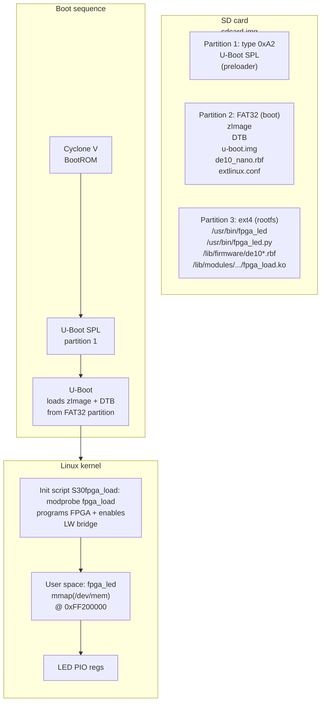

# Phase 6 Tutorial — Embedded Linux on HPS

> **Series:** cvsoc — Stepping into advanced FPGA development on the DE10-Nano  
> **Phase:** 6 of 8  
> **Difficulty:** Intermediate-Advanced — you have completed phases 0–5 and are comfortable with Platform Designer, the Quartus compile flow, ARM bare-metal programming, and hardware interrupt handling

---

## What you will build

By the end of this tutorial you will boot a complete embedded Linux system on the DE10-Nano's ARM Cortex-A9 processor and control the FPGA LEDs from user-space applications:

- **Buildroot** builds a self-contained Linux system: cross-compiler, Linux 6.6 kernel, U-Boot bootloader, and root filesystem — all from a single `make` command
- A **kernel module** (`fpga_load.ko`) programs the FPGA at boot via direct register access and enables the Lightweight HPS-to-FPGA bridge
- A **C application** (`fpga_led`) maps `/dev/mem` into user space and writes LED patterns through `mmap()`
- A **Python script** (`fpga_led.py`) demonstrates the same register access using Python's `mmap` module
- A **genimage** configuration produces a ready-to-flash SD card image containing the U-Boot SPL, kernel, device tree, FPGA bitstream, and root filesystem



The FPGA design is reused unchanged from project 05 (`05_hps_led`). The only new artefact is the Buildroot-based Linux system.

---

## Prerequisites

| Requirement | Details |
|---|---|
| **Docker** | `cvsoc/quartus:23.1` image (for SOF → RBF conversion) |
| **Repository** | `git clone` of `bleviet/cvsoc`; phases 0–5 already working |
| **Phase 3** | Project `05_hps_led` built — the SOF file must exist |
| **Host tools** | `wget`, `tar`, `make`, `gcc`, `mtools` (for SD card image generation) |
| **Board** | Terasic DE10-Nano (Cyclone V `5CSEBA6U23I7`) |
| **SD card** | MicroSD card (≥512 MB) and a card reader |
| **Serial console** | USB-UART adapter connected to DE10-Nano UART header (115200 8N1) |

Verify the Docker image and SOF file before continuing:

```bash
docker images | grep cvsoc/quartus
# Expected: cvsoc/quartus   23.1   ...

ls 05_hps_led/quartus/de10_nano.sof
# Must exist. Run 'make compile' in 05_hps_led/quartus/ if missing.
```

Install `mtools` if not already present (required by genimage for the FAT32 boot partition):

```bash
sudo apt-get install -y mtools
```

> **Where do commands run?** This tutorial involves three environments. Code
> blocks are annotated with 🖥️ **Host**, 🐳 **Docker**, or 📟 **Target** when
> the context is not obvious from the surrounding text.
>
> | Environment | What | Examples |
> |---|---|---|
> | 🖥️ **Host** (your Linux / WSL2 machine) | Building, flashing SD card | `make buildroot`, `make app-cross`, `dd` |
> | 🐳 **Docker** (`cvsoc/quartus:23.1`) | FPGA bitstream conversion only | `make rbf` (wraps `quartus_cpf`) |
> | 📟 **Target** (DE10-Nano via serial console) | Running apps on the board | `fpga_led`, `devmem`, `dmesg` |
>
> `make rbf` is the **only** command that requires Docker. Everything else —
> including `make buildroot` and `make app-cross` — runs natively on the host
> using Buildroot's own cross-compiler (no Quartus or Docker needed).

---

## Concepts in 5 minutes

Before touching any file, read these ideas. They explain *why* each component is needed and *how* the pieces fit together.

### From bare-metal to Linux

In phases 3–5 your C code ran directly on the ARM Cortex-A9 with no operating system. The startup assembly set up the exception vector table, initialised the stack, disabled watchdogs, configured the LW H2F bridge, and jumped to `main()`. Your code had direct access to every register.

Linux changes the game:

| Aspect | Bare-metal (Phase 3) | Linux (Phase 6) |
|--------|---------------------|-----------------|
| **Memory access** | Direct physical address (`*(volatile uint32_t *)0xFF200000`) | Via `mmap()` on `/dev/mem` at `0xFF200000` |
| **Peripheral init** | Manual bridge release, watchdog disable | Kernel module `fpga_load.ko` handles it at boot |
| **Build system** | Cross-compiler + linker script | Buildroot (builds entire OS) |
| **Boot** | U-Boot SPL → bare-metal ELF in OCRAM | U-Boot SPL → U-Boot → Linux kernel → init → shell |
| **User interaction** | JTAG debugger | Serial console (+ SSH if Ethernet connected) |

### Buildroot

[Buildroot](https://buildroot.org/) is a Makefile-based build system that produces a complete embedded Linux image from source. You configure it with a `defconfig` file (similar to the Linux kernel's own Kconfig system), and a single `make` builds:

1. A **cross-toolchain** (GCC + glibc for ARM)
2. The **Linux kernel** (zImage + device tree blob)
3. **U-Boot** bootloader (with SPL for Cyclone V)
4. The **root filesystem** (BusyBox + custom packages)
5. An **SD card image** (partitioned and ready to flash)

Buildroot supports an **external tree** (`BR2_EXTERNAL`) that keeps all board-specific files outside the Buildroot source tree. This project uses an external tree in `br2-external/` to hold the defconfig, board scripts, kernel config fragments, and the `fpga-led` package.

### FPGA programming from Linux

Unlike bare-metal where the FPGA is typically pre-programmed via JTAG, a Linux system can program the FPGA dynamically at boot time. The Cyclone V FPGA Manager is a hardware block with memory-mapped registers at `0xFF706000` that controls the FPGA configuration process.

This project uses a **custom kernel module** (`fpga_load.ko`) that:

1. Maps the FPGA Manager registers via `ioremap()`
2. Puts the FPGA into configuration mode (reset → config state)
3. Writes the compressed bitstream to the FPGA data port (`0xFFB90000`)
4. Polls for CONF_DONE assertion (configuration complete)
5. Waits for USER_MODE (FPGA fully operational)
6. Enables the LW HPS-to-FPGA bridge (reset cycle + L3 remap)

> **Why not use the kernel's `fpga_mgr` API?** The mainline FPGA Manager driver uses a 10ms IRQ-based timeout for CONF_DONE that is too short in practice and causes spurious failures. Direct register access with a 5-second polling loop is more reliable for initial bring-up.

### User-space register access via `/dev/mem`

Once the FPGA is programmed and the bridge is enabled, user-space code accesses hardware registers through `/dev/mem`:

```c
int fd = open("/dev/mem", O_RDWR | O_SYNC);
volatile uint32_t *base = mmap(NULL, 0x1000,
    PROT_READ | PROT_WRITE, MAP_SHARED, fd, 0xFF200000);

// Write to the LED PIO DATA register (offset 0x00)
*base = 0xAA;  // alternating LEDs on

munmap(base, 0x1000);
close(fd);
```

This is equivalent to the bare-metal `*(volatile uint32_t *)0xFF200000 = 0xAA`, but goes through the kernel's memory management — the physical address is translated via the page table set up by `mmap()`.

### SD card partition layout

The Cyclone V BootROM expects a specific SD card layout:

| Partition | Type | Content | Purpose |
|-----------|------|---------|---------|
| 1 | `0xA2` (custom) | `u-boot-with-spl.sfp` | BootROM loads SPL from here |
| 2 | `0x0C` (FAT32) | zImage, DTB, u-boot.img, RBF, extlinux.conf | U-Boot loads kernel from here |
| 3 | `0x83` (ext4) | Root filesystem | Linux mounts as `/` |

The BootROM scans the MBR partition table for a type-`0xA2` entry and reads the U-Boot SPL (Second Program Loader) from it. The SPL initialises DDR3 SDRAM and loads the full U-Boot from the FAT32 partition. U-Boot then uses its `distro boot` mechanism to find `extlinux/extlinux.conf`, which tells it which kernel and DTB to load.

### Compressed RBF and MSEL switches

The DE10-Nano's MSEL DIP switches are factory-set to `0x0A` (Fast Passive Parallel ×32 with Decompression). This means the FPGA's hardware decompression engine is **always active** and expects a **compressed** bitstream. An uncompressed RBF will cause CONF_DONE to never assert — the decompression engine cannot parse raw configuration data.

The conversion script uses `quartus_cpf -c --option=bitstream_compression=on` to produce a compressed RBF (~1.9 MB instead of ~7 MB uncompressed).

---

## Project structure

```
10_linux_led/
├── Makefile                          ← Top-level orchestration
├── .gitignore
├── de10_nano.rbf                     ← Compressed FPGA bitstream (generated)
├── br2-external/                     ← Buildroot external tree
│   ├── external.desc                 ← BR2_EXTERNAL descriptor
│   ├── external.mk                   ← Package makefile includes
│   ├── Config.in                     ← Package Kconfig menu
│   ├── configs/
│   │   └── de10_nano_defconfig       ← Master Buildroot configuration
│   ├── board/de10_nano/
│   │   ├── genimage.cfg              ← SD card partition layout
│   │   ├── linux-uio.fragment        ← Kernel config: FPGA Manager + UIO
│   │   ├── extlinux.conf             ← U-Boot distro boot config
│   │   ├── S30fpga_load              ← Init script: loads fpga_load.ko at boot
│   │   ├── uboot.fragment            ← U-Boot config: enable bootcmd
│   │   ├── post-build.sh             ← Copies scripts/firmware to rootfs
│   │   ├── post-image.sh             ← Generates SD card image
│   │   └── uboot-env.txt             ← Reference U-Boot environment
│   └── package/
│       ├── fpga-led/
│       │   ├── Config.in             ← Buildroot package: fpga-led app
│       │   └── fpga-led.mk           ← generic-package makefile
│       └── fpga-mgr-load/
│           ├── Config.in             ← Buildroot package: fpga_load.ko module
│           └── fpga-mgr-load.mk      ← kernel-module makefile
├── dts/
│   └── fpga_led_overlay.dts          ← Device tree overlay source (reference)
├── software/
│   ├── fpga_led/
│   │   ├── fpga_led.c                ← C LED controller (/dev/mem mmap)
│   │   └── Makefile                  ← Cross-compile Makefile
│   ├── fpga_load/
│   │   ├── fpga_load.c               ← Kernel module: FPGA programming + bridge
│   │   ├── Makefile                  ← Kernel module build
│   │   └── Kbuild                    ← Kernel build system integration
│   └── fpga_led.py                   ← Python LED controller (/dev/mem)
└── scripts/
    └── convert_sof_to_rbf.sh         ← SOF → compressed RBF (runs in Docker)
```

---

## Step 1 — Convert the FPGA bitstream

Linux loads FPGA bitstreams in Raw Binary Format (`.rbf`), not the Quartus `.sof` format. Convert the existing bitstream from project 05:

```bash
# 🐳 Runs quartus_cpf inside Docker — the only step that requires Docker
cd 10_linux_led
make rbf
```

This runs `quartus_cpf` inside the Docker container to produce `de10_nano.rbf` (~1.9 MB compressed).

> **Critical: compression must be enabled.** The DE10-Nano's MSEL switches are set to `0x0A` (PP32 Fast with Decompression). The FPGA hardware decompression engine is active and **requires** a compressed bitstream. The script uses `quartus_cpf -c --option=bitstream_compression=on` — if you pass an uncompressed RBF, CONF_DONE will never assert and FPGA programming will time out.

---

## Step 2 — Build the Linux system

### 2.1 Download Buildroot

```bash
make buildroot-download
```

This downloads and extracts Buildroot 2024.11.1 (~8 MB compressed, ~80 MB extracted) into `buildroot-2024.11.1/`.

### 2.2 Configure and build

```bash
# 🖥️ Host — no Docker needed; Buildroot builds its own cross-compiler
make buildroot
```

1. Applies the `de10_nano_defconfig` (with `BR2_EXTERNAL` pointing to `br2-external/`)
2. Downloads and builds the ARM cross-compiler (GCC + glibc)
3. Downloads and builds Linux 6.6.86 with the `socfpga` defconfig plus FPGA Manager kernel config fragment
4. Downloads and builds U-Boot 2024.07 with the `socfpga_de10_nano` defconfig plus bootcommand fragment
5. Builds the `fpga_load.ko` kernel module (FPGA programmer + bridge enable)
6. Builds the root filesystem with BusyBox, Python 3, and the `fpga_led` application
7. Runs `post-build.sh` to install init scripts, firmware, and Python scripts into the rootfs
8. Runs `post-image.sh` and `genimage` to assemble the final SD card image

> **First build time:** approximately 15–30 minutes depending on your machine and internet speed. Subsequent builds that only change user-space code take under a minute.

> **WSL2 note:** If your `PATH` contains Windows paths with spaces (common on WSL2), Buildroot will refuse to build. The top-level Makefile handles this automatically by sanitising PATH. If you invoke Buildroot directly, sanitise your PATH first:
> ```bash
> export PATH=$(echo "$PATH" | tr ':' '\n' | grep -v ' ' | tr '\n' ':' | sed 's/:$//')
> ```

### 2.3 Verify the output

After a successful build, the images directory contains:

```bash
ls -lh buildroot-2024.11.1/output/images/
```

| File | Size | Description |
|------|------|-------------|
| `sdcard.img` | ~194 MB | Complete SD card image (flash this) |
| `zImage` | ~6 MB | Compressed Linux kernel |
| `socfpga_cyclone5_de0_nano_soc.dtb` | ~20 KB | Device tree blob |
| `u-boot-with-spl.sfp` | ~758 KB | U-Boot SPL + full U-Boot |
| `rootfs.ext4` | 128 MB | Root filesystem |
| `de10_nano.rbf` | ~1.9 MB | Compressed FPGA bitstream |

---

## Step 3 — Write the SD card

Insert a microSD card into your card reader and identify the device:

```bash
lsblk
# Look for a device matching your SD card size (e.g., /dev/sdb or /dev/mmcblk0)
# DOUBLE CHECK — writing to the wrong device will destroy data!
```

Write the image:

```bash
make flash SDCARD=/dev/sdX
# Or manually:
sudo dd if=buildroot-2024.11.1/output/images/sdcard.img of=/dev/sdX bs=4M status=progress conv=fsync
```

> **Windows/WSL2:** If your SD card reader is on the Windows side, copy the image to a Windows-accessible path and use [balenaEtcher](https://etcher.balena.io/) or Win32DiskImager:
> ```bash
> cp buildroot-2024.11.1/output/images/sdcard.img /mnt/c/Windows/Temp/
> ```
> Then flash `C:\Windows\Temp\sdcard.img` from Windows.

---

## Step 4 — Boot the DE10-Nano

### 4.1 Hardware connections

1. Insert the microSD card into the DE10-Nano's SD card slot
2. Connect a USB-UART adapter to the UART header (J4):
   - Pin 1 (GND) → adapter GND
   - Pin 10 (UART0_TX) → adapter RX
   - Pin 9 (UART0_RX) → adapter TX
3. Open a serial terminal at **115200 baud, 8N1**:
   ```bash
   picocom -b 115200 --noreset --noinit /dev/ttyUSB0
   # Or: screen /dev/ttyUSB0 115200
   # Or: minicom -D /dev/ttyUSB0 -b 115200
   ```
4. Power on the board (12V barrel connector)

> **WSL2 UART tip:** Under WSL2, USB serial devices are not natively visible. Use `usbipd` to attach the USB-UART adapter to WSL2:
> ```powershell
> # In PowerShell (admin):
> usbipd list              # find the USB Serial Device
> usbipd bind --busid X-Y  # first time only
> usbipd attach --wsl --busid X-Y
> ```
> Then `/dev/ttyUSB0` will appear in WSL2.

### 4.2 Expected boot output

You should see U-Boot SPL messages, then U-Boot proper, then the Linux kernel:

```
U-Boot SPL 2024.07 (...)
Trying to boot from MMC1


U-Boot 2024.07 (...)
socfpga_de10_nano - Pair HPS with FPGA

Hit any key to stop autoboot:  0
...
Scanning mmc 0:2...
Found /extlinux/extlinux.conf
...
Retrieving file: /zImage
Retrieving file: /socfpga_cyclone5_de0_nano_soc.dtb
...
Starting kernel ...

[    0.000000] Booting Linux on physical CPU 0x0
[    0.000000] Linux version 6.6.86 (buildroot@host) ...
...
Starting FPGA programming...
fpga_load: MSEL=0x0A STAT=0x... GPIO=0x...
fpga_load: CONF_DONE! gpio=0x00000F07 at i=0
fpga_load: FPGA programmed successfully!
fpga_load: LW H2F bridge enabled
OK
...
Welcome to DE10-Nano (cvsoc Phase 6 — Embedded Linux)
de10nano login:
```

Log in as `root` (no password).

> **Key lines to look for:**
> - `fpga_load: CONF_DONE!` — FPGA programmed successfully
> - `fpga_load: LW H2F bridge enabled` — bridge is up, registers accessible
> - If you see `TIMEOUT - CONF_DONE never asserted`, see [Troubleshooting](#troubleshooting)
>
> **If your current SD card stops in U-Boot instead:** type `run distro_bootcmd` at the
> `=>` prompt. Older images were built before the U-Boot fragment-path fix below, so
> they do not auto-boot even though the rest of the Linux image is fine.

---

## Step 5 — Control the LEDs

### 5.1 Quick test with devmem

BusyBox provides `devmem` for direct register access (useful for quick checks):

```bash
# 📟 Target — run these on the DE10-Nano via serial console
# Read current LED value
devmem 0xFF200000
# Expected: 0x00000000

# Set all LEDs on
devmem 0xFF200000 32 0xFF
# All 8 LEDs light up!

# Set alternating pattern
devmem 0xFF200000 32 0xAA

# Turn LEDs off
devmem 0xFF200000 32 0x00
```

### 5.2 Run the C application

```bash
# 📟 Target — run on the DE10-Nano
# Cycle through all LED patterns (Ctrl+C to stop)
fpga_led

# Set a specific pattern
fpga_led 0xAA

# Run a named animation
fpga_led --pattern chase
fpga_led --pattern breathe --speed 50

# Show help
fpga_led --help
```

Example output:

```
# fpga_led --pattern chase
FPGA LED controller — /dev/mem @ 0xFF200000
Current LED value: 0x00
Running pattern: chase (speed: 100 ms, Ctrl+C to stop)
^C
LEDs turned off. Goodbye.
```

> **Stale-image check:** if `fpga_led` instead prints `Error: cannot open /dev/uio0` or
> suggests `modprobe uio_pdrv_genirq`, you are booted into an older Phase 6 image from
> before the `/dev/mem` rewrite. Reflash the current `sdcard.img`.

Available patterns:

| Pattern | Description |
|---------|-------------|
| `chase` | Single LED running left to right |
| `breathe` | LEDs fill up then drain |
| `blink` | All 8 LEDs blink on and off |
| `stripes` | Alternating 0xAA / 0x55 pattern |
| `all` | Cycle through all patterns (default) |

### 5.3 Run the Python script

```bash
# 📟 Target
# Run a pattern
fpga_led.py --pattern chase

# Set a specific value
fpga_led.py --value 0x55

# Adjust speed (in seconds)
fpga_led.py --pattern breathe --speed 0.05
```

---

## Step 6 — Iterate on the application

One of the advantages of Linux is rapid iteration. You can recompile the C application on the host and copy it to the running board:

```bash
# 🖥️ Host — uses Buildroot's cross-compiler (no Docker needed)
make app-cross ARM_CC=buildroot-2024.11.1/output/host/bin/arm-linux-gnueabihf-gcc

# 🖥️ Host — copy to the board (if Ethernet is connected)
scp software/fpga_led/fpga_led root@<board-ip>:/usr/bin/

# 🖥️ Host — or transfer via UART using base64
cat software/fpga_led/fpga_led | base64 > /tmp/fpga_led.b64
# 📟 Target: base64 -d /tmp/fpga_led.b64 > /usr/bin/fpga_led && chmod +x /usr/bin/fpga_led

# 🖥️ Host — or rebuild the entire image and re-flash
make buildroot
```

For the Python script, simply edit `software/fpga_led.py` on the host and copy it to the board — no compilation needed.

---

## Understanding the key files

### FPGA programming module (`software/fpga_load/fpga_load.c`)

This kernel module is the heart of FPGA initialization. It performs the complete FPGA Manager programming sequence via direct register access:

```c
/* Physical base addresses */
#define FPGAMGR_PHYS  0xFF706000   // FPGA Manager control registers
#define FPGADAT_PHYS  0xFFB90000   // FPGA configuration data port
#define RSTMGR_BRGMODRST 0xFFD0501C  // Bridge reset register
#define L3_REMAP      0xFF800000   // L3 GPV remap register
```

The programming sequence:

1. **Set CDRATIO and CFGWDTH** — For MSEL=0x0A: CDRATIO=X8, CFGWDTH=32
2. **Reset the FPGA** — Assert NCFGPULL, wait for RESET state
3. **Enter CONFIG** — Release NCFGPULL, wait for CONFIG state
4. **Clear EOI** — Write `0xFFF` to GPIO_PORTA_EOI to clear pending interrupts
5. **Enable AXICFGEN** — Opens the AXI data path to the FPGA
6. **Write bitstream** — 32-bit `writel()` loop to the data port
7. **Poll CONF_DONE** — 5-second loop checking GPIO_EXT bit 1 (AXICFGEN must remain set!)
8. **Finalize** — Clear AXICFGEN, send DCLK pulses, wait for USER_MODE
9. **Enable bridges** — Cycle RSTMGR_BRGMODRST, then set L3_REMAP bits

### Init script (`board/de10_nano/S30fpga_load`)

```sh
#!/bin/sh
# Loads the kernel module which programs the FPGA and enables bridges.
# Use modprobe so it picks the correct copy from updates/ (depmod order).
modprobe fpga_load firmware="de10_nano.rbf"
```

This runs at boot (BusyBox init, priority 30 — after modules are loaded). The `firmware=` parameter tells the module which RBF file to load from `/lib/firmware/`.

### C application (`software/fpga_led/fpga_led.c`)

The core of the user-space application:

```c
#define LWH2F_BASE  0xFF200000
#define MAP_SIZE    0x1000

int fd = open("/dev/mem", O_RDWR | O_SYNC);
volatile uint32_t *base = mmap(NULL, MAP_SIZE,
    PROT_READ | PROT_WRITE, MAP_SHARED, fd, LWH2F_BASE);

// Write to the LED PIO DATA register (offset 0x00)
*base = 0xFF;  // all LEDs on
```

`mmap()` on `/dev/mem` maps the physical Lightweight HPS-to-FPGA bridge region into the process's virtual address space. Writes to the mapped memory go directly to the FPGA fabric — no kernel transition, no ioctl, just a store instruction.

### SD card layout (`board/de10_nano/genimage.cfg`)

The `genimage.cfg` file defines three partitions:

1. **U-Boot SPL** (type `0xA2`, offset 1 MB) — the Cyclone V BootROM searches for this specific partition type
2. **FAT32 boot** (64 MB) — contains zImage, DTB, U-Boot, FPGA bitstream, and `extlinux.conf`
3. **ext4 rootfs** (128 MB) — the full Linux root filesystem

### Buildroot external tree (`br2-external/`)

The external tree keeps all DE10-Nano customisations outside the Buildroot source:

- `external.desc` — declares the external tree name (`DE10_NANO`)
- `configs/de10_nano_defconfig` — the master configuration (architecture, toolchain, kernel, U-Boot, packages)
- `board/de10_nano/` — board-specific scripts, config fragments, and init scripts
- `package/fpga-led/` — Buildroot package definition for the C application
- `package/fpga-mgr-load/` — Buildroot package definition for the kernel module

### U-Boot configuration (`board/de10_nano/uboot.fragment`)

```
CONFIG_USE_BOOTCOMMAND=y
CONFIG_BOOTCOMMAND="run distro_bootcmd"
```

The stock `socfpga_de10_nano_defconfig` in U-Boot 2024.07 does **not** define a `bootcmd`, which causes U-Boot to drop to the `=>` prompt instead of auto-booting. This fragment enables automatic boot via the distro boot mechanism.

---

## Troubleshooting

### FPGA programming times out (CONF_DONE never asserted)

**Symptom:** `fpga_load: TIMEOUT - CONF_DONE never asserted. gpio=0x...`

**Root cause:** The RBF bitstream is uncompressed, but the DE10-Nano's MSEL switches (`0x0A`) require a compressed bitstream.

**Fix:** Regenerate the RBF with compression enabled:
```bash
quartus_cpf -c --option=bitstream_compression=on input.sof output.rbf
```

The `scripts/convert_sof_to_rbf.sh` already does this. If you manually generated the RBF, ensure compression is on.

**How to verify MSEL:** In the kernel module boot log:
```
fpga_load: MSEL=0x0A ...
```
MSEL `0x0A` = Fast Passive Parallel ×32 with AES + Decompression. The decompression engine is active and rejects uncompressed data.

### U-Boot stops at `=>` prompt (no auto-boot)

**Symptom:** U-Boot prints its banner but does not automatically load Linux.

**Root cause:** The stock U-Boot `socfpga_de10_nano` defconfig leaves `CONFIG_USE_BOOTCOMMAND`
unset, and the original Buildroot defconfig in this repo pointed at the wrong external-tree
variable, so `uboot.fragment` was not applied.

**Workaround (manual boot):** At the `=>` prompt, type:
```
run distro_bootcmd
```

**Permanent fix:** The `uboot.fragment` in `br2-external/board/de10_nano/` sets:
```
CONFIG_USE_BOOTCOMMAND=y
CONFIG_BOOTCOMMAND="run distro_bootcmd"
```

The original bug was a wrong external-tree variable in `de10_nano_defconfig`. The correct setting is:
```
BR2_TARGET_UBOOT_CONFIG_FRAGMENT_FILES="$(BR2_EXTERNAL_DE10_NANO_PATH)/board/de10_nano/uboot.fragment"
```

### `devmem 0xFF200000` returns bus error

The LW H2F bridge is not enabled. This can happen if:

1. **FPGA is not programmed** — `fpga_load.ko` failed to load or the S30 init script didn't run
2. **Bridge resets not released** — Check `dmesg | grep fpga_load` for the "LW H2F bridge enabled" message
3. **fpga_load.ko is stale** — Verify the module has bridge-enable code: `dmesg | grep "LW H2F bridge enabled"`
4. **You are running an older flashed image** — Older Phase 6 images still contain the UIO-based
   `fpga_led` binary and predate the final bridge-enable fixes

If you see both of these together:

- `fpga_led` fails with `cannot open /dev/uio0`
- `devmem 0xFF200000` ends in `Bus error`

then the most likely root cause is that the board is still booting an older SD card image. The
current Phase 6 image uses `/dev/mem`, prints `FPGA LED controller — /dev/mem @ 0xFF200000`, and
boots with the corrected FPGA/bridge sequence. Reflash:

```bash
sudo dd if=10_linux_led/buildroot-2024.11.1/output/images/sdcard.img of=/dev/sdX bs=4M status=progress conv=fsync
```

To manually enable the bridge (after FPGA is programmed):
```bash
# Assert then deassert bridge resets
devmem 0xFFD0501C 32 0x7    # assert all bridge resets
devmem 0xFFD0501C 32 0x0    # deassert
# Set L3 remap bits
devmem 0xFF800000 32 0x18   # enable H2F + LW H2F in L3 GPV
```

### Serial console shows garbage or no output

Verify the baud rate is **115200** and the TX/RX lines are not swapped. The DE10-Nano UART header (J4) pinout:

```
J4 header (looking at the board with UART header on left side):
Pin 1  (GND)      — Connect to adapter GND
Pin 9  (UART0_RX) — Connect to adapter TX
Pin 10 (UART0_TX) — Connect to adapter RX
```

> **Tip:** If using picocom on WSL2, add `--noreset --noinit` to prevent picocom from sending modem control signals that can reset the board:
> ```bash
> picocom -b 115200 --noreset --noinit /dev/ttyUSB0
> ```

### `/dev/ttyUSB0` busy or locked

If picocom reports "Device or resource busy", another process holds the serial port:

```bash
fuser /dev/ttyUSB0
# Shows PID of the process holding the port
# Then kill it (replace 12345 with actual PID):
kill 12345
```

### Build fails: `You seem to have a path with spaces`

Buildroot cannot handle paths containing spaces. On WSL2, the Windows `PATH` is inherited and often contains spaces. The top-level Makefile handles this automatically. If you invoke Buildroot directly, sanitise PATH first:

```bash
export PATH=$(echo "$PATH" | tr ':' '\n' | grep -v ' ' | tr '\n' ':' | sed 's/:$//')
```

---

## How the FPGA programming works (deep dive)

This section explains the hardware-verified programming sequence for readers who want to understand or modify the kernel module.

### MSEL and CDRATIO

The Cyclone V FPGA has physical mode-select switches (MSEL[4:0]) that determine the configuration scheme. The DE10-Nano uses MSEL = `0b01010` (0x0A), which maps to:

| Parameter | Value | Meaning |
|-----------|-------|---------|
| Mode | FPPx32 | Fast Passive Parallel, 32-bit data |
| AES | Optional | Encryption available but not used |
| Decompression | Enabled | Hardware decompression is **active** |
| CDRATIO | X8 | Clock-to-data ratio for decompression |
| CFGWDTH | 32 | Configuration data width |

The CDRATIO and CFGWDTH values are taken from the Linux kernel source (`drivers/fpga/socfpga.c`, `cfgmgr_modes[]` array) and **must** match what the hardware expects.

### Register map

| Address | Register | Purpose |
|---------|----------|---------|
| `0xFF706000` | FPGAMGR_STAT | Current state machine state + MSEL readback |
| `0xFF706004` | FPGAMGR_CTRL | Configuration control (EN, NCE, NCFGPULL, CDRATIO, AXICFGEN) |
| `0xFF706008` | FPGAMGR_DCLKCNT | DCLK pulse count for finalization |
| `0xFF706850` | FPGAMGR_GPIO_EXT | nSTATUS, CONF_DONE, INIT_DONE monitoring |
| `0xFF70684C` | GPIO_PORTA_EOI | End-of-interrupt clear (must clear before data write) |
| `0xFFB90000` | Data port | 32-bit write-only: bitstream data goes here |

### State machine progression

```
POWER_OFF → RESET → CONFIG → INIT → USER_MODE
                         ↑              ↑
                    After NCFGPULL   After CONF_DONE
                    release          + DCLK pulses
```

### Bridge enable sequence

After FPGA reaches USER_MODE, the HPS-to-FPGA bridges must be explicitly enabled:

1. **Assert bridge resets** (`RSTMGR_BRGMODRST @ 0xFFD0501C`): Write bits [2:0] = `0x7`
2. **Wait 100µs** for reset to propagate
3. **Deassert bridge resets**: Clear bits [2:0] = `0x0`
4. **Wait 100µs** for bridges to come out of reset
5. **Set L3 remap** (`L3_REMAP @ 0xFF800000`): Set bit 4 (LW H2F) and bit 3 (H2F)

> **Critical:** Accessing `0xFF200000` before the bridge is enabled will cause an AXI bus stall and hang the system (bus error or complete freeze).

---

## What you have learned

| Concept | Where demonstrated |
|---|---|
| Building a complete Linux system with Buildroot | `make buildroot` produces kernel, U-Boot, rootfs, SD card image |
| Buildroot external tree for board customisation | `br2-external/` with defconfig, board scripts, custom packages |
| FPGA programming from Linux via kernel module | `fpga_load.ko` — direct FPGA Manager register access |
| Compressed bitstream requirement (MSEL) | `convert_sof_to_rbf.sh` with `bitstream_compression=on` |
| HPS-to-FPGA bridge initialization | Reset cycle + L3 remap in `fpga_load.c` |
| User-space register access via `mmap()` | `fpga_led.c` — `mmap()` on `/dev/mem` at `0xFF200000` |
| Python mmap for hardware access | `fpga_led.py` — same registers from Python |
| SD card partition layout for Cyclone V | `genimage.cfg` — type 0xA2 SPL + FAT32 + ext4 |
| U-Boot distro boot mechanism | `extlinux.conf` → automatic kernel + DTB loading |
| Init scripts for hardware initialization | `S30fpga_load` loads kernel module at boot |

---

## Next steps

- **Ethernet control (Phase 7):** Add a TCP/UDP server to `fpga_led` so you can control the LEDs remotely from a PC. This builds on the Linux networking stack already present in the image.
- **UIO driver integration:** Add a `compatible = "generic-uio"` node to the device tree for a cleaner user-space interface without requiring root access to `/dev/mem`.
- **Custom kernel driver:** Replace the `/dev/mem` approach with a full `platform_driver` that exposes LED control through the kernel LED subsystem (`/sys/class/leds/`).
- **Runtime device tree overlays:** Rebuild the kernel DTB with symbols (`-@` flag) and apply overlays at runtime through configfs — useful for hot-plugging FPGA peripherals.
- **FPGA Manager API:** Once the 10ms IRQ timeout is resolved upstream (or with a patched kernel), switch from direct register access to the standard `fpga_mgr_load()` API for better maintainability.
