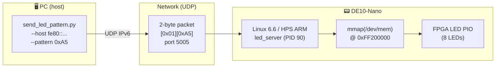
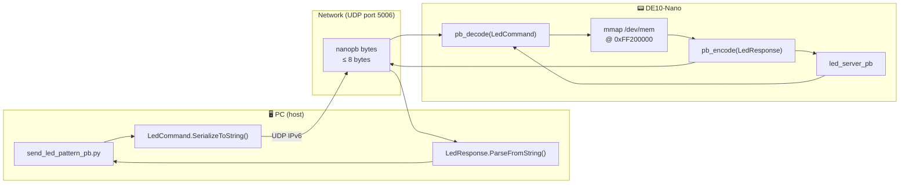
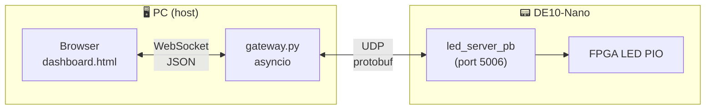

# Phase 7 Tutorial — Ethernet LED Control over UDP

> **Series:** cvsoc — Stepping into advanced FPGA development on the DE10-Nano  
> **Phase:** 7 of 8  
> **Difficulty:** Intermediate-Advanced — you have completed phases 0–6 and are comfortable with Buildroot, the Linux `/dev/mem` approach, and the HPS-to-FPGA bridge

---

## What you will build

By the end of this tutorial you will control the DE10-Nano's FPGA LEDs remotely over UDP from your PC — no serial console, no direct hardware access:

- A **Buildroot Linux image** that includes a Dropbear SSH server and a custom UDP LED server (`led_server`) as a pre-installed, auto-starting service
- A **C UDP server** (`led_server`) that runs on the board at boot, receives 2-byte commands from the network, and writes patterns to the FPGA LED PIO register via `mmap()` on `/dev/mem`
- A **Python client** (`send_led_pattern.py`) that runs on your PC and supports single-pattern commands, live pattern reads, and named animations over UDP
- A complete **deployment workflow** using `scp` and `make server-cross` for rapid iteration without a full Buildroot rebuild



The FPGA design is **reused unchanged** from project `10_linux_led` (Phase 6). The only new component is the Linux UDP server packaged into the Buildroot image.

---

## Prerequisites

| Requirement | Details |
|---|---|
| **Phase 6 complete** | Project `10_linux_led` must have been built — the `de10_nano.rbf` bitstream must exist |
| **Host tools** | `wget`, `tar`, `make`, `gcc`, `mtools`, Python 3 (for PC client and `make test`) |
| **Docker** | `cvsoc/quartus:23.1` image (for `make server-cross` cross-compile iterations only) |
| **Repository** | `git clone` of `bleviet/cvsoc`; phases 0–6 complete |
| **Board** | Terasic DE10-Nano (Cyclone V `5CSEBA6U23I7`) |
| **SD card** | MicroSD card (≥512 MB) and a card reader |
| **Ethernet** | USB-to-Ethernet adapter or direct Ethernet cable between PC and DE10-Nano |
| **Serial console** | USB-UART adapter connected to DE10-Nano UART header (115200 8N1) — only needed for first-boot SSH setup |

Verify the Phase 6 bitstream exists before continuing:

```bash
ls 10_linux_led/de10_nano.rbf
# Must exist. Run 'make rbf' in 10_linux_led/ if missing.
```

> **Where do commands run?** This tutorial involves three environments. Code
> blocks are annotated with 🖥️ **Host**, 🐳 **Docker**, or 📟 **Target** when
> the context is not obvious from the surrounding text.
>
> | Environment | What | Examples |
> |---|---|---|
> | 🖥️ **Host** (your Linux / WSL2 machine) | Building, flashing SD card, running Python client | `make buildroot`, `make flash`, `python3 client/send_led_pattern.py` |
> | 🐳 **Docker** (`cvsoc/quartus:23.1`) | Quick cross-compile for iteration | `make server-cross` |
> | 📟 **Target** (DE10-Nano via serial or SSH) | Verification only — `led_server` starts automatically | `ps aux`, `cat /var/log/led_server.log` |
>
> Unlike Phase 6, **no Quartus tools are required**: `make rbf` copies the existing bitstream
> from Phase 6. The only Docker call in this project is `make server-cross`, and even that
> is only needed for manual server iteration — a full `make buildroot` uses the host Buildroot
> cross-compiler.

---

## Concepts in 5 minutes

Before touching any file, read these ideas. They explain *why* each design decision was made and *how* the pieces fit together.

### UDP vs. TCP for LED control

The wire protocol uses **UDP** (User Datagram Protocol), not TCP. The trade-off is deliberate:

| Aspect | TCP | UDP |
|--------|-----|-----|
| **Setup** | 3-way handshake before first byte | No connection — send immediately |
| **Reliability** | Guaranteed delivery, ordered | Best-effort, no ordering guarantee |
| **Latency** | Higher (ACK wait, congestion control) | Lower (fire-and-forget) |
| **Server state** | Must track connection per client | Stateless — any client, any time |
| **LED control fit** | Over-engineered for 2-byte commands | Natural fit — missed frame ≠ catastrophe |

For a toy LED controller the reliability difference is irrelevant: if one SET_PATTERN packet is lost, the next one will be there in milliseconds. UDP's stateless, connectionless nature means the server loop is a single `recvfrom()` — no `accept()`, no per-client state, no connection teardown.

### Dual-stack IPv6 sockets

`led_server` opens a single `AF_INET6` socket with `IPV6_V6ONLY` set to `0`. This makes it **dual-stack**: it accepts both native IPv6 clients and IPv4 clients (where the IPv4 address is represented as an IPv4-mapped IPv6 address, e.g. `::ffff:192.168.1.100`).

The Python client uses `socket.getaddrinfo()` before opening its socket, which resolves the host string to the right address family automatically. This means the same client code handles all three cases:

| Host argument | Resolved family | Example |
|---|---|---|
| `192.168.1.100` | `AF_INET` | IPv4 direct |
| `fd00::1` | `AF_INET6` | IPv6 global |
| `fe80::2833:8aff:fe95:cb3d%enx08beac224c03` | `AF_INET6` | Link-local with zone ID |

### Link-local IPv6 addresses (no DHCP needed)

When the DE10-Nano boots Linux and brings up its `eth0` interface, the kernel immediately assigns a **link-local** IPv6 address in the `fe80::/10` prefix. This address is derived from the MAC address using **SLAAC** (Stateless Address Autoconfiguration, RFC 4862) and requires no DHCP server.

Link-local addresses are only valid on the directly connected network segment. To contact the board you must specify both the address and the **zone ID** (the interface name on your host):

```
fe80::2833:8aff:fe95:cb3d%enx08beac224c03
```

The `%enx...` suffix tells the OS which interface to use for the link-local route. Without it, the OS cannot determine which physical link to send the packet on.

> **Discovery:** Use the all-nodes multicast address to find the board's IPv6 address without a DHCP server or ARP:
> ```bash
> ping6 -c3 -I enx08beac224c03 ff02::1
> ```
> Every IPv6 node on the link replies. The board's address is the one that is *not* your host's `fe80::` address.

### Buildroot packaging: the `led-server` package

The `led_server` binary is not compiled on the board — it is cross-compiled during the Buildroot build and installed into the root filesystem as a proper Buildroot package. The package definition in `br2-external/package/led-server/` tells Buildroot:

1. Where the source lives (local path relative to the external tree)
2. How to build it (`arm-linux-gnueabihf-gcc` via `$(TARGET_CONFIGURE_OPTS)`)
3. Where to install it (`/usr/bin/led_server`)

The init script `S40led_server` (priority 40, runs after `S30fpga_load`) starts the server at boot. Priority 40 ensures the FPGA is already programmed and the LW H2F bridge is enabled before the server tries to `mmap()` the LED register.

### Dropbear SSH

The Buildroot image includes **Dropbear**, a lightweight SSH server optimised for embedded systems (the full OpenSSH package would add ~10 MB to the rootfs). Dropbear is enabled by a single defconfig line:

```
BR2_PACKAGE_DROPBEAR=y
```

A root password is set at build time via:

```
BR2_TARGET_GENERIC_ROOT_PASSWD="root"
```

> **Why can't Dropbear log in with an empty password?** Dropbear's default security policy rejects password authentication for accounts with no password set in `/etc/shadow` — it treats a missing password hash as "account locked". This is intentional: an SSH daemon listening on the network should never allow password-free root login. You must either set a password (as done here) or use SSH key authentication.

---

## Project structure

```
11_ethernet_hps_led/
├── Makefile                          ← Top-level orchestration
├── .gitignore
├── de10_nano.rbf                     ← Compressed FPGA bitstream (copied from Phase 6)
├── br2-external/                     ← Buildroot external tree (extends Phase 6 tree)
│   ├── external.desc                 ← BR2_EXTERNAL descriptor
│   ├── external.mk                   ← Package makefile includes
│   ├── Config.in                     ← Package Kconfig menu
│   ├── configs/
│   │   └── de10_nano_defconfig       ← Master Buildroot configuration
│   ├── board/de10_nano/
│   │   ├── genimage.cfg              ← SD card partition layout (same as Phase 6)
│   │   ├── linux-uio.fragment        ← Kernel config fragment
│   │   ├── extlinux.conf             ← U-Boot distro boot config
│   │   ├── S30fpga_load              ← Init script: loads FPGA at boot
│   │   ├── S40led_server             ← Init script: starts led_server at boot
│   │   ├── uboot.fragment            ← U-Boot config: enable bootcmd
│   │   ├── post-build.sh             ← Copies scripts/firmware to rootfs
│   │   ├── post-image.sh             ← Generates SD card image
│   │   └── uboot-env.txt             ← Reference U-Boot environment
│   └── package/
│       ├── fpga-led/                 ← Reused from Phase 6
│       ├── fpga-mgr-load/            ← Reused from Phase 6
│       └── led-server/
│           ├── Config.in             ← Buildroot package: led_server
│           └── led-server.mk         ← generic-package makefile
├── client/
│   ├── send_led_pattern.py           ← PC-side UDP client
│   └── test_protocol.py             ← Unit tests for protocol encoding
├── doc/
│   └── deploying_without_ssh.md      ← Field guide for board bring-up obstacles
└── software/
    └── led_server/
        ├── led_server.c              ← UDP server (dual-stack, mmap /dev/mem)
        └── Makefile                  ← Cross-compile Makefile
```

---

## Step 1 — Copy the FPGA bitstream

Phase 7 reuses the compressed FPGA bitstream from Phase 6 unchanged. The Verilog design, LED PIO peripheral, and LW H2F bridge are identical.

```bash
# 🖥️ Host — no Docker or Quartus needed
cd 11_ethernet_hps_led
make rbf
```

Expected output:

```
Copying FPGA bitstream from Phase 6...
FPGA bitstream: /path/to/cvsoc/11_ethernet_hps_led/de10_nano.rbf
```

> **If Phase 6 has not been built:** `make rbf` will fail with `ERROR: 10_linux_led/de10_nano.rbf not found`. Run `make rbf` in `10_linux_led/` first (that step does require Docker + Quartus).

---

## Step 2 — Build the Linux image

### 2.1 Download Buildroot

```bash
# 🖥️ Host
make buildroot-download
```

Downloads Buildroot 2024.11.1 (~8 MB compressed) and extracts it to `buildroot-2024.11.1/`. Skip if already present from a previous build.

### 2.2 Build everything

```bash
# 🖥️ Host — no Docker needed; Buildroot builds its own cross-compiler
make buildroot
```

This single command:

1. Applies `de10_nano_defconfig` (with `BR2_EXTERNAL` pointing to `br2-external/`)
2. Downloads and builds the ARM cross-compiler (GCC + glibc)
3. Builds Linux 6.6.86, U-Boot 2024.07, and BusyBox
4. Cross-compiles the `fpga_load.ko` kernel module, `fpga_led`, and `led_server`
5. Installs the `S30fpga_load` and `S40led_server` init scripts into the rootfs
6. Runs `genimage` to assemble the final SD card image

> **First build time:** approximately 15–30 minutes. Subsequent builds that only change `led_server.c` take under a minute using `make server-cross` + `scp` (see [Step 8](#step-8--iterate-on-the-server)).

> **WSL2 note:** The Makefile automatically sanitises `PATH` to remove Windows entries that contain spaces. Buildroot refuses to build if any path component contains a space.

### 2.3 Verify the output

```bash
ls -lh buildroot-2024.11.1/output/images/
```

| File | Size | Description |
|------|------|-------------|
| `sdcard.img` | ~194 MB | Complete SD card image (flash this) |
| `zImage` | ~6 MB | Compressed Linux kernel |
| `socfpga_cyclone5_de0_nano_soc.dtb` | ~20 KB | Device tree blob |
| `u-boot-with-spl.sfp` | ~758 KB | U-Boot SPL + full U-Boot |
| `rootfs.ext4` | 128 MB | Root filesystem |
| `de10_nano.rbf` | ~1.9 MB | Compressed FPGA bitstream |

Verify `led_server` and `dropbear` were installed:

```bash
grep -q led_server buildroot-2024.11.1/output/target/usr/bin/led_server && echo "led_server: OK"
grep -q dropbear  buildroot-2024.11.1/output/target/usr/sbin/dropbear  && echo "dropbear: OK"
```

---

## Step 3 — Write the SD card

Insert a microSD card and identify the device:

```bash
lsblk
# Look for a device matching your SD card size (e.g., /dev/sdb or /dev/mmcblk0)
# DOUBLE CHECK — writing to the wrong device will destroy data!
```

Write the image:

```bash
make flash SDCARD=/dev/sdX
# Or manually:
sudo dd if=buildroot-2024.11.1/output/images/sdcard.img of=/dev/sdX bs=4M status=progress conv=fsync
```

> **Windows/WSL2:** If your card reader is on the Windows side, copy the image to a Windows path and flash it with [balenaEtcher](https://etcher.balena.io/):
> ```bash
> cp buildroot-2024.11.1/output/images/sdcard.img /mnt/c/Windows/Temp/
> ```
> Then flash `C:\Windows\Temp\sdcard.img` from Windows.

---

## Step 4 — Bring up the host Ethernet interface

Before booting the board, ensure your host's USB-Ethernet adapter is up and has an IPv6 address. This step is only necessary on WSL2 — on a native Linux host the interface usually comes up automatically when you plug in the cable.

Identify your Ethernet interface (it will have a name like `enx08beac224c03` or `eth0`):

```bash
ip link show
```

If the interface is listed as `state DOWN`, bring it up:

```bash
# 🖥️ Host (WSL2) — requires sudo for network management
sudo ip link set enx08beac224c03 up && sleep 2 && ip addr show enx08beac224c03
```

| Command | Purpose |
|---------|---------|
| `sudo ip link set enx08beac224c03 up` | Transitions the interface from `DOWN` to `UP`. In WSL2 there is no NetworkManager to do this automatically when a USB adapter is plugged in. |
| `sleep 2` | Waits for IPv6 Duplicate Address Detection (DAD) to complete. The kernel sends a Neighbor Solicitation on the link and waits ~1 second for a collision response before assigning the `fe80::` address. Skipping the sleep can cause `ping6` to fail immediately. |
| `ip addr show enx08beac224c03` | Confirms the interface has a `fe80::` link-local address in the `TENTATIVE`→`PREFERRED` state. |

Expected output after the sleep:

```
3: enx08beac224c03: <BROADCAST,MULTICAST,UP,LOWER_UP> mtu 1500 ...
    inet6 fe80::abe:acff:fe22:4c03/64 scope link
       valid_lft forever preferred_lft forever
```

> **Why link-local only?** There is no DHCP server in this setup. The kernel assigns a link-local `fe80::` address automatically via SLAAC as soon as the interface comes up. No additional configuration is needed — the board and the PC can communicate immediately over link-local addresses.

---

## Step 5 — Boot the DE10-Nano

### 5.1 Hardware connections

1. Insert the microSD card
2. Connect the Ethernet cable between the DE10-Nano RJ45 port and your USB-Ethernet adapter
3. Connect the USB-UART adapter to UART header J4:
   - Pin 1 (GND) → adapter GND
   - Pin 10 (UART0_TX) → adapter RX
   - Pin 9 (UART0_RX) → adapter TX
4. Open a serial terminal at **115200 baud, 8N1**:
   ```bash
   picocom -b 115200 --noreset --noinit /dev/ttyUSB0
   ```
5. Power on the board (12V barrel connector)

### 5.2 Expected boot output

```
U-Boot SPL 2024.07 (...)
Trying to boot from MMC1

U-Boot 2024.07 (...)
...
Found /extlinux/extlinux.conf
...
Starting kernel ...

[    0.000000] Booting Linux on physical CPU 0x0
[    0.000000] Linux version 6.6.86 ...
...
Starting FPGA programming...
fpga_load: MSEL=0x0A ...
fpga_load: CONF_DONE! gpio=0x00000F07 at i=0
fpga_load: FPGA programmed successfully!
fpga_load: LW H2F bridge enabled
OK
...
Starting LED UDP server (port 5005)... OK (PID 90)
...
Welcome to DE10-Nano (cvsoc Phase 7 — Ethernet)
de10nano login:
```

> **Key lines to look for:**
> - `fpga_load: CONF_DONE!` — FPGA programmed; LED PIO is active
> - `fpga_load: LW H2F bridge enabled` — `/dev/mem` at `0xFF200000` is accessible
> - `Starting LED UDP server (port 5005)... OK` — `led_server` is running and ready
>
> Log in as `root` with password `root`.

### 5.3 Find the board's IPv6 address

With both interfaces up, use the all-nodes multicast address to discover the board's link-local address:

```bash
# 🖥️ Host
ping6 -c3 -I enx08beac224c03 ff02::1
```

Every IPv6 node on the link replies. The board's address is the `fe80::` address that is *not* your host adapter's own address:

```
64 bytes from fe80::abe:acff:fe22:4c03%enx08beac224c03: ...   ← this is YOUR host
64 bytes from fe80::2833:8aff:fe95:cb3d%enx08beac224c03: ...  ← this is the BOARD
```

Note the board address (e.g. `fe80::2833:8aff:fe95:cb3d`) — you will use it in the remaining steps.

> **Alternatively,** read it from the serial console:
> ```bash
> # 📟 Target
> ip addr show eth0
> ```

---

## Step 6 — Set up SSH

`led_server` is already running (started by the init script). SSH is needed for [Step 8](#step-8--iterate-on-the-server) when you iterate on the server binary. Skip SSH setup if you only want to run the Python client.

### 6.1 Generate an SSH key (one time)

```bash
# 🖥️ Host
ssh-keygen -t ed25519 -f ~/.ssh/id_ed25519
# Press Enter twice to use no passphrase (or set one if you prefer)
```

### 6.2 Copy the public key to the board

The first SSH login must use the password `root`, which lets `ssh-copy-id` install the public key:

```bash
# 🖥️ Host — use the board address found in Step 5.3 with the %interface zone ID
ssh-copy-id -i ~/.ssh/id_ed25519.pub "root@fe80::2833:8aff:fe95:cb3d%enx08beac224c03"
```

Subsequent logins use the key and do not require a password.

### 6.3 Verify SSH works

```bash
ssh "root@fe80::2833:8aff:fe95:cb3d%enx08beac224c03" uname -a
# Expected: Linux de10nano 6.6.86 ... armv7l GNU/Linux
```

> **Bootstrap without ssh-copy-id:** If `ssh-copy-id` fails (e.g. key authentication is not yet set up), use the serial console to install the key manually:
> ```bash
> # 📟 Target (via picocom / serial)
> mkdir -p /root/.ssh && chmod 700 /root/.ssh
> echo "ssh-ed25519 AAAA... your_email" >> /root/.ssh/authorized_keys
> chmod 600 /root/.ssh/authorized_keys
> ```
> Paste the contents of `~/.ssh/id_ed25519.pub` as the key value.

---

## Step 7 — Control the LEDs from the PC

`led_server` is running on the board at boot. Open a terminal on your **PC** and run the Python client from the `11_ethernet_hps_led/` directory.

> **Tip:** Store the board address in a variable to avoid retyping it:
> ```bash
> BOARD="fe80::2833:8aff:fe95:cb3d%enx08beac224c03"
> ```

### 7.1 Set a specific LED pattern

```bash
# 🖥️ Host
python3 client/send_led_pattern.py --host "$BOARD" --pattern 0xA5
```

Expected output:

```
SET 0xA5 → status=OK, LED=0xA5
```

The LEDs on the board should immediately show the alternating pattern `1010 0101`.

### 7.2 Read the current pattern

```bash
# 🖥️ Host
python3 client/send_led_pattern.py --host "$BOARD" --get
```

Expected output:

```
Current LED pattern: 0xA5 (status: OK)
```

### 7.3 Run an animation

```bash
# 🖥️ Host — press Ctrl+C to stop; LEDs turn off automatically on exit
python3 client/send_led_pattern.py --host "$BOARD" --animate chase

# Slower speed (200 ms per step)
python3 client/send_led_pattern.py --host "$BOARD" --animate breathe --speed 200

# Cycle through all built-in animations
python3 client/send_led_pattern.py --host "$BOARD" --animate all
```

Available animations:

| Name | Pattern | Description |
|------|---------|-------------|
| `chase` | `0x01→0x02→0x04→…→0x80` | Single LED running left to right |
| `breathe` | `0x01→0x03→…→0xFF→…→0x00` | LEDs fill up then drain |
| `blink` | `0xFF→0x00` | All 8 LEDs blink on and off |
| `stripes` | `0xAA→0x55` | Alternating checkerboard |
| `all` | All of the above | Cycles through every animation |

### 7.4 Verify the server log on the board

```bash
# 📟 Target (via SSH)
cat /var/log/led_server.log
```

Expected:

```
LED server listening on UDP port 5005
LED PIO at 0xFF200000 (via /dev/mem)
Initial LED state: 0x00
SET 0xA5  from ::ffff:192.168.1.x → LED=0xA5
GET       from ::ffff:192.168.1.x → LED=0xA5
SET 0x01  from fe80::abe:... → LED=0x01
...
```

> The `::ffff:192.168.1.x` prefix is an **IPv4-mapped IPv6 address** — this is how the dual-stack socket represents IPv4 clients. A native IPv6 client (link-local) shows the full `fe80::` address.

---

## Step 8 — Iterate on the server

When modifying `led_server.c`, a full Buildroot rebuild is unnecessary. Use the standalone cross-compile workflow:

### 8.1 Edit and cross-compile

Edit `software/led_server/led_server.c` on your host, then rebuild just the binary:

```bash
# 🐳 Runs arm-linux-gnueabihf-gcc inside Docker
make server-cross
```

Output:

```
Binary: software/led_server/led_server
  scp software/led_server/led_server root@<board-ip>:/usr/bin/
```

### 8.2 Deploy to the running board

```bash
# 🖥️ Host — stop the running server, replace binary, restart

# Step 1: stop the server
ssh "root@$BOARD" "/etc/init.d/S40led_server stop"

# Step 2: copy new binary to a temp location (avoids ETXTBSY — can't overwrite a running ELF)
scp software/led_server/led_server "root@$BOARD:/tmp/led_server"

# Step 3: atomically replace and restart
ssh "root@$BOARD" "mv /tmp/led_server /usr/bin/led_server && chmod +x /usr/bin/led_server && /etc/init.d/S40led_server start"
```

> **Why `/tmp` first?** Linux prevents overwriting the ELF of a running process (`ETXTBSY` — "text file busy"). Stopping the process, copying to `/tmp`, then using `mv` (atomic rename within the same filesystem) avoids this error.

### 8.3 Run the protocol unit tests (no board required)

```bash
# 🖥️ Host
make test
```

This runs `client/test_protocol.py` which tests request encoding, response decoding, and error handling without a board or network connection.

---

## Understanding the key files

### UDP server (`software/led_server/led_server.c`)

The server is a tight loop around `recvfrom()`:

```c
/* LW H2F bridge physical base on Cyclone V */
#define LWH2F_BASE  0xFF200000UL

/* Open /dev/mem and mmap the LED PIO register */
int memfd = open("/dev/mem", O_RDWR | O_SYNC);
volatile uint32_t *led_base = mmap(NULL, 0x1000,
    PROT_READ | PROT_WRITE, MAP_SHARED, memfd, LWH2F_BASE);

/* Dual-stack UDP socket (accepts both IPv4 and IPv6 clients) */
int sockfd = socket(AF_INET6, SOCK_DGRAM, 0);
int v6only = 0;
setsockopt(sockfd, IPPROTO_IPV6, IPV6_V6ONLY, &v6only, sizeof(v6only));
```

The `IPV6_V6ONLY = 0` option makes the IPv6 socket also accept IPv4 packets (arriving as `::ffff:x.x.x.x` mapped addresses). A single socket serves all clients regardless of address family.

The wire protocol is intentionally minimal:

| Byte | Field | Values |
|------|-------|--------|
| `req[0]` | CMD | `0x01` SET_PATTERN, `0x02` GET_PATTERN |
| `req[1]` | PATTERN | `0x00`–`0xFF` (ignored for GET) |
| `resp[0]` | STATUS | `0x00` OK, `0x01` unknown CMD, `0x02` wrong length |
| `resp[1]` | CURRENT | Current LED register value after the operation |

### Python client (`client/send_led_pattern.py`)

The client's address-family handling is the most interesting part:

```python
# Resolve host → determine address family automatically
addr_info = socket.getaddrinfo(args.host, args.port, type=socket.SOCK_DGRAM)
af, _, _, _, dest_addr = addr_info[0]
sock = socket.socket(af, socket.SOCK_DGRAM)
```

`getaddrinfo()` handles everything: IPv4 names, IPv6 globals, and link-local addresses with `%interface` zone IDs. The socket is then created with whatever family the resolver returns.

### Buildroot configuration (`br2-external/configs/de10_nano_defconfig`)

The Phase 7 defconfig adds three lines to the Phase 6 base:

```
# SSH server for remote access
BR2_PACKAGE_DROPBEAR=y

# Root password (required — Dropbear rejects empty-password logins)
BR2_TARGET_GENERIC_ROOT_PASSWD="root"

# UDP LED control server (Phase 7 Track A)
BR2_PACKAGE_LED_SERVER=y
```

### Buildroot package (`br2-external/package/led-server/led-server.mk`)

```make
LED_SERVER_VERSION    = 1.0
LED_SERVER_SITE       = $(BR2_EXTERNAL_DE10_NANO_PATH)/../software/led_server
LED_SERVER_SITE_METHOD = local

define LED_SERVER_BUILD_CMDS
    $(MAKE) $(TARGET_CONFIGURE_OPTS) -C $(@D)
endef

define LED_SERVER_INSTALL_TARGET_CMDS
    $(INSTALL) -D -m 0755 $(@D)/led_server $(TARGET_DIR)/usr/bin/led_server
endef
```

`$(TARGET_CONFIGURE_OPTS)` expands to include `CC=arm-linux-gnueabihf-gcc` and `CROSS_COMPILE=arm-linux-gnueabihf-` — Buildroot's standard way of injecting the cross-compiler into a package's `make` invocation.

> **Buildroot caching:** Because `LED_SERVER_SITE_METHOD = local`, Buildroot caches the package by its `VERSION` string, not by source timestamps. If you edit `led_server.c` and run `make buildroot`, the change will *not* be picked up automatically. The top-level `make buildroot` target calls `led-server-dirclean` first precisely to work around this. If you invoke Buildroot directly, run `make -C buildroot-2024.11.1/ led-server-dirclean && make -C buildroot-2024.11.1/` instead.

### Init script (`br2-external/board/de10_nano/S40led_server`)

```sh
#!/bin/sh
start() {
    led_server --port "$PORT" >> "$LOGFILE" 2>&1 &
    echo $! > /var/run/led_server.pid
}
stop() {
    kill "$(cat /var/run/led_server.pid)"
    rm -f /var/run/led_server.pid
}
```

The `S40` prefix places this script after `S30fpga_load` in BusyBox's init order, guaranteeing the FPGA is programmed and the bridge is enabled before `led_server` attempts to `mmap()` the hardware registers.

---

## Troubleshooting

### `ping6 ff02::1` — no reply from board

**Symptom:** Only one address replies (your own host).

**Causes and fixes:**

1. **Board not booted yet** — wait for the login prompt on the serial console
2. **Host interface is `DOWN`** — repeat Step 4: `sudo ip link set enx08beac224c03 up`
3. **Ethernet cable not connected** — check both ends; the board's Ethernet LED should be lit
4. **DAD not complete** — add another `sleep 2` before pinging

### SSH connection refused (port 22)

**Symptom:** `ssh: connect to host fe80::... port 22: Connection refused`

**Check whether Dropbear is running on the board:**

```bash
# 📟 Target
ps aux | grep dropbear
```

If not running, check the init log:

```bash
dmesg | tail -20
```

Dropbear requires a root password to accept password logins. If `BR2_TARGET_GENERIC_ROOT_PASSWD` was not set, the account has no password and Dropbear will refuse all login attempts. Rebuild with the password set, or set it live:

```bash
# 📟 Target
passwd root   # set a password interactively
```

### Python client: `no response from ... (timeout 2.0s)`

**Symptom:** `Error: no response from fe80::...:5005 (timeout 2.0s)`

**Check in order:**

1. **Is `led_server` running?**
   ```bash
   # 📟 Target
   cat /var/run/led_server.pid && ps aux | grep led_server
   ```
2. **Is the FPGA programmed?**
   ```bash
   # 📟 Target
   dmesg | grep fpga_load
   # Must see: fpga_load: FPGA programmed successfully!
   ```
   If `mmap()` at `0xFF200000` fails before the bridge is enabled, `led_server` exits immediately. Check `/var/log/led_server.log` for the error.
3. **Zone ID missing?** Link-local addresses require the `%interface` suffix on the host:
   ```bash
   python3 client/send_led_pattern.py --host "fe80::2833:8aff:fe95:cb3d%enx08beac224c03" ...
   ```
4. **Firewall?** On Ubuntu hosts, `ufw` may block inbound UDP replies:
   ```bash
   sudo ufw status
   # If active, allow the interface: sudo ufw allow in on enx08beac224c03
   ```

### `ETXTBSY` when deploying with scp

**Symptom:** `scp: /usr/bin/led_server: Text file busy`

You cannot overwrite the ELF of a running process. Stop the service first:

```bash
ssh "root@$BOARD" "/etc/init.d/S40led_server stop"
scp software/led_server/led_server "root@$BOARD:/tmp/led_server"
ssh "root@$BOARD" "mv /tmp/led_server /usr/bin/led_server && chmod +x /usr/bin/led_server && /etc/init.d/S40led_server start"
```

### Build fails: `You seem to have a path with spaces`

Buildroot cannot handle paths containing spaces. The top-level Makefile sanitises PATH automatically. If you invoke Buildroot directly:

```bash
export PATH=$(echo "$PATH" | tr ':' '\n' | grep -v ' ' | tr '\n' ':' | sed 's/:$//')
make -C buildroot-2024.11.1/
```

### `led_server` exits immediately after boot

**Check the server log:**

```bash
# 📟 Target
cat /var/log/led_server.log
```

If you see `Error: cannot open /dev/mem: Permission denied`, the server was not started as root. The init script runs as root by default; if you started it manually as a different user this will fail.

If you see `Error: mmap failed: Operation not permitted`, the kernel was compiled without `CONFIG_STRICT_DEVMEM=n` (or with `CONFIG_IO_STRICT_DEVMEM`). The Buildroot `linux-uio.fragment` disables strict `/dev/mem` to allow unrestricted physical address access.

---

## What you have learned

| Concept | Where demonstrated |
|---|---|
| UDP sockets for low-latency hardware control | `led_server.c` — `socket()` + `recvfrom()` loop |
| Dual-stack IPv6/IPv4 socket with `IPV6_V6ONLY=0` | `led_server.c:142–156` |
| Link-local IPv6 addressing and SLAAC | `ping6 ff02::1` board discovery |
| Zone IDs for link-local addresses | `%enx08beac224c03` suffix in `--host` argument |
| `getaddrinfo()` for address-family-agnostic clients | `send_led_pattern.py:114–121` |
| Packaging a Linux application in Buildroot | `br2-external/package/led-server/` |
| BusyBox init priority ordering | `S30fpga_load` before `S40led_server` |
| Dropbear SSH in an embedded Buildroot system | `BR2_PACKAGE_DROPBEAR=y` in defconfig |
| Atomic binary replacement to avoid `ETXTBSY` | `scp to /tmp` + `mv` workflow |
| Rapid iteration with `make server-cross` + `scp` | Step 8 — no full Buildroot rebuild needed |

---

## Phase 7.5 — Protocol Buffers (nanopb)

In Phase 7 you built a functional UDP LED server with a deliberately simple wire protocol: a 2-byte request `[CMD][PATTERN]` and a 2-byte response `[STATUS][PATTERN]`. That protocol is fast and easy to understand, but it has limitations that grow as a project scales:

- **No schema** — the meaning of each byte is implicit and must be documented separately.
- **Fragile versioning** — adding a new field (e.g. LED brightness) requires updating every client and server simultaneously.
- **Single-language** — the encoding logic must be re-implemented independently in C and Python.

This section upgrades the wire layer to **Protocol Buffers** (protobuf), using [nanopb](https://jpa.kapsi.fi/nanopb/) for the embedded C server and the official `protoc` Python plugin for the PC client. The UDP transport and FPGA hardware logic remain identical; only the byte-packing layer changes.



Both servers — the original `led_server` on port 5005 and the new `led_server_pb` on port 5006 — run simultaneously on the board, so you can compare the raw and protobuf protocols side-by-side.

### Prerequisites for Phase 7.5

Phase 7 must be complete: the board is running, `led_server` is reachable on port 5005, and `make server-cross` works. Install the Python tooling on your host once:

```bash
# 🖥️ Host
pip install nanopb grpcio-tools
```

- `nanopb` provides the stub generator (`nanopb_generator.py`) that turns `.proto` files into C encoder/decoder code.
- `grpcio-tools` bundles a copy of `protoc` accessible as `python -m grpc_tools.protoc`, which generates the Python classes.

> **Note:** The generated stubs (`led_command.pb.c`, `led_command.pb.h`, `led_command_pb2.py`) are already committed to the repository. You only need to re-run `make proto` if you modify `proto/led_command.proto`.

---

### Step 9 — Explore the schema

All message shapes live in a single source of truth:

```
11_ethernet_hps_led/
└── proto/
    └── led_command.proto
```

Open `proto/led_command.proto`:

```protobuf
syntax = "proto3";

package led;

// ── Command type ─────────────────────────────────────────────────────────────

enum CommandType {
  SET_PATTERN = 0;   // Write the supplied pattern to the FPGA LED PIO register.
  GET_PATTERN = 1;   // Read the current register value (pattern field is ignored).
}

// ── Status codes ──────────────────────────────────────────────────────────────

enum StatusCode {
  OK               = 0;
  ERR_UNKNOWN_CMD  = 1;
  ERR_DECODE_FAIL  = 2;
  ERR_INVALID_DATA = 3;
}

// ── Request: PC → board ───────────────────────────────────────────────────────

message LedCommand {
  CommandType command = 1;   // field tag 1
  uint32      pattern = 2;   // field tag 2 — LED bitmask (0x00–0xFF)

  // Future fields (commented out — schema evolution demo):
  // uint32 brightness  = 3;
  // uint32 duration_ms = 4;
}

// ── Response: board → PC ──────────────────────────────────────────────────────

message LedResponse {
  StatusCode status  = 1;
  uint32     pattern = 2;   // current LED register value after the operation
}
```

**What to notice:**

| Detail | Explanation |
|---|---|
| `syntax = "proto3"` | Proto3 is the current version; all fields are optional with zero-value defaults, which is ideal for embedded systems where you want minimal wire bytes |
| `package led;` | nanopb prefixes all generated C names with `led_` (e.g. `led_LedCommand`, `led_CommandType_SET_PATTERN`) |
| Field tags (`= 1`, `= 2`) | These small integers are what actually appear on the wire — not the field names. This is the mechanism that enables schema evolution: a future field 3 (`brightness`) is simply ignored by any decoder that only understands fields 1 and 2 |
| Zero-value defaults | In proto3, a field set to its default (`SET_PATTERN = 0`, `pattern = 0`) is **not encoded on the wire**. A `GET_PATTERN` request with `pattern = 0` therefore encodes as a single byte |
| `ERR_DECODE_FAIL = 2` | The server sends this status code back when an incoming packet cannot be decoded as a valid `LedCommand` — e.g. when the raw 2-byte Phase 7 client accidentally sends a packet to the port 5006 server |

---

### Step 10 — Regenerate the stubs (optional)

The committed stubs are up to date. If you modify `proto/led_command.proto` in the future, regenerate everything with one command:

```bash
# 🖥️ Host — from 11_ethernet_hps_led/
make proto
```

Expected output:

```
Generating nanopb C stubs...
Generating Python stubs...
Proto generation complete.
  software/led_server/led_command.pb.c
  software/led_server/led_command.pb.h
  client/led_command_pb2.py
```

The `make proto` target handles two quirks automatically:
1. **Output directory flattening** — nanopb places generated files in a `proto/` subdirectory; the Makefile moves them up one level into `software/led_server/`.
2. **Include path fix** — the generated `led_command.pb.c` initially contains `#include "proto/led_command.pb.h"`, which is wrong after the move; a `sed` call corrects it to `#include "led_command.pb.h"`.

---

### Step 11 — Cross-compile the protobuf server

```bash
# 🖥️ Host — from 11_ethernet_hps_led/
make server-pb-cross
```

This runs the same Docker cross-compiler (`arm-linux-gnueabihf-gcc` inside `cvsoc/quartus:23.1`) that you used in Step 8, but compiles five source files: `led_server_pb.c`, `led_command.pb.c`, and the three nanopb runtime files bundled in `software/led_server/nanopb/`.

```
Binary: software/led_server/led_server_pb
Deploy to board (replace $BOARD with your board address):
  scp software/led_server/led_server_pb root@$BOARD:/usr/bin/
  ssh root@$BOARD 'chmod +x /usr/bin/led_server_pb && led_server_pb &'
```

**Why bundle the nanopb runtime?**

The `pip install nanopb` package contains only the generator tool, not the C runtime sources (`pb_encode.c`, `pb_decode.c`, `pb_common.c`). To ensure reproducible builds without depending on a system-level nanopb installation, the runtime is vendored in `software/led_server/nanopb/` from the official `nanopb-0.4.9.1` release.

Verify the output is a valid ARM binary:

```bash
# 🖥️ Host
file software/led_server/led_server_pb
# → ELF 32-bit LSB executable, ARM, EABI5 version 1 (SYSV), dynamically linked ...
```

---

### Step 12 — Deploy and start the protobuf server

Set your board address in a shell variable to avoid repetition:

```bash
# 🖥️ Host
export BOARD="fe80::2833:8aff:fe95:cb3d%enx08beac224c03"
```

Copy the binary. Note that SCP requires **bracket notation** for link-local IPv6 addresses:

```bash
# 🖥️ Host
scp software/led_server/led_server_pb \
    "root@[$BOARD]:/usr/bin/led_server_pb"
```

Start the server on the board. It runs on port **5006**, leaving the original `led_server` on 5005 untouched:

```bash
# 🖥️ Host
ssh -6 "root@$BOARD" \
    "chmod +x /usr/bin/led_server_pb && led_server_pb &"
```

```
LED protobuf server listening on UDP port 5006
LED PIO at 0xFF200000 (via /dev/mem)
Protocol: nanopb LedCommand / LedResponse (Phase 7.5)
Initial LED state: 0x00
Press Ctrl+C to stop.
```

Verify both servers are running simultaneously:

```bash
# 🖥️ Host
ssh -6 "root@$BOARD" "ps aux | grep led_server"
```

```
 90  root     led_server --port 5005        ← Phase 7 raw protocol
 95  root     led_server_pb                 ← Phase 7.5 protobuf
```

---

### Step 13 — Send commands with the protobuf client

The protobuf client (`send_led_pattern_pb.py`) has an identical CLI to the Phase 7 client, but serialises every request as a `LedCommand` protobuf message and deserialises the `LedResponse` reply.

**Set a pattern:**

```bash
# 🖥️ Host — from 11_ethernet_hps_led/client/
python3 send_led_pattern_pb.py \
    --host "$BOARD" --pattern 0xA5
```

```
SET 0xA5 → status=OK, LED=0xA5
```

**Read the current pattern:**

```bash
# 🖥️ Host
python3 send_led_pattern_pb.py \
    --host "$BOARD" --get
```

```
Current LED pattern: 0xA5 (status: OK)
```

**Run an animation:**

```bash
# 🖥️ Host
python3 send_led_pattern_pb.py \
    --host "$BOARD" --animate chase --speed 80
```

```
Running animation 'chase' at 80 ms/step (protobuf) — Ctrl+C to stop
```

**Compare raw and protobuf side-by-side** — both servers are running, so you can target either port:

```bash
# 🖥️ Host — Phase 7 raw protocol (port 5005)
python3 send_led_pattern.py    --host "$BOARD" --pattern 0x0F
# 🖥️ Host — Phase 7.5 protobuf  (port 5006)
python3 send_led_pattern_pb.py --host "$BOARD" --pattern 0xF0
```

> **What happens if you send a raw 2-byte packet to the protobuf server?**
>
> The raw client uses port 5005 by default, but if you explicitly target port 5006 the protobuf server will attempt to parse the 2 bytes as a `LedCommand`. Protobuf is generally tolerant of short valid-looking encodings, but a random 2-byte payload that violates the wire format causes `pb_decode()` to fail. The server replies with a nanopb-encoded `LedResponse{status: ERR_DECODE_FAIL}` — demonstrating that the error path is exercised with a real protobuf response, not a crash or silent drop.

---

### Step 14 — Run the unit tests

Phase 7.5 ships with 24 unit tests that cover encoding, decoding, round-trips, size limits, schema evolution, animations, and status name helpers — all without a network connection or a running board.

```bash
# 🖥️ Host — from 11_ethernet_hps_led/
make test-pb
```

```
test_all_animations_defined (TestAnimations) ... ok
test_animation_values_in_byte_range (TestAnimations) ... ok
test_animations_non_empty (TestAnimations) ... ok
test_all_led_values_roundtrip (TestRequestEncoding) ... ok
test_get_pattern_decodes_correctly (TestRequestEncoding) ... ok
test_max_encoded_size_fits_nanopb_limit (TestRequestEncoding) ... ok
test_max_pattern (TestRequestEncoding) ... ok
test_pattern_masked_to_byte (TestRequestEncoding) ... ok
test_set_pattern_decodes_correctly (TestRequestEncoding) ... ok
test_set_pattern_is_bytes (TestRequestEncoding) ... ok
test_set_pattern_non_empty (TestRequestEncoding) ... ok
test_zero_pattern (TestRequestEncoding) ... ok
test_err_decode_fail (TestResponseDecoding) ... ok
test_err_unknown_cmd (TestResponseDecoding) ... ok
test_garbage_raises_value_error (TestResponseDecoding) ... ok
test_max_response_size_fits_nanopb_limit (TestResponseDecoding) ... ok
test_ok_response (TestResponseDecoding) ... ok
test_pattern_preserved (TestResponseDecoding) ... ok
test_response_roundtrip (TestRoundTrip) ... ok
test_set_pattern_roundtrip (TestRoundTrip) ... ok
test_unknown_field_ignored_by_decoder (TestSchemaEvolution) ... ok
test_ok_name (TestStatusNames) ... ok
test_unknown_cmd_name (TestStatusNames) ... ok
test_unknown_code_shows_hex (TestStatusNames) ... ok

----------------------------------------------------------------------
Ran 24 tests in 0.013s

OK
```

**The `TestSchemaEvolution` test** is worth understanding in detail, as it demonstrates the core value proposition of protobuf:

```python
def test_unknown_field_ignored_by_decoder(self):
    # Build a valid LedCommand for SET_PATTERN 0xA5
    future_msg  = build_request(CommandType.SET_PATTERN, 0xA5)
    # Append a future field: field tag 3 (brightness), value 75
    # Wire format for a varint field: (field_number << 3) | wire_type
    # Tag byte for field 3, type 0 (varint): (3 << 3) | 0 = 0x18
    future_msg += bytes([0x18, 75])

    cmd = LedCommand()
    cmd.ParseFromString(future_msg)
    # The current decoder ignores the unknown field and still reads correctly
    self.assertEqual(cmd.command, CommandType.SET_PATTERN)
    self.assertEqual(cmd.pattern, 0xA5)
```

This test proves that a newer client sending a `brightness` field (field 3) can talk to the current server unmodified. The server decodes `command` and `pattern` correctly and ignores the unknown field. With the raw 2-byte protocol, this kind of graceful evolution is impossible without a version byte and bespoke logic in every client and server.

---

### Understanding the key Phase 7.5 files

#### `proto/led_command.proto` — the schema

The single source of truth. Both the C stubs and the Python stubs are generated from this file. Edit it here; never edit the generated files directly.

#### `software/led_server/led_server_pb.c` — the C server

The main loop is structurally identical to `led_server.c` (open `/dev/mem`, create socket, `recvfrom` loop) but the packet handling is different:

```c
/* Decode incoming LedCommand */
led_LedCommand cmd = led_LedCommand_init_zero;
pb_istream_t in = pb_istream_from_buffer(rx, (size_t)nbytes);

if (!pb_decode(&in, led_LedCommand_fields, &cmd)) {
    /* Send ERR_DECODE_FAIL response and continue */
    send_error_response(sockfd, &client, client_len,
                        led_StatusCode_ERR_DECODE_FAIL,
                        led_read(led_base));
    continue;
}

/* ... apply cmd.command to hardware ... */

/* Encode LedResponse */
pb_ostream_t out = pb_ostream_from_buffer(tx, sizeof(tx));
pb_encode(&out, led_LedResponse_fields, &resp);
sendto(sockfd, tx, out.bytes_written, 0, ...);
```

`pb_istream_from_buffer` / `pb_ostream_from_buffer` are lightweight nanopb helpers that work directly on stack-allocated byte arrays — no heap allocation, no dynamic memory, safe for embedded use.

#### `software/led_server/nanopb/` — the bundled C runtime

Seven files copied from the official `nanopb-0.4.9.1` release:

```
nanopb/
├── pb.h          ← Core types and macros
├── pb_common.c   ← Shared utilities
├── pb_common.h
├── pb_decode.c   ← pb_decode() and helpers
├── pb_decode.h
├── pb_encode.c   ← pb_encode() and helpers
└── pb_encode.h
```

These are compiled into `led_server_pb` by `make server-pb-cross`. There is no runtime dependency on a system-installed nanopb library.

#### `software/led_server/led_command.pb.{c,h}` — generated nanopb stubs

The nanopb generator reads `led_command.proto` and produces a C struct for each message and a field descriptor table (`led_LedCommand_fields`) that the nanopb runtime uses to encode and decode instances. The maximum encoded size is computed at compile time:

```c
#define led_LedCommand_size   8   /* bytes */
#define led_LedResponse_size  8   /* bytes */
```

Because both messages have at most two small fields (enum + uint32), the worst-case encoded size is 8 bytes — smaller than most Ethernet MTU headers.

#### `client/send_led_pattern_pb.py` — the Python client

Two key functions wrap the protobuf API:

```python
def build_request(command, pattern=0) -> bytes:
    msg = LedCommand()
    msg.command = command
    msg.pattern = pattern & 0xFF
    return msg.SerializeToString()

def parse_response(data: bytes) -> LedResponse:
    resp = LedResponse()
    resp.ParseFromString(data)
    return resp
```

`SerializeToString()` and `ParseFromString()` are the Python protobuf API equivalents of nanopb's `pb_encode()` / `pb_decode()`.

#### `client/led_command_pb2.py` — generated Python stubs

Generated by `python -m grpc_tools.protoc`. Contains the `LedCommand`, `LedResponse`, `CommandType`, and `StatusCode` classes. Do not edit manually — regenerate with `make proto`.

---

### Troubleshooting (Phase 7.5)

#### `ModuleNotFoundError: No module named 'led_command_pb2'`

The Python stubs are missing or you are running from the wrong directory. Either run from `client/`:

```bash
cd 11_ethernet_hps_led/client
python3 send_led_pattern_pb.py ...
```

Or regenerate the stubs:

```bash
# 🖥️ Host — from 11_ethernet_hps_led/
make proto
```

#### No response / timeout from the protobuf server

1. Verify `led_server_pb` is running: `ssh -6 "root@$BOARD" "ps aux | grep led_server_pb"`
2. Confirm you are targeting **port 5006**, not 5005: `--port 5006` (default for `send_led_pattern_pb.py`)
3. Check the board's server log. Because `led_server_pb` was started with `&` (background), its stdout may not be visible. Restart it in the foreground for debugging:
   ```bash
   # 📟 Target
   led_server_pb
   ```

#### `ERR_DECODE_FAIL` returned instead of `OK`

This happens when the server receives bytes it cannot parse as a valid `LedCommand`. The most common cause is accidentally targeting the wrong port — for example, running the Phase 7 raw client (`send_led_pattern.py`) against port 5006. Ensure you are using `send_led_pattern_pb.py` for the protobuf server.

#### `make server-pb-cross` fails: `arm-linux-gnueabihf-gcc: not found`

The cross-compiler lives inside the Docker image. Ensure Docker is running and the `cvsoc/quartus:23.1` image is available:

```bash
docker images cvsoc/quartus
# If not present, build it:
make -C common/docker
```

---

## What you have learned

| Concept | Where demonstrated |
|---|---|
| UDP sockets for low-latency hardware control | `led_server.c` — `socket()` + `recvfrom()` loop |
| Dual-stack IPv6/IPv4 socket with `IPV6_V6ONLY=0` | `led_server.c:142–156` |
| Link-local IPv6 addressing and SLAAC | `ping6 ff02::1` board discovery |
| Zone IDs for link-local addresses | `%enx08beac224c03` suffix in `--host` argument |
| `getaddrinfo()` for address-family-agnostic clients | `send_led_pattern.py:114–121` |
| Packaging a Linux application in Buildroot | `br2-external/package/led-server/` |
| BusyBox init priority ordering | `S30fpga_load` before `S40led_server` |
| Dropbear SSH in an embedded Buildroot system | `BR2_PACKAGE_DROPBEAR=y` in defconfig |
| Atomic binary replacement to avoid `ETXTBSY` | `scp to /tmp` + `mv` workflow |
| Rapid iteration with `make server-cross` + `scp` | Step 8 — no full Buildroot rebuild needed |
| Protobuf schema as a single source of truth | `proto/led_command.proto` — generates both C and Python stubs |
| nanopb for zero-heap protobuf on embedded C | `led_server_pb.c` — `pb_decode()` / `pb_encode()` on stack buffers |
| Proto3 zero-value wire elision | `GET_PATTERN` request encodes as 1 byte because all fields are default |
| Field tags and schema evolution | `TestSchemaEvolution` — unknown field 3 (`brightness`) ignored by current decoder |
| Vendoring a C runtime for reproducible cross-builds | `software/led_server/nanopb/` — bundled from nanopb-0.4.9.1 |
| Running two protocol versions in parallel | Ports 5005 (raw) and 5006 (protobuf) running simultaneously on the board |
| IoT gateway pattern: protocol translation at a border node | `dashboard/gateway.py` — WebSocket JSON ↔ protobuf UDP |
| WebSocket server-push vs. HTTP request-response | `gateway.py` broadcasts state to all clients on every pattern change |
| asyncio event-driven architecture | Single event loop handles WebSocket clients + UDP socket + board polling |
| Protobuf-JSON transcoding | `pb_decode()` → Python dict → `json.dumps()` in `_handle_message()` |
| Dependency-free browser SPA | `dashboard.html` — vanilla JS, no npm, no framework |
| CSS animations for real-time data visualisation | `dashboard.html` — LED `box-shadow` glow transitions |

---

## Phase 7.6 — Web Dashboard

Phase 7.6 extends the §7.5 protobuf setup with a browser-based dashboard. No changes are required to the board firmware — `led_server_pb` (port 5006) continues running unchanged.

### Architecture

```
Browser ←── WebSocket (JSON) ──→ gateway.py ←── UDP / protobuf ──→ led_server_pb (C) ──→ FPGA LEDs
           ws://localhost:8081         port 5006
           http://localhost:8080
```



The **gateway** is the only new host-side component. It runs on your PC and acts as a protocol bridge:

| Layer | Protocol | Who speaks it |
|---|---|---|
| Browser ↔ gateway | WebSocket + JSON | `dashboard.html` + `gateway.py` |
| Gateway ↔ board | UDP + nanopb protobuf | `gateway.py` + `led_server_pb` |

Because UDP datagrams are exchanged in an `asyncio` executor thread, the event loop is never blocked and multiple browsers can connect simultaneously.

### Step 1 — Install dashboard dependencies

```bash
# 🖥️ Host — from 11_ethernet_hps_led/
pip3 install -r dashboard/requirements.txt
```

This installs two Python packages:

| Package | Version | Purpose |
|---|---|---|
| `websockets` | ≥ 10.0 | WebSocket server for browser clients |
| `protobuf` | ≥ 4.0 | LedCommand/LedResponse encoding for the UDP bridge |

> **Note:** `led_server_pb` must already be running on the board (port 5006). Verify with:
> ```bash
> # 📟 Target
> ps aux | grep led_server_pb
> ```

### Step 2 — Start the dashboard

```bash
# 🖥️ Host — from 11_ethernet_hps_led/
make dashboard BOARD=fe80::2833:8aff:fe95:cb3d%enx08beac224c03
```

Replace the `BOARD=` value with your board's IPv6 (or IPv4) address. The gateway prints its URLs on startup:

```
23:45:29  INFO  UDP → fe80::2833:8aff:fe95:cb3d%enx08beac224c03  port 5006  (IPv6)
23:45:29  INFO  server listening on 127.0.0.1:8081
23:45:29  INFO  Dashboard  →  http://localhost:8080
23:45:29  INFO  WebSocket  →  ws://localhost:8081  (internal)
23:45:29  INFO  Press Ctrl+C to stop.
```

### Step 3 — Open the browser

Navigate to **http://localhost:8080**. You will see:

```
┌──────────────────────────────────────────────────────────────────┐
│  💡 DE10-Nano LED Dashboard                        ● Connected  │
├──────────────────────────────────────────────────────────────────┤
│  FPGA LED State — click a circle to toggle                      │
│                                                                  │
│   ●  ●  ○  ●  ○  ●  ○  ●    0xFF     11111111                 │
│   7  6  5  4  3  2  1  0                                       │
│                                                                  │
├──────────────────────────────────────────────────────────────────┤
│  Presets & Animations                                           │
│  [All On] [All Off] [0xAA] [0x55]                               │
│  [Chase →] [Bounce ↔] [Blink] [Fill ↑]    Speed ─────● 200 ms │
│                                                                  │
├──────────────────────────────────────────────────────────────────┤
│  Packet Log                                       [Clear]       │
│  21:45:31  ←  GET_PATTERN  OK  0xFF                             │
│  21:45:31  →  GET_PATTERN  —                                    │
└──────────────────────────────────────────────────────────────────┘
```

**Controls:**

| UI element | Action |
|---|---|
| LED circle | Click to toggle that individual bit |
| All On / All Off | Sets all 8 LEDs to 0xFF / 0x00 |
| 0xAA / 0x55 | Sets alternating checkerboard patterns |
| Chase → / Bounce ↔ / Blink / Fill ↑ | Starts a looping animation at the configured speed |
| Clicking an active animation button | Stops the animation |
| Speed slider | Sets the animation frame interval (50–800 ms) |

### Step 4 — Observe the packet log

Every UDP message to and from the board is decoded and shown in the **Packet Log** panel at the bottom of the page:

```
21:45:31  ←  SET_PATTERN  OK   0x55
21:45:31  →  SET_PATTERN  0x55
21:45:30  ←  SET_PATTERN  OK   0xFF
21:45:30  →  SET_PATTERN  0xFF
```

- `→` entries are outbound (browser → board) — shown in blue
- `←` entries are inbound (board → browser) — shown in green
- The `pattern` column shows the 8-bit LED bitmask in hex

The gateway also polls the board every 2 seconds and pushes a `state` message if the pattern has changed (for example, if another client — such as `send_led_pattern_pb.py` — changes the LEDs while the dashboard is open).

### Run the unit tests

The gateway's protobuf helper functions (`pb_encode`, `pb_decode`) are tested without a board:

```bash
# 🖥️ Host — from 11_ethernet_hps_led/
make test-dashboard
```

```
test_all_patterns_preserved ... ok
test_err_decode_fail        ... ok
test_ok_status              ... ok
...
Ran 16 tests in 0.002s
OK
```

---

### Key files (§7.6)

```
11_ethernet_hps_led/
└── dashboard/
    ├── gateway.py          # asyncio WebSocket ↔ UDP bridge (~230 lines)
    ├── dashboard.html      # single-file SPA — LED visualiser + controls + packet log
    ├── requirements.txt    # websockets>=10.0, protobuf>=4.0
    └── test_gateway.py     # pb_encode/pb_decode unit tests (16 tests, no board needed)
```

---

### Code walkthrough (§7.6)

#### `dashboard/gateway.py` — the bridge

The gateway runs a single `asyncio` event loop with three concurrent tasks:

1. **HTTP server** (`asyncio.start_server` on port 8080) — serves `dashboard.html` with the WebSocket port number substituted into the `{{WS_PORT}}` placeholder.

2. **WebSocket server** (`websockets.serve` on port 8081) — for each connected browser, calls `_ws_connection()`. On connect, it immediately pushes the last-known LED state so the browser visualiser is always in sync.

3. **Board polling** (`_poll_board` coroutine) — every 2 seconds, sends a `GET_PATTERN` command to the board. If the returned pattern differs from the cached value, it broadcasts a `state` message to all connected browsers.

When a browser sends a JSON command, `_handle_message()` performs the translation:

```python
# 1. Log the outbound direction to all browsers
await _broadcast({"type": "log", "entry": {"dir": "→", "command": cmd_name, ...}})

# 2. Call led_server_pb via UDP (blocking, run in executor)
result = await loop.run_in_executor(None, udp.send, command, pattern)

# 3. Broadcast the inbound response and the updated LED state
await _broadcast({"type": "log", "entry": {"dir": "←", "status": result["status"], ...}})
await _broadcast({"type": "state", "pattern": result["pattern"]})
```

`loop.run_in_executor(None, ...)` runs the blocking `socket.sendto()` / `socket.recvfrom()` call in the default thread pool so the event loop is never blocked.

#### `dashboard/dashboard.html` — the browser SPA

A single file with no build step and no external dependencies. All logic is in an inline `<script>` block.

On load, it opens a WebSocket connection to `ws://localhost:{{WS_PORT}}` (the port is injected by the gateway's HTTP handler at serve time):

```javascript
const ws = new WebSocket("ws://localhost:{{WS_PORT}}");
```

Incoming `state` messages drive the LED visualiser:

```javascript
ws.onmessage = (ev) => {
    const msg = JSON.parse(ev.data);
    if (msg.type === "state") renderLeds(msg.pattern);
    else if (msg.type === "log")  appendLog(msg.entry);
    else if (msg.type === "error") appendError(msg);
};

function renderLeds(pattern) {
    for (let i = 0; i < 8; i++) {
        const el = document.getElementById("led" + i);
        el.className = "led " + ((pattern >> i) & 1 ? "on" : "off");
    }
}
```

Clicking an LED circle calls `toggleLed(bit)` which XORs the current pattern and sends a `SET_PATTERN` command:

```javascript
function toggleLed(bit) {
    sendCmd("SET_PATTERN", currentPattern ^ (1 << bit));
}
```

Client-side animations loop in the browser, sending `SET_PATTERN` at each frame:

```javascript
function toggleAnim(name) {
    const frames = ANIMATIONS[name];  // e.g. [0x01, 0x02, 0x04, ...]
    function step() {
        sendCmd("SET_PATTERN", frames[animIdx++ % frames.length]);
        animTimer = setTimeout(step, getSpeed());
    }
    step();
}
```

This means every animation frame generates one UDP round-trip and one log entry in the packet log panel, making the flow entirely transparent.

---

### Troubleshooting (Phase 7.6)

#### `make dashboard` fails: `Set BOARD=<board-ip>`

You must supply the board address:

```bash
make dashboard BOARD=fe80::2833:8aff:fe95:cb3d%enx08beac224c03
```

#### Browser shows "Connecting…" and never connects

The WebSocket connection to port 8081 is refused. Check that the gateway is running:

```bash
# 🖥️ Host
make dashboard BOARD=<board-ip>
# Check for: "server listening on 127.0.0.1:8081"
```

If another process already uses port 8081, change it:

```bash
python3 dashboard/gateway.py --host <board-ip> --ws-port 8082 --http-port 8083
```

#### LED state never updates / "UDP timeout" in the log

`led_server_pb` is not running on the board. Start it manually:

```bash
# 📟 Target
led_server_pb &
```

Or verify it is listening:

```bash
# 📟 Target
ps aux | grep led_server_pb
```

#### `ModuleNotFoundError: No module named 'led_command_pb2'`

The Python protobuf stubs are missing. Regenerate them:

```bash
# 🖥️ Host — from 11_ethernet_hps_led/
make proto
```

---

## Next steps

- **MQTT / CoAP broker:** Add an MQTT broker (e.g. Mosquitto) to the Buildroot image and publish LED state to a topic. Any MQTT client (Home Assistant, Node-RED, phone app) can then subscribe and control the LEDs.
- **Phase 8 — Zephyr RTOS:** Port the LED server to run on Zephyr RTOS (`west build -b cyclonev_socdk`) instead of Linux, exploring real-time constraints and the Zephyr networking stack.
- **UIO driver:** Replace the `/dev/mem` approach with a `generic-uio` device tree node and `/dev/uio0`, removing the requirement for root access and the strict `/dev/mem` kernel config workaround.
- **Track B — FPGA UDP receiver:** Implement a lightweight UDP listener in the FPGA fabric itself (e.g. using LiteEth), bypassing the HPS entirely for sub-microsecond LED response times.
