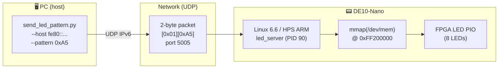

# Phase 7 Tutorial — Ethernet LED Control over UDP

> **Series:** cvsoc — Stepping into advanced FPGA development on the DE10-Nano  
> **Phase:** 7 of 8  
> **Difficulty:** Intermediate-Advanced — you have completed phases 0–6 and are comfortable with Buildroot, the Linux `/dev/mem` approach, and the HPS-to-FPGA bridge

---

## What you will build

By the end of this tutorial you will control the DE10-Nano's FPGA LEDs remotely over UDP from your PC — no serial console, no direct hardware access:

- A **Buildroot Linux image** that includes a Dropbear SSH server and a custom UDP LED server (`led_server`) as a pre-installed, auto-starting service
- A **C UDP server** (`led_server`) that runs on the board at boot, receives 2-byte commands from the network, and writes patterns to the FPGA LED PIO register via `mmap()` on `/dev/mem`
- A **Python client** (`send_led_pattern.py`) that runs on your PC and supports single-pattern commands, live pattern reads, and named animations over UDP
- A complete **deployment workflow** using `scp` and `make server-cross` for rapid iteration without a full Buildroot rebuild



The FPGA design is **reused unchanged** from project `10_linux_led` (Phase 6). The only new component is the Linux UDP server packaged into the Buildroot image.

---

## Prerequisites

| Requirement | Details |
|---|---|
| **Phase 6 complete** | Project `10_linux_led` must have been built — the `de10_nano.rbf` bitstream must exist |
| **Host tools** | `wget`, `tar`, `make`, `gcc`, `mtools`, Python 3 (for PC client and `make test`) |
| **Docker** | `cvsoc/quartus:23.1` image (for `make server-cross` cross-compile iterations only) |
| **Repository** | `git clone` of `bleviet/cvsoc`; phases 0–6 complete |
| **Board** | Terasic DE10-Nano (Cyclone V `5CSEBA6U23I7`) |
| **SD card** | MicroSD card (≥512 MB) and a card reader |
| **Ethernet** | USB-to-Ethernet adapter or direct Ethernet cable between PC and DE10-Nano |
| **Serial console** | USB-UART adapter connected to DE10-Nano UART header (115200 8N1) — only needed for first-boot SSH setup |

Verify the Phase 6 bitstream exists before continuing:

```bash
ls 10_linux_led/de10_nano.rbf
# Must exist. Run 'make rbf' in 10_linux_led/ if missing.
```

> **Where do commands run?** This tutorial involves three environments. Code
> blocks are annotated with 🖥️ **Host**, 🐳 **Docker**, or 📟 **Target** when
> the context is not obvious from the surrounding text.
>
> | Environment | What | Examples |
> |---|---|---|
> | 🖥️ **Host** (your Linux / WSL2 machine) | Building, flashing SD card, running Python client | `make buildroot`, `make flash`, `python3 client/send_led_pattern.py` |
> | 🐳 **Docker** (`cvsoc/quartus:23.1`) | Quick cross-compile for iteration | `make server-cross` |
> | 📟 **Target** (DE10-Nano via serial or SSH) | Verification only — `led_server` starts automatically | `ps aux`, `cat /var/log/led_server.log` |
>
> Unlike Phase 6, **no Quartus tools are required**: `make rbf` copies the existing bitstream
> from Phase 6. The only Docker call in this project is `make server-cross`, and even that
> is only needed for manual server iteration — a full `make buildroot` uses the host Buildroot
> cross-compiler.

---

## Concepts in 5 minutes

Before touching any file, read these ideas. They explain *why* each design decision was made and *how* the pieces fit together.

### UDP vs. TCP for LED control

The wire protocol uses **UDP** (User Datagram Protocol), not TCP. The trade-off is deliberate:

| Aspect | TCP | UDP |
|--------|-----|-----|
| **Setup** | 3-way handshake before first byte | No connection — send immediately |
| **Reliability** | Guaranteed delivery, ordered | Best-effort, no ordering guarantee |
| **Latency** | Higher (ACK wait, congestion control) | Lower (fire-and-forget) |
| **Server state** | Must track connection per client | Stateless — any client, any time |
| **LED control fit** | Over-engineered for 2-byte commands | Natural fit — missed frame ≠ catastrophe |

For a toy LED controller the reliability difference is irrelevant: if one SET_PATTERN packet is lost, the next one will be there in milliseconds. UDP's stateless, connectionless nature means the server loop is a single `recvfrom()` — no `accept()`, no per-client state, no connection teardown.

### Dual-stack IPv6 sockets

`led_server` opens a single `AF_INET6` socket with `IPV6_V6ONLY` set to `0`. This makes it **dual-stack**: it accepts both native IPv6 clients and IPv4 clients (where the IPv4 address is represented as an IPv4-mapped IPv6 address, e.g. `::ffff:192.168.1.100`).

The Python client uses `socket.getaddrinfo()` before opening its socket, which resolves the host string to the right address family automatically. This means the same client code handles all three cases:

| Host argument | Resolved family | Example |
|---|---|---|
| `192.168.1.100` | `AF_INET` | IPv4 direct |
| `fd00::1` | `AF_INET6` | IPv6 global |
| `fe80::2833:8aff:fe95:cb3d%enx08beac224c03` | `AF_INET6` | Link-local with zone ID |

### Link-local IPv6 addresses (no DHCP needed)

When the DE10-Nano boots Linux and brings up its `eth0` interface, the kernel immediately assigns a **link-local** IPv6 address in the `fe80::/10` prefix. This address is derived from the MAC address using **SLAAC** (Stateless Address Autoconfiguration, RFC 4862) and requires no DHCP server.

Link-local addresses are only valid on the directly connected network segment. To contact the board you must specify both the address and the **zone ID** (the interface name on your host):

```
fe80::2833:8aff:fe95:cb3d%enx08beac224c03
```

The `%enx...` suffix tells the OS which interface to use for the link-local route. Without it, the OS cannot determine which physical link to send the packet on.

> **Discovery:** Use the all-nodes multicast address to find the board's IPv6 address without a DHCP server or ARP:
> ```bash
> ping6 -c3 -I enx08beac224c03 ff02::1
> ```
> Every IPv6 node on the link replies. The board's address is the one that is *not* your host's `fe80::` address.

### Buildroot packaging: the `led-server` package

The `led_server` binary is not compiled on the board — it is cross-compiled during the Buildroot build and installed into the root filesystem as a proper Buildroot package. The package definition in `br2-external/package/led-server/` tells Buildroot:

1. Where the source lives (local path relative to the external tree)
2. How to build it (`arm-linux-gnueabihf-gcc` via `$(TARGET_CONFIGURE_OPTS)`)
3. Where to install it (`/usr/bin/led_server`)

The init script `S40led_server` (priority 40, runs after `S30fpga_load`) starts the server at boot. Priority 40 ensures the FPGA is already programmed and the LW H2F bridge is enabled before the server tries to `mmap()` the LED register.

### Dropbear SSH

The Buildroot image includes **Dropbear**, a lightweight SSH server optimised for embedded systems (the full OpenSSH package would add ~10 MB to the rootfs). Dropbear is enabled by a single defconfig line:

```
BR2_PACKAGE_DROPBEAR=y
```

A root password is set at build time via:

```
BR2_TARGET_GENERIC_ROOT_PASSWD="root"
```

> **Why can't Dropbear log in with an empty password?** Dropbear's default security policy rejects password authentication for accounts with no password set in `/etc/shadow` — it treats a missing password hash as "account locked". This is intentional: an SSH daemon listening on the network should never allow password-free root login. You must either set a password (as done here) or use SSH key authentication.

---

## Project structure

```
11_ethernet_hps_led/
├── Makefile                          ← Top-level orchestration
├── .gitignore
├── de10_nano.rbf                     ← Compressed FPGA bitstream (copied from Phase 6)
├── br2-external/                     ← Buildroot external tree (extends Phase 6 tree)
│   ├── external.desc                 ← BR2_EXTERNAL descriptor
│   ├── external.mk                   ← Package makefile includes
│   ├── Config.in                     ← Package Kconfig menu
│   ├── configs/
│   │   └── de10_nano_defconfig       ← Master Buildroot configuration
│   ├── board/de10_nano/
│   │   ├── genimage.cfg              ← SD card partition layout (same as Phase 6)
│   │   ├── linux-uio.fragment        ← Kernel config fragment
│   │   ├── extlinux.conf             ← U-Boot distro boot config
│   │   ├── S30fpga_load              ← Init script: loads FPGA at boot
│   │   ├── S40led_server             ← Init script: starts led_server at boot
│   │   ├── uboot.fragment            ← U-Boot config: enable bootcmd
│   │   ├── post-build.sh             ← Copies scripts/firmware to rootfs
│   │   ├── post-image.sh             ← Generates SD card image
│   │   └── uboot-env.txt             ← Reference U-Boot environment
│   └── package/
│       ├── fpga-led/                 ← Reused from Phase 6
│       ├── fpga-mgr-load/            ← Reused from Phase 6
│       └── led-server/
│           ├── Config.in             ← Buildroot package: led_server
│           └── led-server.mk         ← generic-package makefile
├── client/
│   ├── send_led_pattern.py           ← PC-side UDP client
│   └── test_protocol.py             ← Unit tests for protocol encoding
├── doc/
│   └── deploying_without_ssh.md      ← Field guide for board bring-up obstacles
└── software/
    └── led_server/
        ├── led_server.c              ← UDP server (dual-stack, mmap /dev/mem)
        └── Makefile                  ← Cross-compile Makefile
```

---

## Step 1 — Copy the FPGA bitstream

Phase 7 reuses the compressed FPGA bitstream from Phase 6 unchanged. The Verilog design, LED PIO peripheral, and LW H2F bridge are identical.

```bash
# 🖥️ Host — no Docker or Quartus needed
cd 11_ethernet_hps_led
make rbf
```

Expected output:

```
Copying FPGA bitstream from Phase 6...
FPGA bitstream: /path/to/cvsoc/11_ethernet_hps_led/de10_nano.rbf
```

> **If Phase 6 has not been built:** `make rbf` will fail with `ERROR: 10_linux_led/de10_nano.rbf not found`. Run `make rbf` in `10_linux_led/` first (that step does require Docker + Quartus).

---

## Step 2 — Build the Linux image

### 2.1 Download Buildroot

```bash
# 🖥️ Host
make buildroot-download
```

Downloads Buildroot 2024.11.1 (~8 MB compressed) and extracts it to `buildroot-2024.11.1/`. Skip if already present from a previous build.

### 2.2 Build everything

```bash
# 🖥️ Host — no Docker needed; Buildroot builds its own cross-compiler
make buildroot
```

This single command:

1. Applies `de10_nano_defconfig` (with `BR2_EXTERNAL` pointing to `br2-external/`)
2. Downloads and builds the ARM cross-compiler (GCC + glibc)
3. Builds Linux 6.6.86, U-Boot 2024.07, and BusyBox
4. Cross-compiles the `fpga_load.ko` kernel module, `fpga_led`, and `led_server`
5. Installs the `S30fpga_load` and `S40led_server` init scripts into the rootfs
6. Runs `genimage` to assemble the final SD card image

> **First build time:** approximately 15–30 minutes. Subsequent builds that only change `led_server.c` take under a minute using `make server-cross` + `scp` (see [Step 8](#step-8--iterate-on-the-server)).

> **WSL2 note:** The Makefile automatically sanitises `PATH` to remove Windows entries that contain spaces. Buildroot refuses to build if any path component contains a space.

### 2.3 Verify the output

```bash
ls -lh buildroot-2024.11.1/output/images/
```

| File | Size | Description |
|------|------|-------------|
| `sdcard.img` | ~194 MB | Complete SD card image (flash this) |
| `zImage` | ~6 MB | Compressed Linux kernel |
| `socfpga_cyclone5_de0_nano_soc.dtb` | ~20 KB | Device tree blob |
| `u-boot-with-spl.sfp` | ~758 KB | U-Boot SPL + full U-Boot |
| `rootfs.ext4` | 128 MB | Root filesystem |
| `de10_nano.rbf` | ~1.9 MB | Compressed FPGA bitstream |

Verify `led_server` and `dropbear` were installed:

```bash
grep -q led_server buildroot-2024.11.1/output/target/usr/bin/led_server && echo "led_server: OK"
grep -q dropbear  buildroot-2024.11.1/output/target/usr/sbin/dropbear  && echo "dropbear: OK"
```

---

## Step 3 — Write the SD card

Insert a microSD card and identify the device:

```bash
lsblk
# Look for a device matching your SD card size (e.g., /dev/sdb or /dev/mmcblk0)
# DOUBLE CHECK — writing to the wrong device will destroy data!
```

Write the image:

```bash
make flash SDCARD=/dev/sdX
# Or manually:
sudo dd if=buildroot-2024.11.1/output/images/sdcard.img of=/dev/sdX bs=4M status=progress conv=fsync
```

> **Windows/WSL2:** If your card reader is on the Windows side, copy the image to a Windows path and flash it with [balenaEtcher](https://etcher.balena.io/):
> ```bash
> cp buildroot-2024.11.1/output/images/sdcard.img /mnt/c/Windows/Temp/
> ```
> Then flash `C:\Windows\Temp\sdcard.img` from Windows.

---

## Step 4 — Bring up the host Ethernet interface

Before booting the board, ensure your host's USB-Ethernet adapter is up and has an IPv6 address. This step is only necessary on WSL2 — on a native Linux host the interface usually comes up automatically when you plug in the cable.

Identify your Ethernet interface (it will have a name like `enx08beac224c03` or `eth0`):

```bash
ip link show
```

If the interface is listed as `state DOWN`, bring it up:

```bash
# 🖥️ Host (WSL2) — requires sudo for network management
sudo ip link set enx08beac224c03 up && sleep 2 && ip addr show enx08beac224c03
```

| Command | Purpose |
|---------|---------|
| `sudo ip link set enx08beac224c03 up` | Transitions the interface from `DOWN` to `UP`. In WSL2 there is no NetworkManager to do this automatically when a USB adapter is plugged in. |
| `sleep 2` | Waits for IPv6 Duplicate Address Detection (DAD) to complete. The kernel sends a Neighbor Solicitation on the link and waits ~1 second for a collision response before assigning the `fe80::` address. Skipping the sleep can cause `ping6` to fail immediately. |
| `ip addr show enx08beac224c03` | Confirms the interface has a `fe80::` link-local address in the `TENTATIVE`→`PREFERRED` state. |

Expected output after the sleep:

```
3: enx08beac224c03: <BROADCAST,MULTICAST,UP,LOWER_UP> mtu 1500 ...
    inet6 fe80::abe:acff:fe22:4c03/64 scope link
       valid_lft forever preferred_lft forever
```

> **Why link-local only?** There is no DHCP server in this setup. The kernel assigns a link-local `fe80::` address automatically via SLAAC as soon as the interface comes up. No additional configuration is needed — the board and the PC can communicate immediately over link-local addresses.

---

## Step 5 — Boot the DE10-Nano

### 5.1 Hardware connections

1. Insert the microSD card
2. Connect the Ethernet cable between the DE10-Nano RJ45 port and your USB-Ethernet adapter
3. Connect the USB-UART adapter to UART header J4:
   - Pin 1 (GND) → adapter GND
   - Pin 10 (UART0_TX) → adapter RX
   - Pin 9 (UART0_RX) → adapter TX
4. Open a serial terminal at **115200 baud, 8N1**:
   ```bash
   picocom -b 115200 --noreset --noinit /dev/ttyUSB0
   ```
5. Power on the board (12V barrel connector)

### 5.2 Expected boot output

```
U-Boot SPL 2024.07 (...)
Trying to boot from MMC1

U-Boot 2024.07 (...)
...
Found /extlinux/extlinux.conf
...
Starting kernel ...

[    0.000000] Booting Linux on physical CPU 0x0
[    0.000000] Linux version 6.6.86 ...
...
Starting FPGA programming...
fpga_load: MSEL=0x0A ...
fpga_load: CONF_DONE! gpio=0x00000F07 at i=0
fpga_load: FPGA programmed successfully!
fpga_load: LW H2F bridge enabled
OK
...
Starting LED UDP server (port 5005)... OK (PID 90)
...
Welcome to DE10-Nano (cvsoc Phase 7 — Ethernet)
de10nano login:
```

> **Key lines to look for:**
> - `fpga_load: CONF_DONE!` — FPGA programmed; LED PIO is active
> - `fpga_load: LW H2F bridge enabled` — `/dev/mem` at `0xFF200000` is accessible
> - `Starting LED UDP server (port 5005)... OK` — `led_server` is running and ready
>
> Log in as `root` with password `root`.

### 5.3 Find the board's IPv6 address

With both interfaces up, use the all-nodes multicast address to discover the board's link-local address:

```bash
# 🖥️ Host
ping6 -c3 -I enx08beac224c03 ff02::1
```

Every IPv6 node on the link replies. The board's address is the `fe80::` address that is *not* your host adapter's own address:

```
64 bytes from fe80::abe:acff:fe22:4c03%enx08beac224c03: ...   ← this is YOUR host
64 bytes from fe80::2833:8aff:fe95:cb3d%enx08beac224c03: ...  ← this is the BOARD
```

Note the board address (e.g. `fe80::2833:8aff:fe95:cb3d`) — you will use it in the remaining steps.

> **Alternatively,** read it from the serial console:
> ```bash
> # 📟 Target
> ip addr show eth0
> ```

---

## Step 6 — Set up SSH

`led_server` is already running (started by the init script). SSH is needed for [Step 8](#step-8--iterate-on-the-server) when you iterate on the server binary. Skip SSH setup if you only want to run the Python client.

### 6.1 Generate an SSH key (one time)

```bash
# 🖥️ Host
ssh-keygen -t ed25519 -f ~/.ssh/id_ed25519
# Press Enter twice to use no passphrase (or set one if you prefer)
```

### 6.2 Copy the public key to the board

The first SSH login must use the password `root`, which lets `ssh-copy-id` install the public key:

```bash
# 🖥️ Host — use the board address found in Step 5.3 with the %interface zone ID
ssh-copy-id -i ~/.ssh/id_ed25519.pub "root@fe80::2833:8aff:fe95:cb3d%enx08beac224c03"
```

Subsequent logins use the key and do not require a password.

### 6.3 Verify SSH works

```bash
ssh "root@fe80::2833:8aff:fe95:cb3d%enx08beac224c03" uname -a
# Expected: Linux de10nano 6.6.86 ... armv7l GNU/Linux
```

> **Bootstrap without ssh-copy-id:** If `ssh-copy-id` fails (e.g. key authentication is not yet set up), use the serial console to install the key manually:
> ```bash
> # 📟 Target (via picocom / serial)
> mkdir -p /root/.ssh && chmod 700 /root/.ssh
> echo "ssh-ed25519 AAAA... your_email" >> /root/.ssh/authorized_keys
> chmod 600 /root/.ssh/authorized_keys
> ```
> Paste the contents of `~/.ssh/id_ed25519.pub` as the key value.

---

## Step 7 — Control the LEDs from the PC

`led_server` is running on the board at boot. Open a terminal on your **PC** and run the Python client from the `11_ethernet_hps_led/` directory.

> **Tip:** Store the board address in a variable to avoid retyping it:
> ```bash
> BOARD="fe80::2833:8aff:fe95:cb3d%enx08beac224c03"
> ```

### 7.1 Set a specific LED pattern

```bash
# 🖥️ Host
python3 client/send_led_pattern.py --host "$BOARD" --pattern 0xA5
```

Expected output:

```
SET 0xA5 → status=OK, LED=0xA5
```

The LEDs on the board should immediately show the alternating pattern `1010 0101`.

### 7.2 Read the current pattern

```bash
# 🖥️ Host
python3 client/send_led_pattern.py --host "$BOARD" --get
```

Expected output:

```
Current LED pattern: 0xA5 (status: OK)
```

### 7.3 Run an animation

```bash
# 🖥️ Host — press Ctrl+C to stop; LEDs turn off automatically on exit
python3 client/send_led_pattern.py --host "$BOARD" --animate chase

# Slower speed (200 ms per step)
python3 client/send_led_pattern.py --host "$BOARD" --animate breathe --speed 200

# Cycle through all built-in animations
python3 client/send_led_pattern.py --host "$BOARD" --animate all
```

Available animations:

| Name | Pattern | Description |
|------|---------|-------------|
| `chase` | `0x01→0x02→0x04→…→0x80` | Single LED running left to right |
| `breathe` | `0x01→0x03→…→0xFF→…→0x00` | LEDs fill up then drain |
| `blink` | `0xFF→0x00` | All 8 LEDs blink on and off |
| `stripes` | `0xAA→0x55` | Alternating checkerboard |
| `all` | All of the above | Cycles through every animation |

### 7.4 Verify the server log on the board

```bash
# 📟 Target (via SSH)
cat /var/log/led_server.log
```

Expected:

```
LED server listening on UDP port 5005
LED PIO at 0xFF200000 (via /dev/mem)
Initial LED state: 0x00
SET 0xA5  from ::ffff:192.168.1.x → LED=0xA5
GET       from ::ffff:192.168.1.x → LED=0xA5
SET 0x01  from fe80::abe:... → LED=0x01
...
```

> The `::ffff:192.168.1.x` prefix is an **IPv4-mapped IPv6 address** — this is how the dual-stack socket represents IPv4 clients. A native IPv6 client (link-local) shows the full `fe80::` address.

---

## Step 8 — Iterate on the server

When modifying `led_server.c`, a full Buildroot rebuild is unnecessary. Use the standalone cross-compile workflow:

### 8.1 Edit and cross-compile

Edit `software/led_server/led_server.c` on your host, then rebuild just the binary:

```bash
# 🐳 Runs arm-linux-gnueabihf-gcc inside Docker
make server-cross
```

Output:

```
Binary: software/led_server/led_server
  scp software/led_server/led_server root@<board-ip>:/usr/bin/
```

### 8.2 Deploy to the running board

```bash
# 🖥️ Host — stop the running server, replace binary, restart

# Step 1: stop the server
ssh "root@$BOARD" "/etc/init.d/S40led_server stop"

# Step 2: copy new binary to a temp location (avoids ETXTBSY — can't overwrite a running ELF)
scp software/led_server/led_server "root@$BOARD:/tmp/led_server"

# Step 3: atomically replace and restart
ssh "root@$BOARD" "mv /tmp/led_server /usr/bin/led_server && chmod +x /usr/bin/led_server && /etc/init.d/S40led_server start"
```

> **Why `/tmp` first?** Linux prevents overwriting the ELF of a running process (`ETXTBSY` — "text file busy"). Stopping the process, copying to `/tmp`, then using `mv` (atomic rename within the same filesystem) avoids this error.

### 8.3 Run the protocol unit tests (no board required)

```bash
# 🖥️ Host
make test
```

This runs `client/test_protocol.py` which tests request encoding, response decoding, and error handling without a board or network connection.

---

## Understanding the key files

### UDP server (`software/led_server/led_server.c`)

The server is a tight loop around `recvfrom()`:

```c
/* LW H2F bridge physical base on Cyclone V */
#define LWH2F_BASE  0xFF200000UL

/* Open /dev/mem and mmap the LED PIO register */
int memfd = open("/dev/mem", O_RDWR | O_SYNC);
volatile uint32_t *led_base = mmap(NULL, 0x1000,
    PROT_READ | PROT_WRITE, MAP_SHARED, memfd, LWH2F_BASE);

/* Dual-stack UDP socket (accepts both IPv4 and IPv6 clients) */
int sockfd = socket(AF_INET6, SOCK_DGRAM, 0);
int v6only = 0;
setsockopt(sockfd, IPPROTO_IPV6, IPV6_V6ONLY, &v6only, sizeof(v6only));
```

The `IPV6_V6ONLY = 0` option makes the IPv6 socket also accept IPv4 packets (arriving as `::ffff:x.x.x.x` mapped addresses). A single socket serves all clients regardless of address family.

The wire protocol is intentionally minimal:

| Byte | Field | Values |
|------|-------|--------|
| `req[0]` | CMD | `0x01` SET_PATTERN, `0x02` GET_PATTERN |
| `req[1]` | PATTERN | `0x00`–`0xFF` (ignored for GET) |
| `resp[0]` | STATUS | `0x00` OK, `0x01` unknown CMD, `0x02` wrong length |
| `resp[1]` | CURRENT | Current LED register value after the operation |

### Python client (`client/send_led_pattern.py`)

The client's address-family handling is the most interesting part:

```python
# Resolve host → determine address family automatically
addr_info = socket.getaddrinfo(args.host, args.port, type=socket.SOCK_DGRAM)
af, _, _, _, dest_addr = addr_info[0]
sock = socket.socket(af, socket.SOCK_DGRAM)
```

`getaddrinfo()` handles everything: IPv4 names, IPv6 globals, and link-local addresses with `%interface` zone IDs. The socket is then created with whatever family the resolver returns.

### Buildroot configuration (`br2-external/configs/de10_nano_defconfig`)

The Phase 7 defconfig adds three lines to the Phase 6 base:

```
# SSH server for remote access
BR2_PACKAGE_DROPBEAR=y

# Root password (required — Dropbear rejects empty-password logins)
BR2_TARGET_GENERIC_ROOT_PASSWD="root"

# UDP LED control server (Phase 7 Track A)
BR2_PACKAGE_LED_SERVER=y
```

### Buildroot package (`br2-external/package/led-server/led-server.mk`)

```make
LED_SERVER_VERSION    = 1.0
LED_SERVER_SITE       = $(BR2_EXTERNAL_DE10_NANO_PATH)/../software/led_server
LED_SERVER_SITE_METHOD = local

define LED_SERVER_BUILD_CMDS
    $(MAKE) $(TARGET_CONFIGURE_OPTS) -C $(@D)
endef

define LED_SERVER_INSTALL_TARGET_CMDS
    $(INSTALL) -D -m 0755 $(@D)/led_server $(TARGET_DIR)/usr/bin/led_server
endef
```

`$(TARGET_CONFIGURE_OPTS)` expands to include `CC=arm-linux-gnueabihf-gcc` and `CROSS_COMPILE=arm-linux-gnueabihf-` — Buildroot's standard way of injecting the cross-compiler into a package's `make` invocation.

> **Buildroot caching:** Because `LED_SERVER_SITE_METHOD = local`, Buildroot caches the package by its `VERSION` string, not by source timestamps. If you edit `led_server.c` and run `make buildroot`, the change will *not* be picked up automatically. The top-level `make buildroot` target calls `led-server-dirclean` first precisely to work around this. If you invoke Buildroot directly, run `make -C buildroot-2024.11.1/ led-server-dirclean && make -C buildroot-2024.11.1/` instead.

### Init script (`br2-external/board/de10_nano/S40led_server`)

```sh
#!/bin/sh
start() {
    led_server --port "$PORT" >> "$LOGFILE" 2>&1 &
    echo $! > /var/run/led_server.pid
}
stop() {
    kill "$(cat /var/run/led_server.pid)"
    rm -f /var/run/led_server.pid
}
```

The `S40` prefix places this script after `S30fpga_load` in BusyBox's init order, guaranteeing the FPGA is programmed and the bridge is enabled before `led_server` attempts to `mmap()` the hardware registers.

---

## Troubleshooting

### `ping6 ff02::1` — no reply from board

**Symptom:** Only one address replies (your own host).

**Causes and fixes:**

1. **Board not booted yet** — wait for the login prompt on the serial console
2. **Host interface is `DOWN`** — repeat Step 4: `sudo ip link set enx08beac224c03 up`
3. **Ethernet cable not connected** — check both ends; the board's Ethernet LED should be lit
4. **DAD not complete** — add another `sleep 2` before pinging

### SSH connection refused (port 22)

**Symptom:** `ssh: connect to host fe80::... port 22: Connection refused`

**Check whether Dropbear is running on the board:**

```bash
# 📟 Target
ps aux | grep dropbear
```

If not running, check the init log:

```bash
dmesg | tail -20
```

Dropbear requires a root password to accept password logins. If `BR2_TARGET_GENERIC_ROOT_PASSWD` was not set, the account has no password and Dropbear will refuse all login attempts. Rebuild with the password set, or set it live:

```bash
# 📟 Target
passwd root   # set a password interactively
```

### Python client: `no response from ... (timeout 2.0s)`

**Symptom:** `Error: no response from fe80::...:5005 (timeout 2.0s)`

**Check in order:**

1. **Is `led_server` running?**
   ```bash
   # 📟 Target
   cat /var/run/led_server.pid && ps aux | grep led_server
   ```
2. **Is the FPGA programmed?**
   ```bash
   # 📟 Target
   dmesg | grep fpga_load
   # Must see: fpga_load: FPGA programmed successfully!
   ```
   If `mmap()` at `0xFF200000` fails before the bridge is enabled, `led_server` exits immediately. Check `/var/log/led_server.log` for the error.
3. **Zone ID missing?** Link-local addresses require the `%interface` suffix on the host:
   ```bash
   python3 client/send_led_pattern.py --host "fe80::2833:8aff:fe95:cb3d%enx08beac224c03" ...
   ```
4. **Firewall?** On Ubuntu hosts, `ufw` may block inbound UDP replies:
   ```bash
   sudo ufw status
   # If active, allow the interface: sudo ufw allow in on enx08beac224c03
   ```

### `ETXTBSY` when deploying with scp

**Symptom:** `scp: /usr/bin/led_server: Text file busy`

You cannot overwrite the ELF of a running process. Stop the service first:

```bash
ssh "root@$BOARD" "/etc/init.d/S40led_server stop"
scp software/led_server/led_server "root@$BOARD:/tmp/led_server"
ssh "root@$BOARD" "mv /tmp/led_server /usr/bin/led_server && chmod +x /usr/bin/led_server && /etc/init.d/S40led_server start"
```

### Build fails: `You seem to have a path with spaces`

Buildroot cannot handle paths containing spaces. The top-level Makefile sanitises PATH automatically. If you invoke Buildroot directly:

```bash
export PATH=$(echo "$PATH" | tr ':' '\n' | grep -v ' ' | tr '\n' ':' | sed 's/:$//')
make -C buildroot-2024.11.1/
```

### `led_server` exits immediately after boot

**Check the server log:**

```bash
# 📟 Target
cat /var/log/led_server.log
```

If you see `Error: cannot open /dev/mem: Permission denied`, the server was not started as root. The init script runs as root by default; if you started it manually as a different user this will fail.

If you see `Error: mmap failed: Operation not permitted`, the kernel was compiled without `CONFIG_STRICT_DEVMEM=n` (or with `CONFIG_IO_STRICT_DEVMEM`). The Buildroot `linux-uio.fragment` disables strict `/dev/mem` to allow unrestricted physical address access.

---

## What you have learned

| Concept | Where demonstrated |
|---|---|
| UDP sockets for low-latency hardware control | `led_server.c` — `socket()` + `recvfrom()` loop |
| Dual-stack IPv6/IPv4 socket with `IPV6_V6ONLY=0` | `led_server.c:142–156` |
| Link-local IPv6 addressing and SLAAC | `ping6 ff02::1` board discovery |
| Zone IDs for link-local addresses | `%enx08beac224c03` suffix in `--host` argument |
| `getaddrinfo()` for address-family-agnostic clients | `send_led_pattern.py:114–121` |
| Packaging a Linux application in Buildroot | `br2-external/package/led-server/` |
| BusyBox init priority ordering | `S30fpga_load` before `S40led_server` |
| Dropbear SSH in an embedded Buildroot system | `BR2_PACKAGE_DROPBEAR=y` in defconfig |
| Atomic binary replacement to avoid `ETXTBSY` | `scp to /tmp` + `mv` workflow |
| Rapid iteration with `make server-cross` + `scp` | Step 8 — no full Buildroot rebuild needed |

---

## Next steps

- **Phase 7.5 — Protocol Buffers (nanopb):** Replace the 2-byte raw wire format with a proper protobuf schema (`led_command.proto`). The nanopb generator produces C server stubs and Python client code from a single `.proto` file — demonstrating schema evolution without breaking existing clients.
- **MQTT / CoAP broker:** Add an MQTT broker (e.g. Mosquitto) to the Buildroot image and publish LED state to a topic. Any MQTT client (Home Assistant, Node-RED, phone app) can then subscribe and control the LEDs.
- **Phase 8 — Zephyr RTOS:** Port the LED server to run on Zephyr RTOS (`west build -b cyclonev_socdk`) instead of Linux, exploring real-time constraints and the Zephyr networking stack.
- **UIO driver:** Replace the `/dev/mem` approach with a `generic-uio` device tree node and `/dev/uio0`, removing the requirement for root access and the strict `/dev/mem` kernel config workaround.
- **Track B — FPGA UDP receiver:** Implement a lightweight UDP listener in the FPGA fabric itself (e.g. using LiteEth), bypassing the HPS entirely for sub-microsecond LED response times.
